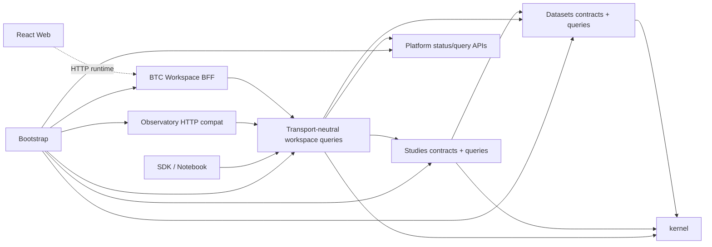
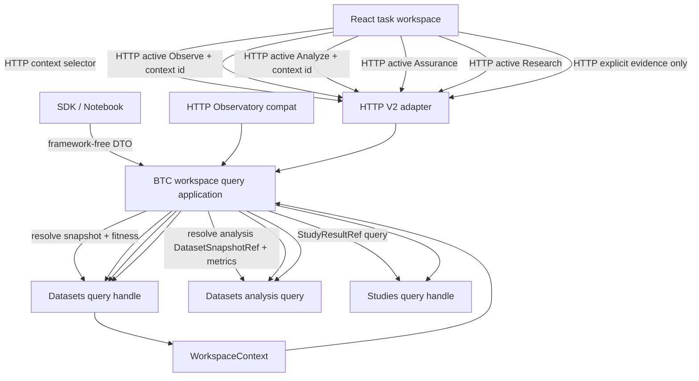
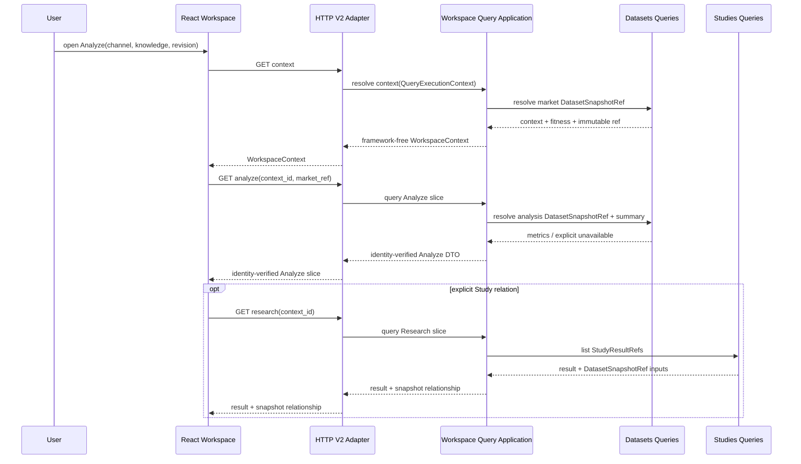
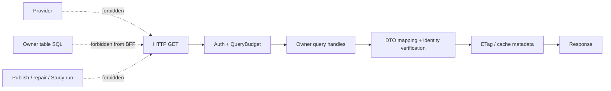
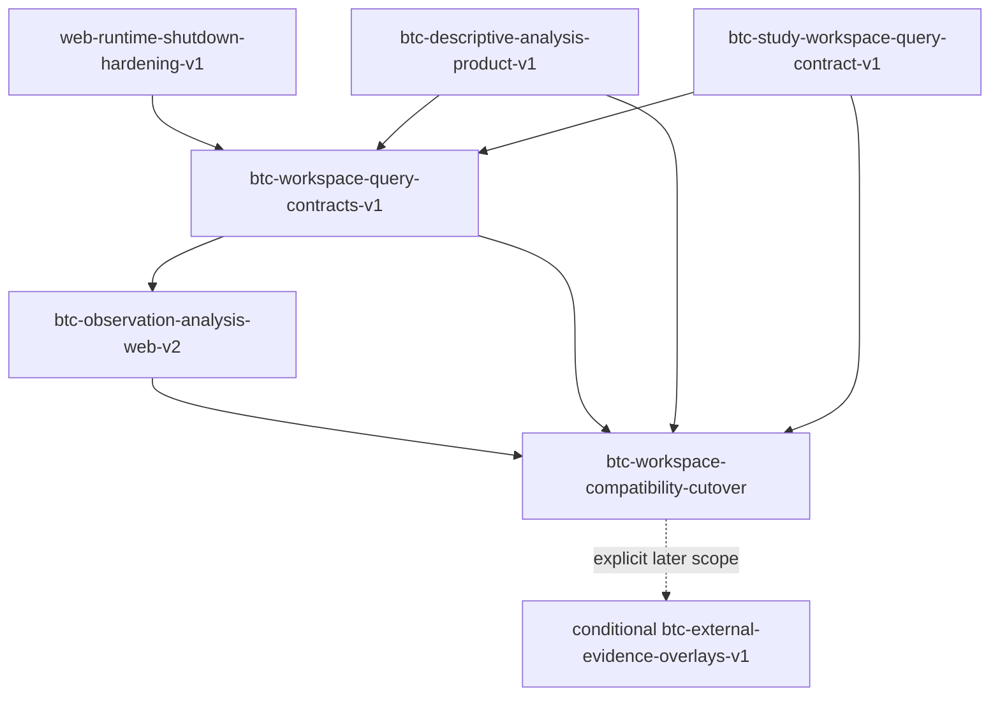

# BTC Observation and Analysis UI v2

## Context

This change is a design-only child of
`restructure-trade-architecture-v1`. It designs a second-generation BTC
workspace over the target Datasets, Studies, Interfaces, Processes, and
Platform boundaries. It does not modify React, FastAPI, Python domain code,
database state, parquet, Catalog generations, provider traffic, or trading
behavior.

The design starts from the current code, not from historical screenshots:

- `trade_web/frontend/src/pages/observatory/ObservatoryPage.tsx` is 723 lines.
  It owns the top-level tabs, selection validation, and eight resource families:
  context, selected series, composite series, trust, date evidence, runs,
  run detail/diff, and H1 hypotheses/research result. It correctly resolves
  Context before selected-snapshot facts, but UI composition and request graph
  ownership remain concentrated in one page.
- `trade_web/frontend/src/pages/observatory/MarketWorkspace.tsx` composes the
  current exchange-style K-line, lifecycle comparison, market summary,
  Formal-status explanation, and date evidence. It is already a useful Observe
  surface and is retained rather than rewritten.
- `trade_web/frontend/src/components/observatory/OverviewPanels.tsx` calculates
  fallback returns, peak drawdown, and RV20 percentile from visible browser
  rows. The values are labelled `display_estimate`, which avoids pretending
  they are backend facts, but the calculation still has no reusable Dataset
  owner, immutable method reference, independent lineage, or consistent SDK
  contract. It also operates on raw selected-series rows rather than the strict
  chart adapter's validated model, a risk already accepted as
  `KLINE-REVIEW-014` in the prior design review.
- `trade_web/frontend/src/components/observatory/SnapshotContextBar.tsx` exposes
  asset/provider identity, three lifecycle watermarks, knowledge cut, five
  state axes, and five purpose-fitness results. It preserves important truth,
  but its density makes the most important first-screen distinctions harder to
  scan.
- `trade_web/frontend/src/lib/api.ts` contains the legacy Observatory DTOs and
  route builders. Most legacy fields are optional because they mirror a frozen
  compatibility payload. The same file also contains unrelated application
  contracts and has grown to almost 2,000 lines.
- `trade_web/backend/observatory/router.py` is a focused 252-line read-only
  router. It preserves ETag and error mapping and is a better migration seed
  than `trade_web/backend/app.py`, but each route constructs the existing
  `ObservatoryQuery` facade. There is no BFF contract for snapshot-bound
  descriptive analysis.
- `trade_py/observatory/query/facade.py` is a 406-line read facade over context,
  series, date, trust, runs, diffs, hypotheses, and research receipts. Under the
  target architecture, these facts separate into Datasets, Studies, and
  Interfaces owners. The facade remains a compatibility adapter, not a target
  business domain.
- Current public HTTP resources are limited to capability, context, series,
  date evidence, trust, runs/detail/diff, hypotheses, and research-run reads.
  There is no immutable reusable descriptive-analysis product or method-aware
  metric contract.
- The Data page independently uses Observatory selected-series data for BTC
  while non-BTC assets use the generic kline API. V2 cannot silently remove or
  redirect that consumer.
- Existing frontend coverage is substantial: focused Observatory unit tests,
  K-line/chart tests, capability/navigation tests, bundle budgets, and
  Playwright functional, performance, and accessibility scenarios. These are
  migration baselines, not proof that the new analysis semantics exist.

The current product safely answers:

1. which BTC lifecycle channel and immutable snapshot are selected;
2. what the selected daily OHLCV contains;
3. whether Formal use is allowed and why;
4. which capture/run facts and H1 receipt are available.

It does not yet answer, under one immutable and reusable contract:

1. how BTC performance, range, volatility, and drawdown compare across declared
   historical windows;
2. how much evidence and which exclusions support each observation;
3. which method/version produced each value;
4. whether a displayed metric is current for the selected market snapshot;
5. where descriptive observation stops and Study inference begins.

## Goals / Non-Goals

**Goals:**

- Deliver a concrete, incrementally implementable UI architecture for BTC
  observation and analysis.
- Preserve the current K-line, lifecycle/PIT behavior, capability gate,
  assurance evidence, H1 receipt, and deep links.
- Make Observe, Analyze, Assurance, and Research distinct user tasks with clear
  evidence relationships.
- Move reusable metric ownership from browser presentation to a Datasets-owned,
  immutable derived product.
- Keep inferential, forward-looking, validation, and promotion semantics in
  Studies.
- Make the BFF a read-only, bounded query composer rather than a business owner.
- Give Web, SDK, and notebook callers the same structured metric, reference,
  temporal, unavailable, and error semantics.
- Define explicit mobile, accessibility, query, response, render, and 10x
  capacity envelopes.
- Split future implementation into small child changes that can ship and roll
  back independently.

**Non-Goals:**

- No production implementation in this change.
- No provider fetch, Capture change, Catalog rebuild, repair, backfill,
  publication, Study execution, or EvidenceGap closure from a Web GET.
- No live/tick/order-book view, exchange selector, arbitrary indicator editor,
  chart drawing suite, alert engine, portfolio action, or trading execution.
- No buy/sell/long/short label, target price, expected future return,
  directional probability, position size, ranking, recommendation, or automated
  decision.
- No browser-side business-metric fallback after the V2 Analyze cutover.
- No direct use of raw CaptureArtifact, filesystem path, moving `latest`,
  current DB state, unpinned DataFrame, or provider response as a formal
  analysis/Study input.
- No new Observatory bounded context. Observatory is the compatibility/product
  surface over Datasets and Studies.
- No big-bang `trade_web` to `web/` or `trade_py` to `src/trade` move.
- No expansion of the C++ engine. A future optimized metric implementation
  could be a Datasets adapter behind a port, but is unnecessary for V1.
- No storage or schema migration in this design change. A future analysis
  product implementation must declare and govern its durable writes
  separately.

## Design Quality Brief

### Requirements and acceptance

The primary callers are BTC researchers, operators, the existing Observatory
Web client, the Data-page BTC adapter, and future SDK/notebook clients.
Acceptance requires Observe to preserve the selected-channel K-line and PIT
identity, Analyze to consume only immutable owner-produced metrics, Assurance
and Research to retain their distinct evidence scopes, and every URL/HTTP
compatibility baseline to pass before V2 becomes the default. Hidden views do
not fetch, unavailable facts have no numeric fallback, and this design changes
no production behavior.

### Ownership and boundaries

Datasets owns canonical BTC snapshots and reusable descriptive analysis;
Studies owns hypotheses, forward labels, validation and promotion. Interfaces
owns WorkspaceContext resolution, read-only BFF composition, compatibility
mapping and SDK DTOs. React owns task/view state and presentation only, while
Platform owns bounded deadline, cancellation and status primitives. Bootstrap
is the only target composition root for concrete queries and adapters.
Observatory remains a product surface, not a business context.

### Data and state invariants

Every displayed formal fact binds an immutable DatasetSnapshotRef or
StudyResultRef plus content digest, UTC event/available/knowledge clocks,
revision policy, method version and availability state. The analysis convenience
object is a query-only `AnalysisSnapshotDescriptor`, not a second formal ref.
WorkspaceContext identity excludes render time and UI state. Cross-snapshot or
cross-channel payloads cannot combine, missing required clocks fail closed, and
revision creates a new version while preserving prior evidence.

### Contracts and compatibility

Existing `/api/v1/observatory/*` methods, status/error/ETag behavior, capability
gate, Data-page consumer, URL selectors and viewport identity remain available.
V2 adds versioned context/observe/analyze/assurance/lineage/research/evidence
DTOs and the additive `obsLens=analysis` value. Missing or unknown lens values
restore Observe, and an incomplete legacy response maps to unproven or
unavailable rather than an invented immutable fact.

### Failure and recovery

Context failure blocks dependent slices; other slice failures stay isolated
and retain typed timeout, unavailable, partial, stale, mismatch or budget
states. Admission closes before shutdown cancellation propagates. Each owner
has a finite grace period, owned child process groups escalate from TERM to
KILL and are reaped, and late results are discarded. Python threads cannot be
force-reaped; a non-cooperative residual thread is reported as residual and its
capacity remains owned. Current code still has unbounded concurrent-stop,
startup-cleanup and executor-tail waits, and Uvicorn replaces the CLI SIGINT
handler while lifespan shutdown runs, so the current watchdog cannot guarantee
termination of a stuck lifespan. V2 activation therefore requires the separate
runtime-hardening child, owner/stage receipts, and a supervisor-independent
termination proof; it never waits for or signals an unrelated process.

### Performance and capacity

One subject/workspace permits at most four active HTTP requests and one
in-flight request per complete slice identity. One process permits 32 active
and 32 queued workspace requests with at most one second admission wait.
Initial ceilings are 15 seconds, 2 MiB uncompressed JSON, 2,000 Observe
positions per response, 2,000 analysis points, 100 metrics, 50 lineage rows per
page and 100 evidence refs. The product can retain 7,300 daily positions behind
bounded range/cursor reads. Hidden views remain lazy, detail is selected
explicitly, overload is rejected or paginated, and temporary-fixture 1x and
320-attempt tests measure latency, memory, event-loop lag, cancellation and
residual owners.

### Persistent-write safety

This design writes no business state. A separately governed Datasets child is
the sole future writer of immutable analysis generations and must stage,
fsync, digest-verify and validate schema, clocks, lineage, method and quality
before an atomic release transition. Idempotency binds ordered immutable inputs
and policy/environment versions. A crash leaves the prior release authoritative;
rollback selects a previous verified release and retains every immutable
generation and receipt.

### Point-in-time and predictive evidence

Analyze is descriptive and direction-neutral: it uses only as-known,
snapshot-pinned history and has no forecast horizon, label, recommendation or
numeric fallback. Research exposes only Studies-owned registered input,
population, OOS window, horizon, method, uncertainty and lifecycle evidence.
Missing source publication, first-seen, available or revision clocks remain
explicit unavailable; revised inputs stale affected Study results instead of
remaining current.

### Observability and operations

Every slice returns request/correlation ids, contract version, immutable
identity, result state and stable reason code. Low-cardinality metrics record
route/result/owner class, latency, response-size buckets, cache outcome,
cancellation/deadline and mismatch counts. Correlation/ref identity stays in
bounded logs or receipts, not metric labels. ShutdownReceipt exposes stage,
deadline, graceful/forced counts and residual owner/category without payloads,
credentials, local paths or unbounded refs. Operators can distinguish empty,
partial, stale, unavailable, failed, superseded and timed-out results.

### Validation strategy

Contract and golden fixtures validate immutable refs, exact-decimal metrics,
clocks, revision propagation, lineage and no predictive-field leakage.
Integration tests use temporary roots and fail-fast write/provider spies to
prove read-only BFF behavior, identity-safe ETags, deadlines and process-tree
cleanup. Vitest and Playwright cover URL compatibility, rapid-switch
cancellation, explicit states, a11y, nonblank chart pixels and desktop/mobile
overlap. Each implementation child repeats native OpenSpec, design, focused
code, compatibility and implemented-diff review gates.

### Alternatives and trade-offs

A frontend-only refresh was rejected because browser metrics would still lack
an immutable owner. One all-page BFF payload was rejected because it couples
failure, caching and hidden-view cost. A generic panel plugin system was
rejected as premature abstraction. Context-first view-local slices plus a
Datasets analysis product add contracts and staged rollout work, but give one
owner per fact, bounded reads, independent failures and Web/SDK parity.

### Rollout and rollback

Delivery is split into runtime hardening, analysis-product, Study-query,
workspace-query, Web and compatibility children. The analysis product ships
without consumers, the BFF dark-launches with dual-read evidence, Web remains
feature-gated, and cutover follows OpenAPI/URL/PIT/read-only/capacity/visual/a11y
parity. Any identity mismatch, write attempt, quantified latency/payload breach,
inaccessible layout or shutdown residual disables V2 and restores the legacy
page/routes and previous verified analysis release without deleting data or
changing old URLs. The cutover child owns a rehearsed runbook with flag owner,
scope, activation mechanism, smoke checks, time limit and escalation path.

## Requirements and acceptance

The primary user is a researcher or operator inspecting locally available BTC
daily evidence. From one workspace they need to:

1. identify the selected lifecycle channel, knowledge cut, revision policy,
   data fitness, and Formal relationship;
2. inspect the supplied daily bars and exact date evidence;
3. understand historical performance, volatility/range, drawdown/distribution,
   and coverage/revision behavior under declared methods;
4. inspect quality and lineage without mistaking catalog-wide history for
   selected-snapshot proof;
5. inspect Study evidence without receiving a trade recommendation.

Acceptance is observable:

- Existing Observatory URLs and API consumers remain compatible.
- Observe remains the default and preserves current chart/PIT behavior.
- Analyze never computes return, drawdown, volatility, percentile, or another
  business metric in React or the BFF.
- Every analysis value has immutable refs, clocks, method/window/unit/sample/
  coverage identity and an explicit availability state.
- Reusable descriptive output belongs to Datasets; Study inference belongs to
  Studies.
- Context-first identity prevents cross-channel, cross-snapshot, cross-knowledge
  or cross-revision response mixing.
- Hidden task views make no default request.
- Query paths are proven read-only.
- Desktop and 360-pixel mobile layouts have no overlap or inaccessible action.
- Focused unit, contract, golden, E2E, accessibility, visual, and capacity
  checks cover success and failure states.
- Every future implementation child passes its own design and code gates before
  cutover.

This architecture design is accepted only after native OpenSpec validation,
non-strict design-check, six-role review, P0 resolution, material P1
disposition, and current digest-bound strict approval.

## Ownership and boundaries

### Target ownership

| Responsibility | Target owner | Transitional implementation seed |
| --- | --- | --- |
| BTC daily canonical data, schema, clocks, revision, PIT, quality, release | `src/trade/datasets/` | `trade_py/data/market/crypto`, `trade_py/observatory` |
| Reusable BTC descriptive metric series and snapshots | `src/trade/datasets/` | new child; browser estimates are not migrated as authority |
| Hypothesis, forward label, effect, validation, promotion, stale Study result | `src/trade/studies/` | `trade_py/observatory/research`, current H1 receipt |
| Cross-context revision rerun/evidence-gap flow | `src/trade/processes/` | later Process Manager child |
| Query timeout/cancellation/status/cache primitives | `src/trade/platform/` public APIs | current HTTP/runtime primitives |
| BTC WorkspaceContext and slice DTO composition | `src/trade/interfaces/http/bff/btc_workspace/` | `trade_web/backend/observatory/` compatibility router |
| SDK query surface | `src/trade/interfaces/sdk/btc_workspace.py` | current Observatory SDK |
| React product surface | repository `web/` after layout migration | `trade_web/frontend/src/pages/observatory/` |
| Legacy HTTP/URL mapping | `src/trade/interfaces/http/compat/observatory/` | current route/type/url helpers |
| Concrete wiring | `src/trade/bootstrap/` | current app factory/runtime resource composition |

### Context cells

The future implementation follows the architecture parent:

```text
datasets/
  contracts/
    dataset_snapshot_ref.py
    btc_descriptive_analysis.py
  domain/
    analysis_method.py
    metric_observation.py
  use_cases/
    build_btc_descriptive_analysis.py
    resolve_btc_analysis_snapshot.py
  ports/
    analysis_repository.py
    analysis_compute.py
  adapters/
    sqlite/
    parquet/

studies/
  contracts/
    study_result_ref.py
    study_query.py
  domain/
  use_cases/
  ports/
  adapters/

interfaces/http/bff/btc_workspace/
  context.py
  observe.py
  analyze.py
  assurance.py
  lineage.py
  research.py
  evidence.py
  mapping.py

interfaces/btc_workspace/
  contracts.py
  queries.py

interfaces/http/compat/observatory/
interfaces/sdk/btc_workspace.py
```

No `service.py`, global `manager.py`, or new catch-all `api.ts` owns the new
contracts. Context contracts contain immutable refs and DTOs, not DataFrames,
ORMs, paths, DB connections, or framework responses.

### Dependency graph



Datasets and Studies never import Interfaces or React. HTTP V2, HTTP compat and
SDK are peer adapters over transport-neutral query contracts; SDK does not
import FastAPI response shaping. The BFF never imports concrete
repositories/adapters. Only Bootstrap composes concrete query implementations.

## Data and state invariants

### Identities

`WorkspaceContext` is the root read identity:

```text
workspace_context_id =
  digest(
    contract_version,
    asset_id,
    selected_channel,
    market_dataset_snapshot_ref,
    effective_knowledge_cut,
    knowledge_mode,
    revision_policy,
    purpose_policy_ref
  )
```

It excludes request/render timestamps, browser page state, chart viewport,
selected tab, and selected date.

The formal analysis product uses a standard Datasets `DatasetSnapshotRef`.
`AnalysisSnapshotDescriptor` is a non-authoritative query DTO containing:

```text
analysis_dataset_snapshot_ref
source_market_snapshot_ref
semantic_schema_policy_ref
method_policy_ref
transform_environment_ref
knowledge_cut
revision_policy
lineage_relationship
created_at_operational
```

A path or mutable pointer is never a reference. The descriptor is never a
DatasetBuild or StudyRun input. The query application verifies the standard
analysis DatasetSnapshotRef and source-lineage relationship before presenting
current analysis.

### Time semantics

- BTC display and product calendar: UTC.
- Event time: the final daily bar date/close interval supplied by the canonical
  Dataset.
- Available time: the owning Dataset's policy-resolved availability, never HTTP
  response time or filesystem mtime.
- Knowledge cut: the frozen as-known boundary used to resolve the source
  DatasetSnapshotRef.
- Revision policy: explicit `as_known` or a later separately proven restatement
  policy. `latest_restated` cannot masquerade as point-in-time evidence.
- Point basis: every rolling point declares `as_known_at_point` or
  `restated_at_snapshot_cut`; an as-known point admits only constituent rows
  whose required clocks are no later than that point's knowledge boundary.
- Clock provenance: `availability_basis`, `clock_confidence`, and
  `clock_source_ref` distinguish provider publication, market-boundary proxy,
  and installation observation.
- Rendered/request time: operational metadata only; it never changes product or
  metric identity.

Missing required clocks fail closed for a formal analysis product. A metric can
be partial only when its versioned method explicitly permits the observed
coverage.

### Metric observation

The UI never receives a bare authoritative number. A metric observation is:

```json
{
  "metric_id": "realized_volatility_20",
  "label": "20-observation realized volatility",
  "state": "confirmed",
  "value": "0.642193",
  "unit": "annualized_decimal",
  "interpretation": "descriptive",
  "window": {
    "kind": "included_observations",
    "size": 20,
    "start_event_date": "2026-06-28",
    "end_event_date": "2026-07-18"
  },
  "event_as_of": "2026-07-18",
  "available_at": "2026-07-19T00:05:00Z",
  "knowledge_cut": "2026-07-19T00:05:00Z",
  "sample_count": 20,
  "expected_sample_count": 20,
  "coverage_ratio": "1",
  "coverage_state": "complete",
  "quality_state": "assured",
  "method": {
    "id": "btc_close_to_close_rv",
    "version": "1"
  },
  "input_ref": {"type": "DatasetSnapshotRef", "digest": "..."},
  "output_ref": {"type": "DatasetSnapshotRef", "digest": "..."},
  "availability_basis": "installation_observed",
  "clock_confidence": "exact",
  "clock_source_ref": {"type": "DatasetSnapshotRef", "digest": "..."},
  "evidence_refs": [],
  "reason_codes": []
}
```

Exact field names are frozen in the query-contract child. The invariant is that
value, scope, method, evidence, and availability travel together.

### Initial metric policy

The first analysis product is deliberately bounded:

| Family | Initial metric | Method-policy requirement |
| --- | --- | --- |
| Performance | trailing return for 1, 7, 30, 90 and 365 return intervals | `n` means `n+1` eligible close endpoints; `close_t / close_t-n - 1`; exact decimal output |
| Volatility | annualized close-to-close realized volatility for 20 and 60 log-return observations | `n+1` eligible close endpoints, sample standard deviation, `ddof=1`, annualization `sqrt(365)`, complete required window |
| Range | daily high-low range percentage and rolling 20-observation median | positive enclosing OHLC; V1 denominator is close; no inferred intraday path |
| Drawdown | current drawdown and maximum drawdown for 30, 90, 365 and full product window | close-based running peak; earliest equal peak wins; episode start/trough/end dates returned |
| Distribution | RV20 empirical percentile over trailing 730 available RV observations | minimum 252 valid RV values; inclusive current point; midrank ties |
| Volume | trailing change/distribution only where stable comparable unit is proven | otherwise `volume_unit_unproven` |
| Coverage/revision | expected, included, excluded, revised and quarantined observations | derived from Dataset quality/revision facts, never chart whitespace heuristics |

This table is a design baseline, not permission to implement values before the
Datasets child freezes decimal scale/rounding, market/venue/instrument/quote
identity, gap policy, dependency manifest and golden fixtures and receives
strict approval. Content identity is canonical bytes over ordered immutable
inputs, dependency manifest, schema/method/environment policies and lineage;
wall-clock/run/release/receipt metadata is excluded.

### State families

State families remain orthogonal:

- transport: `idle | loading | confirmed | failed`;
- observation condition: `nonempty | empty`;
- product availability: `complete | partial | unavailable | stale`;
- quality: Dataset-owned quality enum;
- lifecycle: selected market/analysis release state;
- compatibility: contract/method/schema relationship;
- purpose fitness: one result per declared purpose;
- Study lifecycle: preregistered/run/validated/rejected/insufficient/stale/etc.

Cancellation acceptance is not a terminal business state. Successful empty is
not unavailable or failed. A timed-out query is not a missing Dataset. A stale
Study is not a failed market snapshot. The BFF and UI preserve these
distinctions.

## Contracts and compatibility

### Additive HTTP contract

The proposed BFF routes are additive:

| Method/path | Purpose | Required identity | Default budget |
| --- | --- | --- | --- |
| `GET /api/v1/workspaces/btc/context` | resolve WorkspaceContext | channel + temporal/revision selectors | one context |
| `GET /api/v1/workspaces/btc/observe` | observation strip + selected-series descriptor | context id + market ref + range/cursor | 2,000 positions/response; 7,300 product history |
| `GET /api/v1/workspaces/btc/analyze` | bounded metric summary | context id + market ref | 100 metrics |
| `GET /api/v1/workspaces/btc/analyze/series` | one metric series | context id + analysis DatasetSnapshotRef + metric/window/range | 2,000 points |
| `GET /api/v1/workspaces/btc/assurance` | selected-snapshot fitness/coverage/findings | context id + market/analysis DatasetSnapshotRef | bounded findings |
| `GET /api/v1/workspaces/btc/lineage` | catalog-wide runs/diff descriptor | cursor or immutable refs | 50 rows/page |
| `GET /api/v1/workspaces/btc/research` | hypotheses + Study result summaries | optional context relationship | bounded result list |
| `GET /api/v1/workspaces/btc/evidence/{kind}/{id}` | one explicit evidence detail | immutable ref + context where required | 100 refs/2 MiB |

These paths use versioned DTO schema names such as
`trade.btc-workspace-context.v1`; the API path's `v1` remains the repository's
HTTP API generation and does not imply legacy Observatory payload identity.

The context response advertises slice capabilities:

```json
{
  "schema": "trade.btc-workspace-context.v1",
  "workspace_context_id": "...",
  "selected_channel": "observed",
  "market_snapshot_ref": {},
  "effective_knowledge_cut": "...",
  "knowledge_mode": "installation_observed",
  "revision_policy": "as_known",
  "capabilities": {
    "observe": "available",
    "analyze": "unavailable",
    "assurance": "available",
    "lineage": "available",
    "research": "available"
  },
  "reason_codes": ["analysis_product_unavailable"],
  "correlation_id": "..."
}
```

Capability state prevents a partial deployment from encouraging the client to
invent missing facts.

### Legacy mapping

| Current contract | V2 destination | Compatibility rule |
| --- | --- | --- |
| `obsLens=overview` | Observe | unchanged serialized value during compatibility window |
| `obsLens=trust` | Assurance summary | unchanged |
| `obsLens=runs` | Assurance / Lineage | unchanged |
| `obsLens=research` | Research | unchanged |
| `obsLens=analysis` | Analyze | additive; old client treats unknown as Observe |
| `obsChannel` | Workspace selected channel | exact enum retained |
| `knowledgeAsOf` | Context knowledge cut selector | retained; commit, not per-keystroke query |
| `obsChart`, `obsTimeframe`, `obsDate` | Observe-local state | retained |
| `obsRun`, `obsCompare` | Lineage-local state | retained |
| `/api/v1/observatory/...` | compat adapter | method, selectors/defaults, status, headers/ETag, complete payload field/type/optional semantics, capability, errors, and SSE-or-none retained per route |
| Data page BTC series adapter | legacy selected series | retained until separately migrated |

No legacy optional field becomes proof for a new immutable ref. Missing owner,
digest, clock, method, or source relationship maps to `unproven`/unavailable.

### Frozen legacy HTTP inventory

Actual `trade_web/backend/observatory/router.py` audit identifies ten GET routes
and no SSE route. The compatibility child snapshots every nested field, nullable/
optional distinction and enum value from the existing fixture/OpenAPI payload;
the field summaries below are minimum complete top-level obligations, not
permission to drop nested fields.

| Method/path | Query/path contract | Success/header behavior | Frozen top-level payload |
| --- | --- | --- | --- |
| `GET /api/v1/observatory/capability` | no parameters; always registered | `200`; no ETag/SSE; disabled, ready, stale and registration-error variants | `enabled`, `state`, `show_nav`, optional `generation_id`, optional `reason_code` |
| `GET /api/v1/observatory/assets/crypto.BTC/context` | `channel=observed`, `knowledge_as_of=latest`, `knowledge_mode=installation_observed`, `revision_policy=as_known`, optional `snapshot_id`, `run_id` | `200` + ETag; exact `If-None-Match` yields empty `304` + ETag; no SSE | complete `_context_payload` plus `view_fingerprint`, `etag`, `evidence_coverage`, `semantic_channels` |
| `GET /api/v1/observatory/assets/crypto.BTC/series` | `view=composite`, same temporal defaults, `include_quarantined=false`, optional `snapshot_id`, `run_id`, `from`, `to` | `200` + ETag; exact `If-None-Match` yields empty `304` + ETag; no SSE | composite: `view`, `asset_id`, `layers`, `reason_codes`, `fingerprint_basis`, `view_fingerprint`, `etag`; single: `view`, `context`, `rows`, `pit_valid`, `reason_codes`, `view_fingerprint`, `etag` |
| `GET /api/v1/observatory/assets/crypto.BTC/dates/{market_date}` | path date; optional `snapshot_id`; `channel=formal` | `200`; no ETag/SSE | `date`, `snapshot_id`, `run_id`, nullable `ohlcv`, nullable `reconciliation`, nullable `revision`, `run_lineage`, `research_visibility`, `reason_codes` |
| `GET /api/v1/observatory/assets/crypto.BTC/trust` | optional `snapshot_id`; `channel=formal` | `200`; no ETag/SSE | `snapshot_id`, `run_id`, `gates`, `findings`, `acquisition_state`, `quality_state` |
| `GET /api/v1/observatory/assets/crypto.BTC/runs` | optional `cursor`; `limit=50`, maximum `500` | `200`; FastAPI `422` remains for invalid limit shape; no ETag/SSE | `runs`, nullable `next_cursor`, `catalog_fingerprint` |
| `GET /api/v1/observatory/runs/diff` | required `base`, `compare` | `200`; FastAPI `422` remains for missing parameters; no ETag/SSE | `base`, `compare`, `added_dates`, `removed_dates`, `changed_dates`, `gate_changes`, `code_changed`, `config_changed`, `schema_changed` |
| `GET /api/v1/observatory/runs/{run_id}` | path run id; traversal remains fail-closed | `200`; no ETag/SSE | `run_id`, `created_at`, `market_watermark`, `data_readiness`, `quality_state`, `lifecycle_state`, `acquisition_state`, `canonical_rows`, `code_revision`, `artifact_refs`, `gates` |
| `GET /api/v1/observatory/assets/crypto.BTC/hypotheses` | no parameters | `200`; no ETag/SSE | `hypotheses`, retaining per-item hypothesis id/version, statement, directional, research state and nullable current run id |
| `GET /api/v1/observatory/research-runs/{research_run_id}` | path research run id | `200`; no ETag/SSE | research run/input identities, knowledge cut, lifecycle/current flag, `metrics`, `evidence_refs` |

All facade `ObservatoryError` responses retain `to_payload()` shape and current
reason/status mapping: `404` for missing snapshot/channel, `409` for invalid
pointer/hash/manifest/stale Dataset, `422` for PIT/quality/research/composite/
restatement/legacy-time failures, `400` for invalid selector, and `503` for stale
Catalog. Only stale Catalog adds its bounded `Retry-After`. FastAPI parameter
validation remains its current framework error contract. The child freezes
actual JSON fixtures and OpenAPI so this prose cannot conceal payload drift.

## Persistent-write safety

This architecture design writes no durable business state. Its future
`btc-descriptive-analysis-product-v1` child does introduce a Datasets-owned
immutable product and must satisfy the following contract before Analyze can
become available:

- The Datasets build/publish use cases are the only authoritative writers.
  BFF, React, SDK, notebook, Studies, Processes, and compatibility adapters
  cannot write the product.
- Idempotency is the digest of the ordered immutable input refs plus semantic
  schema, method policy, transform environment, knowledge cut, and revision
  policy. A matching verified output is a no-op.
- A per-product build lease prevents concurrent publication; release movement
  uses generation/CAS semantics rather than last-writer-wins.
- Data and manifest are staged under a temporary same-filesystem generation,
  closed, hash-verified, schema/lineage/quality/PIT-validated, and fsynced before
  visibility.
- Immutable generation artifacts are installed without overwrite. A release
  pointer/row is switched atomically as the final visibility step.
- A crash before visibility leaves the prior release authoritative and a
  diagnosable candidate/orphan; a crash after the switch leaves a complete
  verified generation. Recovery never mutates a committed generation.
- An invalid/tampered predecessor blocks derivation and pointer movement rather
  than being skipped for availability.
- Partial metric observations may be published only where the method policy
  explicitly permits partial coverage; failed/unavailable observations retain
  state/reasons and never become numeric zero.
- Readers freeze one release generation and verify its manifest, content digest,
  lineage and referenced inputs; they never mix pointer and artifact
  generations.
- The prior verified release and all immutable generations are retained through
  rollback. Backup/restore fixtures hash-verify the product catalog/pointer and
  generation artifacts before activation.
- A small deterministic BTC fixture is built and independently recomputed before
  rollout; no live production data root is used for acceptance.
- Rollback atomically selects the previous verified release and disables the
  analysis capability if verification fails. It never rewrites source market
  data or deletes the failed generation needed for audit.
- Build, validation, publication, no-op, CAS conflict, failure, rollback, and
  recovery each emit an immutable receipt/correlation record with input/output
  refs, policy identities, digests and reason codes.

The child selects the concrete artifact/repository layout and must repeat this
governance with implementation-specific paths and crash tests. This parent
design does not authorize a new global DB facade or cross-context transaction.

### SDK and notebook

SDK types mirror transport-neutral owner/query contracts and do not expose
FastAPI, React, DataFrame, repository, DB, path, or adapter types. Notebook code
imports the installed SDK and can pin the analysis product's standard
DatasetSnapshotRef; it does not modify `sys.path` or read parquet directly.

### C++ boundary

No C++ change is required. If a later Datasets adapter uses native computation,
it implements a Datasets port behind `_trade_native`. Domain/use-case code and
the BFF never import the extension directly. Differential Python/native golden
tests would be mandatory.

## Selected architecture

### Runtime query graph



Code dependencies are acyclic even though runtime selection can branch and
converge. Query requests never initiate Capture, Dataset build, Study run, or
Process commands.

### Context-first sequence



### No-write query path



Read-only guards in contract/integration tests instrument persistence and
provider ports. A write attempt fails the request and test rather than being
reported as a normal query failure.

## UI information architecture

### Product navigation

```text
BTC
  Observe      selected lifecycle snapshot and date evidence
  Analyze      descriptive historical behavior
  Assurance    fitness, coverage, revisions, gates, lineage
  Research     registered hypotheses and Study results
```

The labels are user tasks, not bounded-context names. Existing serialized
`obsLens` values remain the compatibility state.

### Desktop composition

```text
┌ BTC / BTC-USDT ─ observed · unpublished ─ as known @ T ─ freshness/fitness ┐
├ Observe | Analyze | Assurance | Research                    context controls ┤
├──────────────────────────────────────────────┬───────────────────────────────┤
│ Primary work surface                         │ Evidence rail (only if open)  │
│                                              │ exact immutable ref           │
│ Observe: K-line / Compare                    │ clocks + method/policy        │
│ Analyze: metric strip + one selected series  │ coverage + reason codes       │
│ Assurance: fitness + coverage/findings       │ lineage relationships         │
│ Research: hypothesis/result detail           │ safe correlation id           │
├──────────────────────────────────────────────┴───────────────────────────────┤
│ compact secondary table/timeline, no nested card shell                        │
└───────────────────────────────────────────────────────────────────────────────┘
```

The header emphasizes:

1. BTC contract;
2. selected channel and published/unpublished state;
3. effective knowledge cut and revision policy;
4. freshness/coverage;
5. permitted purposes.

Full watermarks, provider identities, five state axes, and all policy details
remain accessible in a disclosure/evidence region rather than occupying equal
first-screen weight.

### Analyze layout

Analyze uses a segmented control for:

- Performance;
- Volatility & Range;
- Drawdown & Distribution;
- Coverage & Revisions.

Each subview has:

- a compact metric row with explicit state/unit/window;
- one primary chart or table, not a grid of decorative cards;
- a comparison table for supported windows;
- one evidence action per metric/series;
- a persistent snapshot/method footer.

Metrics do not resize the layout when values load. Fixed tracks, min/max widths,
and bounded text wrapping keep state stable. Long ids are truncated visually
with an accessible full value in the evidence view, not allowed to overflow.

### Mobile

At 360 pixels:

1. compact context header;
2. horizontally operable task tabs;
3. view-local segmented control;
4. metric summary;
5. primary chart/table;
6. details;
7. explicit evidence region/sheet.

No viewport-width font scaling is used. Charts have stable aspect/min-height.
Tables become labelled row groups or bounded horizontal scroll where semantic
columns must be preserved. Evidence open/close restores focus and does not
cover the primary action without an accessible close.

## Query/command separation

All V2 workspace paths are queries. They can:

- authorize;
- resolve immutable refs;
- perform bounded projection reads;
- compose query DTOs;
- map compatibility shapes;
- return status and cache metadata.

They cannot:

- request Capture;
- repair or backfill;
- build/publish/withdraw a Dataset;
- execute or promote a Study;
- close an EvidenceGap;
- rebuild a projection;
- move a current/release pointer;
- mark lifecycle state;
- write an audit fact.

If the user later needs refresh/rebuild/rerun actions, those are explicit
Commands returning OperationReceipt/ProcessView through Processes. They are not
embedded in this read workspace design.

## Failure and recovery

| Failure | Required result | Forbidden fallback |
| --- | --- | --- |
| capability not freshly authorized | workspace does not mount; safe attempted-link notice | cached authorization |
| context unavailable | dependent slices blocked | latest context |
| market ref invalid/tampered | fail closed | direct file read |
| analysis product absent | Analyze unavailable/pending | browser metric calculation |
| analysis source mismatch | `analysis_snapshot_mismatch` | older/current analysis |
| metric insufficient lookback | structured unavailable | zero or prior value |
| partial coverage | visible partial + counts/reasons | normal confirmed styling |
| Study stale after revision | visible stale relationship | current/validated claim |
| valid scope has no matches | HTTP 200 + `condition=empty`; non-retryable empty presentation | unavailable, failed, zero, or stale prior value |
| owner query timeout | scoped ErrorEnvelope; cancellation requested; permit held until owned work exits | claim of release while work continues |
| response exceeds budget | explicit budget error/pagination | silent truncation |
| ETag without matching cache identity | full retry/unavailable | other selector's bytes |
| one panel fails | other confirmed panels retain identity | page-wide fake success |
| process admission saturated | HTTP 429 + bounded `Retry-After` | unbounded queue or retry loop |
| shutdown deadline expires | ShutdownReceipt with residual owner/category; supervisor terminates serving process | unbounded join or false clean receipt |
| V2 cutover defect | feature flag to legacy BFF/page | data deletion |

Every request receives one `QueryExecutionContext` with monotonic deadline,
cancellation token, request/correlation ids, semantic identity, owner identity,
and child budget. Browser abort or transport disconnect requests cancellation
but is not proof of owner termination. Cooperative owners check cancellation
between bounded work units and use native I/O timeouts; a potentially permanent
blocking read runs in an owned terminable process or is unavailable. The process
permit remains held until exit is observed. Structured composition cancels
unfinished siblings and joins them only within the shared remaining budget;
late or mismatched results are discarded.

Shutdown uses one monotonic process deadline across admission close, query
cancellation, owned process-group TERM/KILL/reap, persistence flush, and
executor cleanup. No stage can restart its own full timeout or perform
`shutdown(wait=True)` after the shared deadline is exhausted. `ShutdownReceipt`
records stage, deadline, graceful/forced counts, residual owner/category and last
safe error. A Python thread that cannot terminate is residual, not reaped.

Actual-code audit found three unresolved current runtime paths: concurrent
`stop()` callers can wait without a deadline, startup-failure cleanup uses an
unbounded executor wait, and executor tail cleanup can join after the shutdown
deadline. Uvicorn also replaces the CLI SIGINT handler while lifespan shutdown
runs, so the current in-process watchdog cannot guarantee termination of a
stuck lifespan. This design consumes the public shutdown contract but does not
implement those corrections. `web-runtime-shutdown-hardening-v1` must be
strictly approved, implemented and verified by a real Uvicorn subprocess test
before any V2 route or page can be activated.

## Performance and capacity

### Expected workload

Initial deployment is a local/small-team research workspace, not a public
exchange terminal. Design correctness still requires deterministic bounds:

- at most four active HTTP requests per authenticated subject/workspace;
- one in-flight request per complete slice identity;
- at most 32 active and 32 queued workspace requests per serving process;
- at most one second process-admission wait;
- 15-second server/query deadline;
- 2 MiB uncompressed JSON per slice;
- 2,000 Observe positions per response, with 7,300 retained product-history
  positions reachable only through bounded range/cursor reads;
- 2,000 points per analysis series response;
- 100 metric observations per analysis summary;
- 50 lineage rows per page;
- 100 evidence references per response;
- bounded in-memory same-identity cache; no evidence LocalStorage;
- one primary analysis visualization mounted at a time;
- no polling or automatic retry loop.

These are contract ceilings, not throughput claims. The query-contract child
must freeze a compact `ObservePositionDTO` whose per-slice metadata lives in a
header rather than repeating provider/instrument/ref fields in every row. A
canonical encoding golden proves that each maximum legal response remains
within 2 MiB. The implementation may lower bounds with evidence; increasing any
bound requires design review.

### Backpressure and cancellation

- Hidden views do not fetch.
- Analysis summary does not include every series.
- One selected metric starts one bounded series request.
- Rapid selector/view changes abort or invalidate prior identities.
- Evidence drill-down is explicit and single-selection.
- Pagination/cursor controls lineage.
- Oversize requests are rejected with supported alternatives.
- Canvas/SVG updates are coalesced; accessible summaries are bounded.
- Process admission uses a fixed 32-active/32-queued envelope and returns 429
  after one second rather than growing another queue.
- Browser abort, owner timeout, and process shutdown share cancellation identity,
  but capacity is released only after cooperative exit or owned-process reap.
- Compatibility dual-read has an explicit sample budget and never doubles every
  production request indefinitely.

### 10x validation

Capacity tests exercise 320 concurrent attempts, ten times the 32-active process
envelope, plus maximum supported payloads. They record:

- admitted/rejected requests;
- p50/p95/p99 owner and BFF latency;
- response bytes;
- process/browser memory high-water mark;
- cancellation completion;
- cache hit/miss/identity mismatch;
- event-loop lag;
- stale-response discard;
- timeout/error classes.

Initial rollout thresholds are:

- process queue never exceeds 32 and admission wait never exceeds one second;
- maximum encoded legal slice is at most 2 MiB;
- p95 accepted owner+BFF latency is at most 5 seconds and p99 at most 12 seconds
  under the declared 1x fixture workload;
- 10x overload produces bounded 429/504 results, no OOM, no queue growth after
  admission closes, and zero residual owned process groups after shutdown;
- browser heap after five context/view cycles returns to within 20 MiB of the
  post-first-cycle baseline, long-task p95 is at most 100 ms, and interaction
  p95 is at most 250 ms on the declared CI browser/host profile;
- the maximum Observe and Analyze fixtures have no blank canvas, overlap, or
  event-loop stall over 200 ms caused by one render task;
- the V2 route bundle budget is frozen by the Web child against its measured
  legacy baseline; any increase above the approved absolute bytes or 10% delta
  fails that child.

The implementation children record hardware/runtime/fixture identities with
these measurements. A child may propose tighter or environment-normalized
numbers, but cannot waive process, payload, cleanup, or no-growth guarantees.

## Observability and operations

Each slice emits bounded telemetry:

- low-cardinality metrics: route/slice, contract version, result category,
  reason family, owner class, channel, knowledge mode, revision policy, cache
  outcome, and bounded lag/size buckets;
- bounded structured logs/receipts: request/correlation id, immutable identity
  digest/prefix, owner query names, shutdown stage/residual owner, and safe
  errors;
- audit facts: read-path write attempts, capability/cutover transitions,
  analysis-release selection, and rollback execution.

No token, credential, raw OHLCV set, evidence body, local path, SQL, or full ref
array is logged. Request/correlation/ref/source identities never become metrics
labels. The UI exposes safe correlation id and reason code for support. Metrics
retain 30 days initially, sampled routine request logs retain 14 days, and
audit/shutdown receipts follow the repository operation-record retention policy
frozen by the owning child.

Operational dashboards distinguish:

- Context availability;
- analysis-product lag behind market snapshot;
- partial/unavailable metric rates by reason;
- owner query timeouts;
- response-budget rejection;
- identity mismatch;
- Study stale/evidence-gap counts;
- capability/cutover state.

An operator can therefore tell “no product built yet” from “query failed,”
“partial evidence,” “stale after revision,” and “contract mismatch.”

Initial rollout SLI/SLO and alerts are:

- workspace accepted-request availability at least 99% over 24 hours, excluding
  intentional 4xx selector/auth failures;
- p95 accepted slice latency at most 5 seconds over 30 minutes;
- identity mismatch and read-path write attempt rates exactly zero;
- analysis-product lag no more than one expected daily release interval for
  current-product capability;
- shutdown receipts with residual owned processes exactly zero.

Any identity/write event pages immediately. Availability below 99%, p95 latency
above 5 seconds for 15 minutes, product lag beyond one interval, repeated
budget rejection above 5% of eligible requests for 15 minutes, or any shutdown
residual disables further rollout and invokes the rollback runbook. The
cutover child freezes dashboard queries, alert ownership, notification path,
maintenance exclusions, and the exact operation-record retention policy.

## Validation strategy

### Contract and domain

- Dataset analysis golden fixtures for return, realized volatility, range,
  drawdown, percentile, coverage, revision, exact decimal, units, boundary
  dates, leap years, missing bars, quarantine, and minimum samples.
- Immutable-ref verification/tamper tests.
- PIT tests distinguish `as_known_at_point` from
  `restated_at_snapshot_cut`, require every constituent clock at each point,
  and fail closed on missing/late/quarantined input.
- Field-level revision tests use method dependency manifests so high/low/volume,
  unit, availability, duplicate, quality, and quarantine changes stale or
  rebuild every affected metric even when close is unchanged.
- Property tests randomize revision, gap, duplicate and input order while
  proving deterministic content identity, window boundaries, no NaN/Infinity
  serialization, and no cross-snapshot reuse.
- Golden tests freeze decimal scale/rounding, market/venue/instrument/quote
  identity, range denominator, drawdown tie policy, percentile tie/current-point
  policy, unit conversion, UTC/leap-date cases, and canonical digest inputs.
- Study-boundary tests proving forward labels/inference cannot enter the
  Datasets metric contract and StudyRun accepts only verified
  DatasetSnapshotRef inputs.

### BFF/SDK

- OpenAPI snapshot for all additive routes and existing Observatory routes.
- DTO round-trip and unknown-field/version behavior.
- Context-first request topology and snapshot relationship tests.
- Read-only guard with provider, persistence-write, repair, publish, and Study
  execution spies.
- ErrorEnvelope/HTTP/Retry-After/request/correlation propagation matrix.
- ETag same-identity reuse and mismatch rejection.
- timeout, cooperative cancellation, non-cooperative owned-process,
  disconnected-client, partial-owner, sibling cleanup, process admission, and
  query-budget fixtures.
- Web/SDK/notebook contract parity.
- Full per-route legacy method/selector/default/status/header/payload/
  optional/error/capability/SSE-or-none snapshots.
- Real compact DTO encoding goldens at every row/byte ceiling.
- 1x/320-attempt response/latency/memory/cancellation/admission tests using
  temporary immutable fixtures.
- Real Uvicorn subprocess shutdown tests for idle, active cooperative query,
  non-cooperative owned child, startup failure, concurrent stop and exhausted
  deadline; assert total shutdown bound and zero residual owned process groups.

### Frontend

- URL compatibility and capability-gate tests.
- Observe regression suite, existing K-line/viewport/chart budgets, and date
  evidence behavior.
- Analyze state/method/unit/window/sample/coverage rendering.
- No browser metric computation test: V2 components accept only structured
  MetricObservation/series DTOs, not raw OHLCV for analysis.
- empty/partial/unavailable/failed state golden tests, independent panel
  failures, stale identity, rapid switching, and ETag races.
- keyboard, screen-reader announcements, focus restoration, non-color status.
- Playwright at 360x800, 768x1024, 1280x800, and 1600x900.
- screenshot/visual overlap checks and chart canvas pixel/nonblank checks.
- measured bundle, heap cleanup, render-node, long-task, event-loop and
  interaction budgets.

### Repository gates

Each implementation child runs:

- strict OpenSpec/design approval before code;
- `./trade dev check --show-plan`;
- `./trade dev check`;
- focused Python pytest and compileall where Python changes;
- frontend unit, typecheck, build, E2E, and a11y where Web changes;
- OpenAPI/URL/BFF golden checks;
- `git diff --check`;
- six-role implemented-diff review before merge.

All test data uses temporary roots/fixtures. No real production DB/parquet is
mutated.

## Alternatives and trade-offs

### Alternative A: frontend-only visual refresh

This would preserve all current API behavior and ship quickly. It was rejected
because it leaves metric semantics in browser helpers, duplicates logic across
Web/SDK/notebooks, and cannot prove method, lineage, PIT, or revision identity.
It improves appearance without completing the architecture goal.

### Alternative B: one all-in-one workspace endpoint

One response containing chart, metrics, assurance, lineage, and research would
reduce initial client orchestration. It was rejected because independent owner
failures become page-wide failures, cache identities become coarse, payloads
grow with every feature, hidden views are always loaded, and selected-snapshot
facts become easier to mix with catalog-wide/Study facts.

### Alternative C: client plugin system for every panel

A generic dashboard/plugin runtime could support future assets. It was rejected
for V2 because BTC semantics are not yet proven across another asset consumer,
and a plugin abstraction would hide rather than solve ownership. The contracts
remain asset-explicit but use stable refs/DTOs that a later second consumer can
justify generalizing.

### Selected: Context-first slice BFF plus owner products

This adds a Dataset product and multiple query slices, so implementation is
larger than a visual refresh. In return:

- owner semantics are reusable and testable;
- PIT and revision identity are explicit;
- failures and caches are local;
- hidden work is bounded;
- current interfaces stay compatible;
- implementation can be split and rolled back.

### Metric product materialization versus query-time calculation

Materializing a derived Dataset introduces durable product lifecycle work, but
it gives immutable lineage, deterministic rerun, shared SDK/Web semantics, and
revision propagation. Query-time BFF calculation is cheaper initially but
creates an unowned second analytics system. The selected design materializes
the reusable daily analysis product; the query layer performs only bounded
selection/projection.

## Risks / Trade-offs

- **Metric semantics can look predictive.** Mitigation: direction-neutral
  contract, no forecast fields, explicit “descriptive historical observation”
  language, and Studies ownership for forward outcomes.
- **Analysis product can lag the newest observed snapshot.** Mitigation:
  explicit capability/lag state; keep Observe available; no local fallback;
  later Process Manager can schedule a build without coupling the GET path.
- **Current legacy Observatory refs do not equal final DatasetSnapshotRef.**
  Mitigation: conservative compatibility mapping; `unproven` when a ref cannot
  be verified; formal PIT/contract child precedes current-product cutover.
- **More endpoints can create request fan-out.** Mitigation: Context-first
  gating, active-view-only requests, four-request per-subject ceiling,
  32-active/32-queued process admission, one series/evidence selection,
  cancellation, and 320-attempt tests.
- **New tabs can make the product harder to scan.** Mitigation: four task verbs,
  compact context header, one primary surface, no nested cards, usability and
  responsive screenshot checks.
- **Legacy and V2 routes may drift.** Mitigation: peer HTTP V2/compat adapters
  over one transport-neutral query application, full route-contract goldens,
  bounded dual-read comparison, and a finite compatibility retirement decision.
- **Browser state can become cross-snapshot stale.** Mitigation: complete
  identity keys, context invalidation before children, no evidence persistent
  cache, and stale-response tests.
- **Method-policy changes can silently alter historical values.** Mitigation:
  new analysis DatasetVersion/method ref, never in-place mutation; old ref stays
  queryable.
- **The target `src/trade` package is not yet installed.** Mitigation:
  implementation order depends on the package/public-contract foundation;
  transitional adapters remain in current paths until clean-wheel imports pass.
- **Existing design approvals are currently stale by repository date/commit
  policy.** Mitigation: every prerequisite is revalidated and re-reviewed at
  implementation time; no historical green report authorizes code.
- **Current Web shutdown may hang despite browser cancellation.** Mitigation:
  activation depends on `web-runtime-shutdown-hardening-v1`, one process-level
  deadline, residual-owner receipts, and real Uvicorn subprocess proofs; V2
  remains dark if that child is absent or regresses.
- **Python threads cannot be force-killed safely.** Mitigation: potentially
  permanent reads use owned processes or are unavailable, permits remain held
  while threads live, and residual threads fail the activation gate rather than
  being reported clean.
- **Future news/stream/L2 overlays could bypass temporal and rights controls.**
  Mitigation: current DTOs contain no overlay data; a conditional governed child
  is mandatory before any such route/capability and must set
  `external_event_data=true`.

## Rollout and rollback

### Migration phases

1. **Freeze baselines.** Snapshot current URL, OpenAPI, full per-route payload/
   header/error/capability/SSE behavior, page-state,
   K-line, viewport, capability, Data-page BTC, a11y, visual, and request-budget
   behavior. No production behavior changes.
2. **Harden runtime shutdown.** Close the audited unbounded waits, add
   QueryExecutionContext/owner cancellation and process-level admission, and
   prove real Uvicorn total shutdown bounds. Existing routes retain behavior.
3. **Publish analysis product behind no consumer.** Build a Datasets-owned
   immutable product from pinned BTC snapshots; verify golden methods, lineage,
   revision propagation, and rollback. Existing Web remains unchanged.
4. **Add Study and workspace query contracts dark.** Add owner queries,
   transport-neutral context/slice DTOs, HTTP/SDK adapters, read-only
   guards, compatibility adapters, metrics, and capacity telemetry. Dual-read
   against legacy Observe/Assurance facts; no navigation change.
5. **Ship React V2 behind feature/capability gates.** Observe first uses the new
   BFF while preserving old URL and K-line behavior. Analyze appears only when
   its product capability is available.
6. **Migrate Assurance and Research composition.** Switch to Datasets/Studies
   query handles, retaining legacy route parity and old page rollback.
7. **Default V2 after parity window.** Require runtime hardening, contract,
   visual, a11y, PIT, read-only, shutdown and 1x/320-attempt gates. Monitor
   identity errors, product lag, failure, payload, admission, latency and
   residual owners.
8. **Retire compatibility only in a later change.** Removal requires measured
   zero consumers, published window, snapshot updates, and explicit rollback.

### Rollback triggers

- context or snapshot identity mismatch;
- PIT or revision proof regression;
- legacy URL/OpenAPI/payload break;
- incorrect metric golden;
- browser metric fallback detected;
- query-path write/provider call;
- request/payload/render budget breach;
- admission queue growth or SLO/alert threshold breach;
- any residual owned process or unbounded shutdown stage;
- accessibility blocker or overlapping UI;
- elevated timeout/error/memory beyond approved envelope.

### Rollback mechanics

- Disable V2 feature/capability and route the existing page to the legacy
  Observatory adapter.
- Keep additive BFF endpoints dark or disable their route registration.
- Restore the previous frontend asset bundle.
- Select the previous verified analysis DatasetRelease pointer if the analysis
  product itself is defective; retain all immutable versions for audit.
- Do not delete source/analysis artifacts, rewrite refs, or reverse provider
  data.
- Pending process/outbox facts, if introduced later, are retained for compatible
  recovery rather than discarded by the UI rollback.
- The cutover runbook names flag and route-registration owners, exact disable
  commands/mechanism, smoke checks, five-minute rollback decision target,
  dashboard/receipt checks, communication/escalation path, and forward-recovery
  criteria. It is rehearsed against temporary fixtures before default rollout.

## Child OpenSpec changes

Actual implementation is split after this design is strictly approved:



1. `web-runtime-shutdown-hardening-v1`
   - owner: Platform execution/events plus current Web runtime adapter;
   - closes concurrent-stop, startup cleanup and executor-tail unbounded waits;
     introduces process-level admission, QueryExecutionContext propagation,
     ShutdownReceipt and real Uvicorn process tests;
   - preserves current public routes and is independently rollbackable; V2
     registration remains disabled until its strict approval and implementation
     gates pass.
2. `btc-descriptive-analysis-product-v1`
   - owner: Datasets;
   - delivers method registry, immutable derived DatasetVersion/Snapshot,
     per-point PIT, field/method dependency manifests, lineage,
     quality/revision contracts, repositories/adapters, golden fixtures, and
     reversible release;
   - independently testable/rollbackable; no UI change.
3. `btc-study-workspace-query-contract-v1`
   - owner: Studies;
   - delivers transport-neutral StudyResultRef relationship queries,
     stale/evidence-gap mapping, and tests that formal StudyRun accepts only
     DatasetSnapshotRef;
   - independently returns unavailable when no compatible Study evidence exists;
     no Web dependency.
4. `btc-workspace-query-contracts-v1`
   - owner: Interfaces, consuming separately owned Datasets/Studies queries;
   - delivers transport-neutral WorkspaceContext/slice application, peer HTTP
     V2/compat/SDK adapters, complete ErrorEnvelope/route mapping, read-only
     guard, ETag/query budgets, admission telemetry, and legacy adapters;
   - dark launch and dual-read; no default page change.
5. `btc-observation-analysis-web-v2`
   - owner: Web Interfaces;
   - delivers four-task React composition, compact header, Analyze views,
     evidence rail, responsive/accessibility behavior, and feature flag;
   - consumes only approved HTTP DTOs; keeps the current K-line component and
     removes browser `display_estimate` from all V2 components.
6. `btc-workspace-compatibility-cutover`
   - owner: Interfaces/Bootstrap;
   - migrates Observe/Assurance/Research calls, verifies Data-page and old-client
     parity, verifies shutdown/capacity/SLO gates, rehearses rollback, performs
     monitored default switch, and records retirement conditions;
   - does not remove legacy routes in the same PR.
7. Conditional `btc-external-evidence-overlays-v1`
   - required before any news, social, macro, on-chain, stream, L2, SSE overlay,
     replay/redrive, or external-event capability is designed or implemented;
   - sets `external_event_data=true` and governs Capture manifests, temporal
     envelopes (`event_time`, `published_at`, `first_seen_at`,
     `source_revised_at`), source rights/retention/deletion, multi-source ref
     sets, capacity/backpressure, shared SSE hub/cursor expiry/resync, DLQ and
     explicit Data Ops replay;
   - Workspace GET remains a bounded projection read and never triggers capture,
     replay, redrive or provider access.

Each child maps to one reviewable PR, has its own strict design approval,
focused tests, compatibility/data-safety evidence, feature/capability gate,
reverse-order rollback, and implementation-diff six-role review.

## Open Questions

No unresolved question blocks approval of this design-only parent. The following
values are deliberately delegated to named child approvals and cannot be chosen
silently during implementation:

- exact durable storage shape for the analysis DatasetVersion;
- whether the 2,000 Observe/series caps are lowered after encoded-byte and
  render measurements;
- the final enum names for Dataset quality and Study relationship mapping;
- the compatibility-window duration and zero-consumer retirement threshold;
- exact approved Web bundle bytes after the child records the current legacy
  baseline;
- whether a second asset consumer later justifies generalizing BTC-specific DTO
  names.

Any decision that changes owner, temporal semantics, metric method, public
payload, persistence, or dependency direction requires updating governed
artifacts and regaining strict approval.
