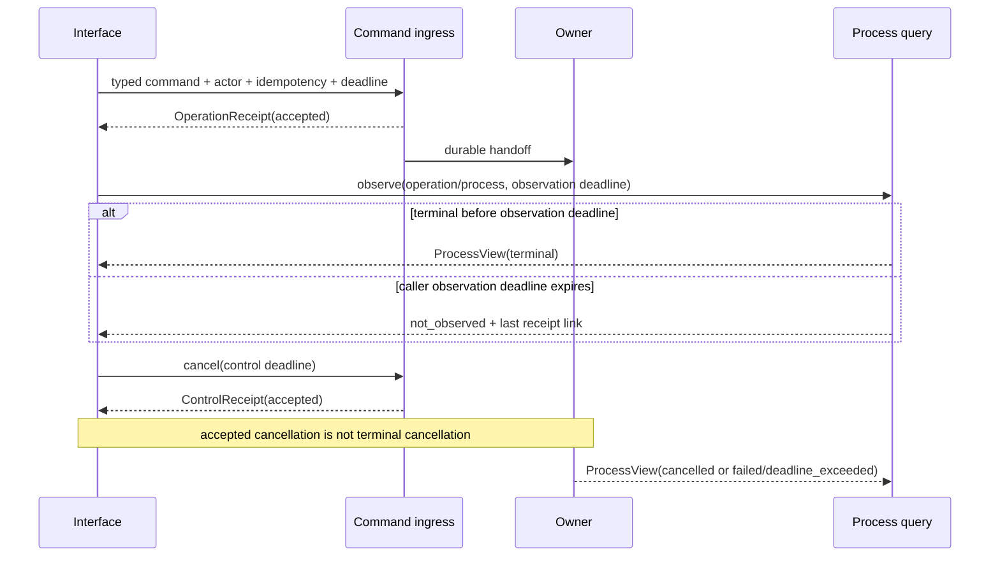
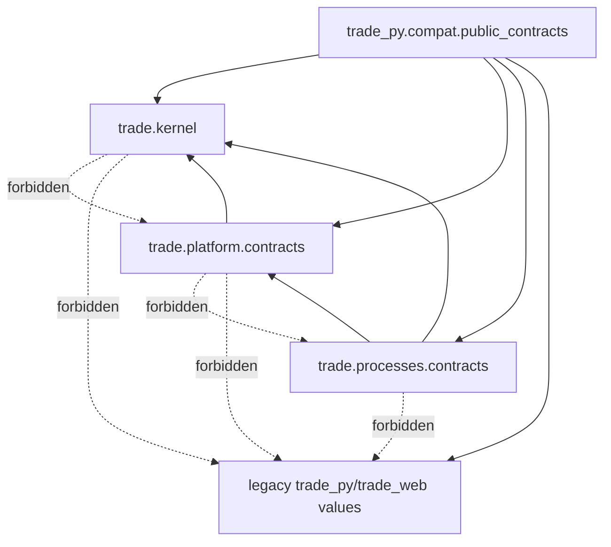

## Context

This is the second implementation child of the approved
`restructure-trade-architecture-v1` architecture. It is a Non-trivial,
cross-module public-contract and runtime-concurrency change. Design-quality
governance applies with the `public_contract` and `runtime_concurrency`
profiles. No implementation may start before six-role review and current-date
strict design approval.

### Current-state audit

The audit used source code at commit
`4fa6113a2cd603da5caef908ad5105fb9c49bff6`. Historical architecture documents
were treated as intent, not as current implementation.

| Current owner | Code fact | Contract problem | Child treatment |
|---|---|---|---|
| `trade_py.bus.Event` | Mutable event contains integer ID, arbitrary mapping and a live `EventBus` back-reference | Cannot cross a Context boundary or serialize without implementation leakage | Map only durable metadata; exclude `bus`; typed event payloads remain later Context work |
| `trade_py.bus.models` | Admission, lifecycle and capacity use several local enums; handler failure may carry a live `Exception` | Useful runtime facts, but not a stable public command/error schema | Preserve legacy enums; define separate closed public state families and safe errors |
| `trade_py.data.operations.contracts` | Operation and step statuses are open strings and evidence is `dict[str, Any]` | Data-operation semantics would be falsely generalized as global operation semantics | Keep Data Operations as legacy owner; do not re-export these DTOs |
| `trade_py.data.contracts` | Quality/freshness DTOs are mutable and contain business dataset semantics | They belong to Datasets, not Kernel or Platform | Defer to `dataset-product-boundary` |
| `trade_py.observatory.domain.models.ArtifactRef` | Frozen reference includes `relative_path` and Observatory run identity | Filesystem location and product-surface ownership are not a cross-context immutable reference | Preserve legacy shape; never expose its path through the new reference identity |
| `trade_py.observatory.domain.vocab.ObservatoryError` | Stable reason enum exists, but error payload accepts arbitrary `extra` and messages | A direct global promotion could leak unsafe fields and Observatory vocabulary | Use a whitelist mapper into a framework-free `ErrorEnvelope` |
| `trade_web.backend.runtime.commands` | Command admission has a useful bounded owner, process-group termination and persistent run audit | Start/result IDs are legacy integers, state names are local, and cleanup still contains `ThreadPoolExecutor.shutdown(wait=True)` | Preserve behavior; specify truthful control receipts and prohibit post-deadline unbounded joins for later adoption |
| `trade_web.backend.runtime.resources` | Web shutdown has a shared 10-second deadline and reports an incomplete stage | A timed-out daemon shutdown thread may remain; there is no public residual-work receipt | Define `ShutdownReceipt`; runtime adoption belongs to the Platform child |
| `trade_py.cli.event` and `trade_py.cli.run` | Existing waits include 300, 3600 and 7200 seconds; event wait timeout can retain legacy exit code zero | Long synchronous observation owns the caller and conflates command admission with completion | Freeze compatibility; new interfaces return receipt quickly and observe through `ProcessView` |
| `trade_web.backend.app:/api/run` | Stable success/failure payloads, 503 mapping and `Retry-After` are covered by tests | Shape differs from the target operation/error contracts | Add pure mapper fixtures; do not reroute the endpoint in this child |
| `TradeDB.job_runs` | Shared rows expose running/ok/error/terminated and recovery reconciliation | Status is not enough to prove user cancellation or process completion | Map conservatively; never infer `cancelled` without cancellation evidence |
| `pyproject.toml` | Distribution is `trade-py`; discovery includes only `trade_py*` and `scripts*` | `src/trade` is not currently installed in editable or wheel builds | Require a proven additive dual-root package discovery change or stop implementation |

The observed user symptom in this design session was a TRAE control-plane
review worker that did not return. The parent session stayed active and retained
an idle-only `systemd-inhibit` process. That inhibitor did not block system
shutdown; it was a symptom of retained process ownership. Trade runtime paths
already have several deadlines, but the audit found the general residual risk
that an outer bounded method may call an unbounded executor join during final
cleanup. This child specifies the contract; it does not modify either TRAE or
Trade production runtime behavior.

### Problems and root causes

1. Similar words such as `running`, `error`, `terminated`, `unknown`, and
   `unavailable` currently have owner-local meanings.
2. Current public-looking objects mix transport, domain and implementation
   details. Promoting them would make Kernel a new global dependency sink.
3. Integer IDs, raw idempotency keys, arbitrary dictionaries, exception text,
   paths and process IDs do not form a stable cross-interface contract.
4. Caller observation, owner execution and process cleanup deadlines are not
   represented as separate facts.
5. Cancellation request, cancellation acceptance, signal delivery, child exit
   and durable terminalization are distinct events but can be collapsed into
   one informal `terminated` status.
6. The target `src/trade` package is not yet discoverable by the current build.
   A source-only test import would hide a broken wheel contract.

### Constraints and stakeholders

CLI, HTTP, Web, SDK, notebook, scheduler and event users must retain current
external behavior until an owning compatibility child migrates them. Platform
and Processes need stable contracts without importing FastAPI, Pydantic,
SQLite, pandas, EventBus, `TradeDB`, concrete repositories or Web services.
Later Capture, Datasets, Studies and Decision Support children need immutable
reference identity without losing their own business semantics. Operators need
to distinguish accepted, still running, observation timed out, cancellation
requested, cancelled, failed, unavailable and shutdown incomplete.

## Goals / Non-Goals

**Goals:**

- Create the smallest target Kernel admitted by the parent architecture rules.
- Publish framework-free Platform and Processes contracts needed by the next
  Platform foundation child.
- Make actor provenance, operation/process identity and state transitions
  explicit and closed.
- Make immutable references content-bound and owner-preserving without paths or
  moving aliases.
- Make wire serialization deterministic, bounded and version-negotiated.
- Define truthful finite wait, cancellation and shutdown contracts.
- Preserve every current external contract through pure, one-way compatibility
  mapping and snapshot evidence.
- Prove source-tree, editable-install and wheel-install imports for both
  `trade_py` and the new `trade` package.

**Non-Goals:**

- No Context aggregate, business command/event, repository, adapter, provider,
  table, migration, artifact write, outbox, process manager or scheduler.
- No formal `CaptureArtifactRef`, `DatasetVersionRef`,
  `DatasetSnapshotRef`, `StudyResultRef`, release or revision semantics.
- No modification to CLI waits, HTTP routes, payloads, exit codes, EventBus,
  Web command execution, shutdown behavior or background process ownership.
- No global DTO facade and no `shared`, `common`, `utils`, `helpers`,
  `services` or catch-all `manager`.
- No Pydantic, FastAPI, ORM, pandas, native extension or new third-party
  runtime dependency.
- No package rename, console-script rename or removal of `trade_py`.

## Decisions

### 1. Add a narrow target package without performing the package migration

The intended modules are:

```text
src/trade/
├── __init__.py
├── kernel/
│   ├── ids.py
│   ├── time.py
│   ├── digest.py
│   ├── errors.py
│   ├── result.py
│   ├── envelope.py
│   └── refs.py
├── platform/
│   └── contracts/
│       ├── actor.py
│       ├── messages.py
│       ├── operations.py
│       ├── errors.py
│       └── control.py
└── processes/
    └── contracts/
        └── process_view.py

trade_py/
└── compat/
    └── public_contracts.py
```

The `trade` package imports no `trade_py` or `trade_web` module. The legacy
compatibility adapter points from `trade_py` to `trade`, never in the reverse
direction. Package `__init__` files export only reviewed stable symbols and do
not perform initialization.

Implementation first proves, in a disposable worktree, an additive package
discovery configuration that retains distribution name `trade-py`, root
`./trade`, console entry `trade-py`, all `trade_py` imports and adds installed
`trade` imports. It must pass source/editable/wheel smoke tests. If current
packaging cannot support both roots without a broader transition, implementation
stops and the `python-package-and-web-layout` ADR is promoted; a root shim,
symlink or `sys.path` mutation is forbidden.

Alternative: place contracts under `trade_py`. This avoids packaging work but
would establish the wrong dependency direction and require a second public
contract move. Alternative: perform the full package migration now. That
violates the independently reversible child sequence. The narrow additive
package wins if and only if install evidence passes.

### 2. Admit Kernel symbols individually

A type enters Kernel only when at least two future Contexts use identical
semantics, no Context owns it, it has no framework dependency, and it is
expected to remain stable. Kernel contains behavior for validation and canonical
representation, not orchestration.

Kernel does not contain actor, operation, process, query, dataset, study,
provider, portfolio or UI vocabulary. Those types live in owner contracts even
when they compose Kernel values.

The admitted primitives are:

| Module | Primitive | Invariant |
|---|---|---|
| `ids` | `OpaqueId`, `IdNamespace` | Non-empty bounded ASCII namespace/value; generated values use UUID4; ordering is never inferred |
| `time` | `UtcInstant`, `DurationMs`, `Deadline` | RFC3339 UTC `Z` on wire; aware datetime only; positive bounded duration; wall-clock deadline is evidence, monotonic time owns local waits |
| `digest` | `ContentDigest` | Algorithm is explicit; v1 permits SHA-256 lower hex only |
| `errors` | `ContractViolation`, `ContractErrorCode` | Safe structural validation errors only; no live cause or traceback on wire |
| `result` | `Result[T, E]` | Exactly one of value/error; no implicit truthiness or exception swallowing |
| `envelope` | `EnvelopeMeta`, `Envelope[T]` | Message/schema/correlation/causation/time metadata plus typed owner payload |
| `refs` | `ImmutableRefIdentity`, `PolicyRef` | Owner namespace, opaque object/version identity and digest; never path/current/latest |

Specific `OperationId`, `ProcessId`, `CaptureArtifactRef` and other named types
remain aliases or wrappers in their owning contracts. `OpaqueId` serializes as
`{"namespace": "...", "value": "..."}` so a legacy integer can be represented
without pretending it was generated globally.

### 3. Separate logical identity, content identity and location

`ImmutableRefIdentity` has:

```text
owner
kind
object_id
version
content_digest
```

The owner contract may add clocks, schema identity, lineage or policy fields.
The identity never contains a filesystem path, URI with credentials, DataFrame,
database key whose meaning requires a private table, or mutable alias.
`current`, `latest` and Web pointers remain projection selectors, never formal
inputs.

`PolicyRef` contains policy name, semantic version and content digest. It is an
identity, not the policy body. A later owner must prove that a reference is
committed before accepting it. This child does not certify an existing
Observatory artifact as a formal Dataset or Capture reference.

Alternative: content digest alone. It loses owner/type/version semantics and
cannot distinguish two interpretations of identical bytes. Alternative:
include storage location. It leaks adapters and makes relocation a contract
change. The composite identity keeps both immutability and ownership.

### 4. Use orthogonal closed state families

One universal status enum is rejected. The contracts use:

```text
AdmissionState:
  accepted | duplicate | rejected | saturated | unavailable

OperationState:
  requested | accepted | running | waiting | retry_scheduled |
  compensation_pending | completed | compensated | failed | blocked |
  cancelled | deadline_exceeded

ProcessState:
  requested | running | waiting | retry_scheduled |
  compensation_pending | completed | compensated | failed | blocked |
  cancelled | deadline_exceeded

ObservationState:
  observed | not_observed | unavailable | unknown

QueryCondition:
  present | empty | partial | stale | quarantined | blocked

ControlDisposition:
  accepted | already_terminal | denied | not_found | unavailable |
  deadline_exceeded

ShutdownState:
  completed | incomplete | deadline_exceeded | failed
```

`unknown`, `not_observed` and `unavailable` are not successful empty results.
`empty`, `partial`, `stale` and `quarantined` are conditions on an observed
query, not operation terminal states. `terminated` is not a target state:
legacy termination maps to `cancelled` only with durable cancellation intent
and terminal evidence; otherwise it maps to a safe failure/unknown observation.

State transition functions reject backward or impossible transitions. Terminal
operation/process states are `completed`, `compensated`, `failed`, `cancelled`
and `deadline_exceeded`; `blocked` is non-terminal unless an owning policy
explicitly closes it. The closed v1 taxonomy requires a new schema version to
add a value.

### 5. Establish actor trust at the transport boundary

`ActorContext` contains:

```text
schema_version
origin
principal_kind
principal_id
authority_scopes
delegation_chain
assurance
provenance
established_at
```

Origins are `cli`, `http`, `sdk`, `notebook`, `scheduler`, `event`, `import`,
and `system`. Principal kinds are `authenticated`, `system`, `anonymous`, and
`unknown`. Assurance is `verified`, `anonymous_allowed`, or `unverified`.
Delegation is bounded to eight immutable hops and scopes to 32 sorted unique
tokens.

An actor is established only from adapter-controlled evidence: authenticated
HTTP/session claims, local CLI process identity, registered schedule identity,
verified parent envelope, or Bootstrap system identity. Command payload fields
named `actor`, `user` or `principal` are data and cannot establish authority.
A wire-decoded actor is observational and `unverified` until a trusted adapter
re-establishes it from local evidence. Unknown actors are denied for mutation;
anonymous actors require an explicit command/query policy. Logs and receipts use
safe principal identifiers, never tokens, credentials or full claims.

Alternative: accept caller-provided actor dictionaries. It enables authority
spoofing. Alternative: put authentication framework objects in the contract.
It couples every Context to HTTP/auth implementation. Explicit provenance keeps
the boundary framework-free and auditable.

### 6. Define command, operation, process and query contracts

`CommandEnvelope[T]` and `QueryEnvelope[T]` compose `EnvelopeMeta`,
`ActorContext`, a deadline, and one typed owner DTO. Business command/query DTOs
are not defined here. Serialization requires the owner codec; arbitrary
`dict[str, Any]` payload admission is forbidden.

`OperationReceipt` contains:

```text
schema_version
operation_id
operation_kind
command_name
command_digest
actor
correlation_id
causation_id
idempotency_scope
idempotency_key_digest
state
reason_code
accepted_at
updated_at
terminal_at
process_id
```

The raw idempotency key and command payload are not exposed. A duplicate returns
the existing receipt. A failed durable claim returns an `ErrorEnvelope`; it
must not fabricate an operation ID.

`ProcessView` contains the parent-required process identity fields plus:

```text
observation_state
retry_limit
next_attempt_at
deadline
last_error
compensation_state
dead_letter_state
bounded_history
permitted_recovery_actions
updated_at
```

History has at most 50 transitions. Recovery actions are closed capabilities
(`cancel`, `retry`, `redrive`, `resume`, `inspect`) and are informational;
querying a view never executes them. No raw payload, SQL, table row, credential,
artifact bytes or traceback is exposed.

Owner query DTOs return typed data plus `QueryStatus`, which composes
`ObservationState` and, only when observed, a `QueryCondition`. Thus an
unavailable query cannot masquerade as an empty list.

### 7. Use a safe versioned error envelope

`ErrorEnvelope` contains:

```text
schema_name = "trade.error"
schema_version = 1
reason_code
category
observation_state
retryable
retry_after_ms
correlation_id
operation_id
process_id
occurred_at
safe_message
recovery_hint
```

Reason codes are uppercase namespaced tokens and stable within a schema
version. Categories are `invalid`, `denied`, `conflict`, `saturated`,
`unavailable`, `blocked`, `quarantined`, `stale`, `timeout`, `cancelled`, and
`internal`. Messages and hints are bounded, operator-safe text. There is no
arbitrary `extra`, traceback, exception object, credential, path, SQL or raw
payload. A legacy adapter whitelists fields and supplies a stable generic
message when safety cannot be proved.

HTTP status and CLI exit code are compatibility-adapter decisions, not fields
owned by the error. This allows current `/api/run` 503 and current CLI exit
behavior to remain unchanged while SDK and future interfaces share reason
semantics.

### 8. Canonical serialization is exact, deterministic and bounded

Each wire DTO declares `schema_name` and integer `schema_version`. Version 1
decoders accept exactly version 1 and reject unknown required/optional fields;
producers negotiate against an explicit accepted-version set. Additive wire
fields therefore require a new version or a separately specified compatibility
projection. No decoder silently drops unknown fields.

Canonical JSON is UTF-8, sorted by key, compact separators, `allow_nan=False`,
RFC3339 UTC `Z`, enum values as strings, integers only for durations/counts,
and no binary or floating point values. Limits are:

| Dimension | v1 limit |
|---|---:|
| Encoded envelope | 64 KiB |
| Nesting depth | 8 |
| String | 2 KiB |
| Collection items | 100 |
| Actor scopes | 32 |
| Delegation hops | 8 |
| Process history | 50 |
| Safe error message/hint | 1 KiB each |

Validation occurs before object construction and before digest calculation.
Command digest uses canonical bytes of the typed command DTO and excludes
transport retry metadata. Serialization failure is a contract error, never a
fallback to `str(object)` or `default=str`.

### 9. Bound observation, cancellation and shutdown truthfully

There are three separate deadlines:

1. `owner_deadline`: durable policy deadline for operation/process work.
2. `control_deadline`: finite deadline to accept and apply cancel/shutdown.
3. `observation_deadline`: caller's finite wait for a newer view.

An observation timeout changes no owner state. It returns
`ObservationState.not_observed` plus a timeout error and the last receipt/view
link. A cancellation request returning `accepted` means intent was durably
accepted, not that work is cancelled. `OperationState.cancelled` requires the
owner's terminal receipt. Signal delivery alone is not terminal evidence.

`ShutdownReceipt` includes owner identity, control ID, requested/deadline/
completed timestamps, state, graceful/forced termination counts, residual
owner counts by bounded category, and a safe error. `completed` requires zero
owned live work and released non-reentrant resources. `deadline_exceeded` or
`incomplete` retains residual ownership evidence and must not release an owner
fence that could admit a second writer.

Every public wait/control API requires a finite deadline. A bounded method must
not perform `Thread.join()`, `Future.result()`, executor shutdown, subprocess
wait, lock acquisition, queue drain or persistence retry without passing the
remaining shared deadline. Potentially non-terminable work uses an owned child
process or remote worker with process-tree termination; Python threads are not
claimed as killable. Reaching a deadline stops new admission, preserves the
last durable receipt and returns control. Cleanup may continue only in a
daemon/isolated owner that cannot retain a writer lease or keep the caller
blocked.



This contract directly prevents a non-returning reviewer, worker or child
process from keeping an interface call open indefinitely once adopted by the
owning runtime. Adoption is deferred to Platform/Processes/Interfaces children.

### 10. Preserve legacy behavior with one-way explicit mappers

The compatibility adapter is pure and read-only. It accepts legacy values and
produces target DTOs or target DTOs plus existing response snapshots. It never
calls a `TradeDB` mutation method or SQL mutation primitive, accesses
`db._conn`, calls a provider, changes a pointer, signals a process or imports
Web/FastAPI types.

| Legacy surface | Canonical interpretation | Preserved legacy behavior | Refusal/fallback |
|---|---|---|---|
| EventBus accepted event | Durable legacy event identity and accepted/waiting observation | Existing event ID/topic/output | Live `bus` and untyped payload are excluded |
| EventBus saturated/submission failure after durable insert | Accepted durable event with deferred/retry or explicit dispatch error, not “not persisted” | Existing deferred output/tempfail mapping | No fabricated process completion |
| `job_runs.running` | Running only when observed row is current | Existing row/status | Stale/owner-lost remains explicit |
| `job_runs.ok` | Completed | Existing `ok` | No inferred business result |
| `job_runs.error` | Failed | Existing `error` | Raw result summary is not public error text |
| `job_runs.terminated` | Cancelled only with durable cancel intent; otherwise failed/unknown terminal observation | Existing `terminated` | Never infer user cancellation from signal/exit alone |
| `/api/run` accepted | Operation receipt only when `run_id` was durably created | Exact current 200 payload including PID | PID remains legacy payload, not canonical receipt |
| `/api/run` failure | Versioned error reason and admission state | Exact 503 body and `Retry-After` snapshot | No operation ID when persistence failed |
| CLI event wait timeout | Command remains accepted; observation timed out | Current output/exit compatibility until interface child | Must not report canonical completion |
| Observatory error | Whitelisted reason/retry semantics | Existing route snapshot | Arbitrary `extra` and unsafe message are dropped |
| Observatory artifact | Legacy artifact observation only | Existing model unchanged | `relative_path` is never a formal immutable reference |
| Runtime shutdown exception | Incomplete/unknown shutdown error | Existing exception behavior | No parsing of free-form error text into fake residual counts |

Each mapper has a named source version, target version, owner, lossiness record,
snapshot, retirement condition and refusal test. Unknown legacy statuses fail
closed to `ObservationState.unknown` and an error; they never map to success.

### 11. This child has no durable state

No new table, schema, migration, file format, artifact, manifest or data root is
introduced. DTOs are immutable in-memory values. Tests use literals and
temporary build/install roots. Operation/process persistence and outbox
transactions belong to
`platform-persistence-events-and-bootstrap-foundation`.

## Code Dependency Graph



## Design Quality Brief

### Requirements and acceptance

Platform and Processes callers can import stable framework-free contracts from
an installed wheel without loading `trade_py.db`, FastAPI, pandas, Web runtime
or a native extension. Round trips retain exact values and reject unsafe,
unknown-version or over-budget input. Actor trust cannot be acquired from
payload deserialization. Unknown/not-observed/unavailable and
accepted/cancelled/completed remain distinct. Existing CLI/HTTP/EventBus/
job-runs/Observatory snapshots do not change. Bounded-control tests prove a
deadline returns with explicit residual state and never invokes an unbounded
tail join.

### Ownership and boundaries

Kernel owns only generic identity/time/digest/result/envelope/reference
primitives. Platform contracts own actors, command/query metadata, operations,
safe errors and controls. Processes contracts own `ProcessView` and process
state. Business references remain future Context contracts. The legacy adapter
owns mapping and imports target contracts; target packages never import legacy
implementation. Package configuration owns additive discovery only, while the
later package-layout child owns canonical distribution migration.

### Data and state invariants

IDs are opaque and immutable; digests are algorithm-bound; times are UTC and
aware; local elapsed deadlines use monotonic time. Reference identity includes
owner/kind/object/version/digest and no location. Contract states use closed
families and validated transitions. Terminal timestamps exist only for terminal
states. Duplicate command identity returns the same operation. Cancellation
acceptance is not cancellation completion. A completed shutdown has no residual
owned work. Query observation and data condition are orthogonal.

### Contracts and compatibility

The new contract version is exact v1 canonical JSON. Existing route paths,
methods, status codes, payloads, CLI names/arguments/output/exit codes, SSE,
EventBus topics, DB schema, parquet, artifacts and C++ ABI remain unchanged.
Pure mappers are additive and one-way. Distribution remains `trade-py`;
`trade_py` remains installed; `trade` is added only after source/editable/wheel
evidence. Unknown legacy values fail closed and no formal Context ref is
invented from an incomplete legacy object.

### Failure and recovery

Invalid IDs/times/digests/transitions, unknown schema versions, forbidden
fields, oversized/deep payloads and unsafe actor provenance return structural
contract errors. Unavailable persistence cannot fabricate a receipt. Caller
timeout preserves owner state and last links. Control timeout returns residual
work; cancelled requires terminal evidence. A failed additive package proof
stops implementation. Since there is no durable state, rollback stops new
consumers and removes the new package/mappers; old paths remain usable.

### Performance and capacity

DTO construction and canonical serialization are linear in bounded input.
Wire bytes, nesting, strings, collections, scopes, delegation and process
history have fixed limits. No queue, worker, polling loop, database call,
network call or artifact read exists in this child. Control tests use one shared
deadline across all cleanup stages and assert elapsed upper bounds at 1x and
10x residual-owner fixtures. No claim about production throughput is made.

### Persistent-write safety

This child has no authoritative durable writer and admits no runtime mutation
path. The target package constructs immutable values in memory; canonical
serialization returns bytes to its caller but does not choose or open a
destination. The compatibility mapper is pure and is prohibited from repository
mutation methods, SQL mutation primitives, private connections, provider calls,
pointer movement, process signals and repair. Tests replace these capabilities
with fail-fast sentinels and use disposable build/install roots only.

There is therefore no idempotent durable key, transaction, staging generation,
visibility cutover, crash-recovery row, backup or reader-consistency transition
owned by this child. Those obligations begin in the Platform persistence child.
If implementation discovers that package or contract validation requires a
durable cache, registry, generated manifest or migration, work stops and this
impact declaration/design must be reviewed again. Rollback removes only
source/config/tests after new consumers are stopped; no runtime state is
deleted, restored or reinterpreted.

### Observability and operations

Receipts carry correlation, operation and process links plus safe reason codes.
Process views expose deadline, step, retry, compensation, dead-letter,
observation and permitted recovery facts with bounded history. Shutdown
receipts expose residual ownership. Operators can distinguish empty, partial,
stale, quarantined, blocked, unknown, not observed, unavailable and failed.
Credentials, raw payloads, paths, SQL, exception text and tracebacks are not
public telemetry.

### Validation strategy

Unit tests cover every primitive invariant and transition. Contract tests cover
canonical bytes, round trip, version negotiation, unknown fields, size/depth
limits and no forbidden runtime types/imports. Actor tests cover trusted local
sources, payload spoofing, anonymous policy and wire downgrade. Legacy snapshots
cover EventBus, job runs, `/api/run`, CLI wait timeout, Observatory error/ref
and shutdown-incomplete mapping. Concurrency fixtures cover observation
deadline, cancellation acceptance versus terminalization, process-tree control,
residual work and an executor whose final join would block. Packaging tests
cover source, editable and clean wheel environments. Existing focused tests run
unchanged.

### Alternatives and trade-offs

Promoting current DTOs is fast but preserves implementation leaks and semantic
collisions. A framework model such as Pydantic improves generated schemas but
violates Kernel independence and forces all consumers onto one framework.
Loose dictionaries maximize forward compatibility but lose validation,
determinism and safety. A universal status enum appears simple but collapses
orthogonal facts. Full package migration would make installation straightforward
but creates a broad rollback surface. The chosen explicit dataclasses, owner
contracts, exact versions, orthogonal states and narrow additive discovery have
more mapper code but preserve ownership and incremental rollback.

### Rollout and rollback

Implementation uses a dedicated worktree after strict approval. First prove
dual-root packaging in isolation; then add Kernel; then Platform and Processes
contracts; then pure legacy mappers and tests. No current caller is rerouted.
Each unit is committed separately and can be reverted independently. A failed
packaging, snapshot, import-isolation, actor or bounded-control test blocks
delivery. Rollback removes new consumers first, retains old DTO/import/payload
paths, and then reverts the additive files/config. No data restore is needed.

## Risks / Trade-offs

- **The contract package starts the `src/trade` layout earlier than the full
  package-layout child** -> Limit it to framework-free contracts, prove all
  install modes, retain distribution/console/import compatibility, and stop if
  dual discovery is not clean.
- **A generic primitive becomes a new catch-all** -> Enforce the five Kernel
  admission tests and architecture guard; owner vocabulary stays outside.
- **Exact version decoding causes upgrade coordination** -> Require explicit
  accepted-version negotiation and parallel codecs; never silently ignore
  unknown fields.
- **Legacy state mapping overstates certainty** -> Use conservative mapping,
  lossiness records and `unknown`/`not_observed`; require durable evidence for
  cancellation or completion.
- **Actor provenance is treated as authentication by name only** -> Wire decode
  always downgrades assurance; only trusted adapter evidence can establish it;
  mutation rejects unknown actors.
- **A deadline returns while a thread still owns a writer or lock** -> Report
  incomplete residual ownership, keep the fence closed, and require process
  isolation before adopting unkillable work.
- **Compatibility tests accidentally freeze unsafe exception text or PID as a
  canonical field** -> Freeze them only in legacy snapshots; canonical
  contracts exclude both.
- **Formal immutable references are declared before PIT/revision proof** ->
  This child defines identity policy only; named Dataset/Capture/Study refs
  remain blocked on their owning child.

## Migration Plan

1. Run diagnostic design checking, six-role review, resolve all P0 and
   implementation-blocking P1, and obtain current-date strict approval.
2. Create a dedicated implementation worktree and invoke the code-quality
   workflow.
3. Prove additive dual-root package discovery in temporary source, editable and
   wheel installs. Stop and promote a package ADR if it fails.
4. Implement Kernel primitives and invariant/serialization tests.
5. Implement Platform public actor/message/operation/error/control contracts
   and tests.
6. Implement Processes `ProcessView` contracts and transition/history tests.
7. Implement one-way legacy compatibility mappers and snapshots without
   rerouting current callers.
8. Run focused and existing compatibility suites, compile/build/import checks,
   architecture guard, quality plan/check and whitespace validation.
9. Run six-role implementation review and resolve every P0 before squash merge.

Rollback at every step is code/config reversion only. There is no schema,
artifact or runtime-state migration.

## Open Questions

No unresolved question authorizes implementation. The later owning children
must still decide:

- which current CLI/HTTP mutation is the first to route through durable command
  ingress;
- when the 300/3600/7200-second compatibility waits can become asynchronous
  receipt observation;
- which Context first publishes a concrete immutable reference;
- when the complete distribution/import transition can retire `trade_py`.

Those decisions do not change this child's type invariants. Any change to the
module graph, wire schema, state taxonomy, actor trust or bounded-control rules
invalidates review evidence and requires renewed strict approval.
