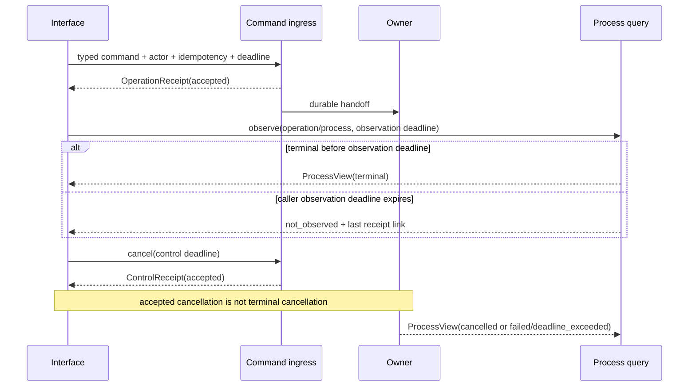
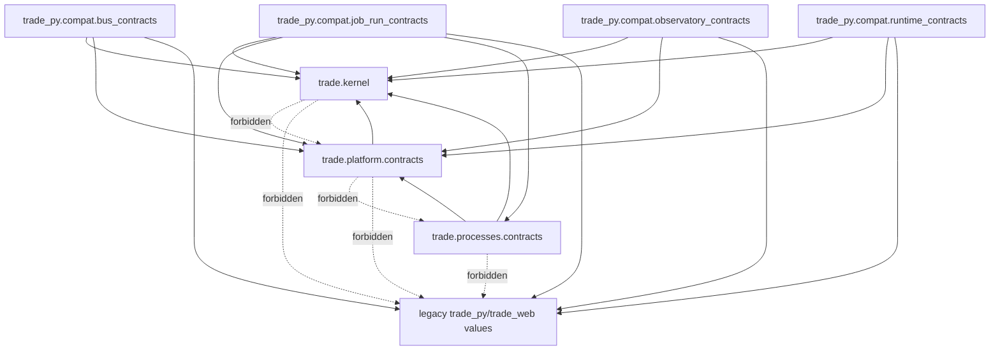

## Context

This is the second implementation child of the approved
`restructure-trade-architecture-v1` architecture. It is a Non-trivial,
cross-module public-contract and runtime-concurrency change. Design-quality
governance applies with the `public_contract` and `runtime_concurrency`
profiles. No implementation may start before six-role review and current-date
strict design approval.

### Current-state audit

The audit used source code at commit
`4fa6113a2cd603da5caef908ad5105fb9c49bff6`. Historical architecture documents
were treated as intent, not as current implementation.

| Current owner | Code fact | Contract problem | Child treatment |
|---|---|---|---|
| `trade_py.bus.Event` | Mutable event contains integer ID, arbitrary mapping and a live `EventBus` back-reference | Cannot cross a Context boundary or serialize without implementation leakage | Map only durable metadata; exclude `bus`; typed event payloads remain later Context work |
| `trade_py.bus.models` | Admission, lifecycle and capacity use several local enums; handler failure may carry a live `Exception` | Useful runtime facts, but not a stable public command/error schema | Preserve legacy enums; define separate closed public state families and safe errors |
| `trade_py.data.operations.contracts` | Operation and step statuses are open strings and evidence is `dict[str, Any]` | Data-operation semantics would be falsely generalized as global operation semantics | Keep Data Operations as inventoried legacy-only owner; add no canonical mapper until the Dataset/interface owner defines it |
| `trade_py.data.contracts` | Quality/freshness DTOs are mutable and contain business dataset semantics | They belong to Datasets, not Kernel or Platform | Defer to `dataset-product-boundary` |
| `trade_py.observatory.domain.models.ArtifactRef` | Frozen reference includes `relative_path` and Observatory run identity | Filesystem location and product-surface ownership are not a cross-context immutable reference | Preserve legacy shape; never expose its path through the new reference identity |
| `trade_py.observatory.domain.vocab.ObservatoryError` | Stable reason enum exists, but error payload accepts arbitrary `extra` and messages | A direct global promotion could leak unsafe fields and Observatory vocabulary | Use a whitelist mapper into a framework-free `ErrorEnvelope` |
| `trade_web.backend.runtime.commands` | Command admission has a useful bounded owner, process-group termination and persistent run audit | Start/result IDs are legacy integers, state names are local, and cleanup still contains `ThreadPoolExecutor.shutdown(wait=True)` | Preserve behavior; specify truthful control receipts and prohibit post-deadline unbounded joins for later adoption |
| `trade_web.backend.runtime.resources` | Web shutdown has a shared 10-second deadline and reports an incomplete stage | A timed-out daemon shutdown thread may remain; there is no public residual-work receipt | Define `ShutdownReceipt`; adoption is gated by `runtime-owner-shutdown-and-recovery-hardening-v1` |
| `trade_py.cli.event` and `trade_py.cli.run` | Existing waits include 300, 3600 and 7200 seconds; event wait timeout can retain legacy exit code zero | Long synchronous observation owns the caller and conflates command admission with completion | Freeze compatibility; new interfaces return receipt quickly and observe through `ProcessView` |
| `trade_web.backend.app:/api/run` | Stable success/failure payloads, 503 mapping and `Retry-After` are covered by tests | Shape differs from the target operation/error contracts | Add pure mapper fixtures; do not reroute the endpoint in this child |
| `TradeDB.job_runs` | Shared rows expose running/ok/error/terminated; schema defaults are naive UTC while ordinary writes use naive local time | Status is not enough to prove user cancellation/process completion, and mixed-origin naive timestamps cannot prove a UTC instant or freshness | Preserve time tokens as bounded `unproven` observations; never infer `cancelled`, `UtcInstant` or current ownership without separate evidence |
| `pyproject.toml` | Distribution is `trade-py`; discovery includes only `trade_py*` and `scripts*` | `src/trade` is not currently installed in editable or wheel builds | Require a proven additive dual-root package discovery change or stop implementation |

The observed user symptom in this design session was a TRAE control-plane
review worker that did not return. The parent session stayed active and retained
an idle-only `systemd-inhibit` process. That inhibitor did not block system
shutdown; it was a symptom of retained process ownership. Trade runtime paths
already have several deadlines, but the audit found the general residual risk
that an outer bounded method may call an unbounded executor join during final
cleanup. This child specifies the contract; it does not modify either TRAE or
Trade production runtime behavior.

### Problems and root causes

1. Similar words such as `running`, `error`, `terminated`, `unknown`, and
   `unavailable` currently have owner-local meanings.
2. Current public-looking objects mix transport, domain and implementation
   details. Promoting them would make Kernel a new global dependency sink.
3. Integer IDs, raw idempotency keys, arbitrary dictionaries, exception text,
   paths and process IDs do not form a stable cross-interface contract.
4. Caller observation, owner execution and process cleanup deadlines are not
   represented as separate facts.
5. Cancellation request, cancellation acceptance, signal delivery, child exit
   and durable terminalization are distinct events but can be collapsed into
   one informal `terminated` status.
6. The target `src/trade` package is not yet discoverable by the current build.
   A source-only test import would hide a broken wheel contract.
7. The parent normative specs and task sequence place durable command ingress
   and `OperationReceipt` in Platform, but one parent ownership-table row
   combines operation receipts and process state under Processes. A repository
   implementation could misread that prose as dual ownership.
8. Canonical JSON settings alone do not choose among all legal Unicode and
   escape spellings. Fingerprinted bytes need one exact output grammar.

### Constraints and stakeholders

CLI, HTTP, Web, SDK, notebook, scheduler and event users must retain current
external behavior until an owning compatibility child migrates them. Platform
and Processes need stable contracts without importing FastAPI, Pydantic,
SQLite, pandas, EventBus, `TradeDB`, concrete repositories or Web services.
Later Capture, Datasets, Studies and Decision Support children need immutable
reference identity without losing their own business semantics. Operators need
to distinguish accepted, still running, observation timed out, cancellation
requested, cancelled, failed, unavailable and shutdown incomplete.

## Goals / Non-Goals

**Goals:**

- Create the smallest target Kernel admitted by the parent architecture rules.
- Publish framework-free Platform and Processes contracts needed by the next
  Platform foundation child.
- Make actor provenance, operation/process identity and state transitions
  explicit and closed.
- Make immutable references content-bound and owner-preserving without paths or
  moving aliases.
- Make wire serialization deterministic, bounded and version-negotiated.
- Define truthful finite wait, cancellation and shutdown contracts.
- Preserve every current external contract through pure, one-way compatibility
  mapping and snapshot evidence.
- Prove source-tree, editable-install and wheel-install imports for both
  `trade_py` and the new `trade` package.

**Non-Goals:**

- No Context aggregate, business command/event, repository, adapter, provider,
  table, migration, artifact write, outbox, process manager or scheduler.
- No formal `CaptureArtifactRef`, `DatasetVersionRef`,
  `DatasetSnapshotRef`, `StudyResultRef`, release or revision semantics.
- No modification to CLI waits, HTTP routes, payloads, exit codes, EventBus,
  Web command execution, shutdown behavior or background process ownership.
- No global DTO facade and no `shared`, `common`, `utils`, `helpers`,
  `services` or catch-all `manager`.
- No Pydantic, FastAPI, ORM, pandas, native extension or new third-party
  runtime dependency.
- No package rename, console-script rename or removal of `trade_py`.

## Decisions

### 1. Add a narrow target package without performing the package migration

The intended modules are:

```text
src/trade/
├── __init__.py
├── kernel/
│   ├── ids.py
│   ├── time.py
│   ├── digest.py
│   ├── errors.py
│   ├── result.py
│   └── envelope.py
├── platform/
│   └── contracts/
│       ├── actor.py
│       ├── messages.py
│       ├── operations.py
│       ├── errors.py
│       └── control.py
└── processes/
    └── contracts/
        └── process_view.py

trade_py/
└── compat/
    ├── bus_contracts.py
    ├── job_run_contracts.py
    ├── observatory_contracts.py
    └── runtime_contracts.py
```

The `trade` package imports no `trade_py` or `trade_web` module. The legacy
compatibility adapter points from `trade_py` to `trade`, never in the reverse
direction. Package `__init__` files export only reviewed stable symbols and do
not perform initialization. There is no aggregate compatibility re-export:
each mapper is named for one legacy owner, imports only the target contracts it
maps, and cannot be imported from `trade`, `trade.platform`, or
`trade.processes`.

This child is a narrow prerequisite exception to the parent migration order,
not the canonical Python-layout migration. Implementation first proves in a
disposable worktree that the existing setuptools backend can discover the root
`trade_py*` packages and `src/trade*` packages through explicit, deterministic
package-dir/discovery configuration while retaining distribution name
`trade-py`, root executable `./trade`, console entry `trade-py`, and all
installed `trade_py` imports. The proof builds one wheel only. It inventories
wheel members, installs that exact artifact in an isolated temporary
environment with dependencies disabled and network access denied, and imports
only modules whose declared dependencies are standard-library or already
provided by the locked test environment. Editable and source checks reuse the
locked repository environment; they do not reinstall the heavy dependency
set. The proof also checks that repository cwd is absent from the clean-wheel
interpreter path.

If explicit dual-root discovery cannot pass without backend replacement,
ambiguous package ownership, duplicated modules, or broad package movement,
implementation stops before adding `src/trade`. The
`python-package-and-web-layout` ADR is then promoted and this child is blocked.
A root shim, symlink, import hook, generated package mirror or `sys.path`
mutation is forbidden. The later layout child remains responsible for moving
legacy Python/Web code and declaring the canonical distribution layout.

Alternative: place contracts under `trade_py`. This avoids packaging work but
would establish the wrong dependency direction and require a second public
contract move. Alternative: perform the full package migration now. That
violates the independently reversible child sequence. The narrow additive
package wins if and only if install evidence passes.

### 2. Admit Kernel symbols individually

A type enters Kernel only when at least two future Contexts use identical
semantics, no Context owns it, it has no framework dependency, and it is
expected to remain stable. Kernel contains behavior for validation and canonical
representation, not orchestration.

Kernel does not contain actor, operation, process, query, dataset, study,
provider, portfolio or UI vocabulary. Those types live in owner contracts even
when they compose Kernel values.

The admitted primitives are:

| Module | Primitive | Invariant |
|---|---|---|
| `ids` | `OpaqueId`, `IdNamespace` | Namespace is 1-64 ASCII lower-case letters/digits plus `._-`; value is 1-128 printable ASCII characters excluding whitespace/control; generated values use UUID4; ordering is never inferred |
| `time` | `UtcInstant`, `DurationMs`, `Deadline` | Sole wire form `YYYY-MM-DDTHH:MM:SS.ffffffZ`; four-digit year `0001..9999`, seconds `00..59`, exact microsecond precision and literal `Z`; direct construction accepts only aware zero-offset datetime; duration is integer 1-86,400,000 ms; wall-clock deadline is evidence, monotonic time owns local waits |
| `digest` | `ContentDigest` | Algorithm is explicit; v1 permits SHA-256 lower hex only |
| `errors` | `ContractViolation`, `ContractErrorCode` | Closed code plus UTF-8 detail of at most 1,024 bytes; no live cause or traceback on wire |
| `result` | `Result[T, E]` | Exactly one of value/error; no implicit truthiness or exception swallowing |
| `envelope` | `EnvelopeMeta`, `Envelope[T]` | Message/schema/correlation/causation/time metadata plus typed owner payload |

Specific `OperationId`, `ProcessId`, `CaptureArtifactRef` and other named types
remain aliases or wrappers in their owning contracts. `OpaqueId` serializes as
`{"namespace": "...", "value": "..."}` so a legacy integer can be represented
without pretending it was generated globally.

### 3. Keep immutable references and policy identities owner-local

The parent-approved Kernel does not contain a generic reference module. Each
business owner defines its named immutable reference in its own `contracts/`
package. Every such DTO must carry the following semantic fields, but there is
no shared `ImmutableRefIdentity` implementation:

```text
owner
kind
object_id
version
content_digest
```

The owner contract may add clocks, schema identity, lineage or policy fields.
The owner DTO never contains a filesystem path, URI with credentials,
DataFrame, database key whose meaning requires a private table, or mutable alias.
`current`, `latest` and Web pointers remain projection selectors, never formal
inputs.

Likewise, a future `PolicyRef` is declared by the consuming owner and contains
policy namespace/name, semantic version and content digest. It identifies
content but does not prove existence, approval, authorization, compatibility,
publication, quality or PIT validity. This child specifies the policy and
negative contract fixtures only; it implements no shared reference type and
does not certify an existing Observatory artifact as a formal Dataset or
Capture reference.

Alternative: content digest alone. It loses owner/type/version semantics and
cannot distinguish two interpretations of identical bytes. Alternative:
include storage location. It leaks adapters and makes relocation a contract
change. The composite identity keeps both immutability and ownership.

### 4. Use orthogonal closed state families

One universal status enum is rejected. The contracts use:

```text
AdmissionState:
  accepted | duplicate | rejected | saturated | unavailable

OperationState:
  requested | accepted | running | waiting | retry_scheduled |
  compensation_pending | completed | compensated | failed | blocked |
  cancelled | deadline_exceeded

ProcessState:
  requested | running | waiting | retry_scheduled |
  compensation_pending | completed | compensated | failed | blocked |
  cancelled | deadline_exceeded

ObservationState:
  observed | not_observed | unavailable | unknown

QueryCondition:
  present | empty | partial | stale | quarantined | blocked

ControlDisposition:
  accepted | already_terminal | denied | not_found | unavailable |
  deadline_exceeded

ShutdownState:
  completed | incomplete | deadline_exceeded | failed
```

`unknown`, `not_observed` and `unavailable` are not successful empty results.
`empty`, `partial`, `stale` and `quarantined` are conditions on an observed
query, not operation terminal states. `terminated` is not a target state:
legacy termination maps to `cancelled` only with durable cancellation intent
and terminal evidence; otherwise it maps to a safe failure/unknown observation.

State transition functions reject backward or impossible transitions. Terminal
operation/process states are `completed`, `compensated`, `failed`, `cancelled`
and `deadline_exceeded`; `blocked` is non-terminal unless an owning policy
explicitly closes it. The closed v1 taxonomy requires a new schema version to
add a value.

The v1 transition relation is exact. Re-emitting the same state is allowed only
as an idempotent observation with no changed terminal fact; every other pair is
rejected:

| State | Allowed next operation states |
|---|---|
| `requested` | `accepted`, `failed`, `cancelled`, `deadline_exceeded` |
| `accepted` | `running`, `waiting`, `retry_scheduled`, `blocked`, `completed`, `failed`, `cancelled`, `deadline_exceeded` |
| `running` | `waiting`, `retry_scheduled`, `compensation_pending`, `blocked`, `completed`, `failed`, `cancelled`, `deadline_exceeded` |
| `waiting` | `running`, `retry_scheduled`, `blocked`, `failed`, `cancelled`, `deadline_exceeded` |
| `retry_scheduled` | `running`, `waiting`, `blocked`, `failed`, `cancelled`, `deadline_exceeded` |
| `compensation_pending` | `compensated`, `blocked`, `failed`, `deadline_exceeded` |
| `blocked` | `running`, `retry_scheduled`, `compensation_pending`, `failed`, `cancelled`, `deadline_exceeded` |
| terminal state | none |

`ProcessState` omits `accepted`; its exact relation is the same table with
`requested -> running|waiting|failed|cancelled|deadline_exceeded` and no
transition to or from `accepted`. `terminal_at` is absent for non-terminal
states, required for a terminal state, set once, and cannot precede
`accepted_at`/`started_at` or follow `updated_at`.

`QueryStatus` is a tagged union, not two independent nullable fields. Its v1
state product is exact; the error's `observation_state` must equal the status
observation:

| Observation | Condition | Error |
|---|---|---|
| `observed` | `present` or `empty` | forbidden |
| `observed` | `partial` | required; category `unavailable` |
| `observed` | `stale` | required; category `stale` |
| `observed` | `quarantined` | required; category `quarantined` |
| `observed` | `blocked` | required; category `blocked` |
| `not_observed` | forbidden | required; category `timeout` |
| `unavailable` | forbidden | required; category `unavailable` |
| `unknown` | forbidden | required; category `internal` |

An owner-specific reason code refines a permitted row but cannot change its
category. Consequently `observed` without a condition, a healthy condition with
an error, an unhealthy condition without its required error, a mismatched error
observation/category, and every non-observed value with a condition are invalid
wire and object states.

### 5. Establish actor trust at the transport boundary

`ActorContext` contains:

```text
schema_version
origin
principal_kind
principal_id
authority_scopes
delegation_chain
assurance
provenance
established_at
```

Origins are `cli`, `http`, `sdk`, `notebook`, `scheduler`, `event`, `import`,
and `system`. Principal kinds are `authenticated`, `system`, `anonymous`, and
`unknown`. Assurance is `verified`, `anonymous_allowed`, or `unverified`.
Delegation is bounded to eight immutable hops and scopes to 32 sorted unique
tokens. Each scope is 1-96 ASCII lower-case letters/digits plus `._:-`.
Principal and evidence identities use `OpaqueId`; delegation entries are
`ActorProvenanceRef` values and the encoded chain remains subject to the global
node/byte budgets.

`provenance` is a bounded `ActorProvenanceRef`, never a mapping. It contains
`provenance_type` (one of `cli_process`, `http_session`, `sdk_credential`,
`notebook_session`, `schedule_lease`, `parent_envelope`, `import_session`, or
`bootstrap_identity`), verifier namespace, opaque evidence ID, establishment
time, optional expiry, and a reason code. Verifier namespace and reason code
obey the 64/96-byte token limits below; the encoded provenance reference is at
most 1,024 bytes. It contains no credential, claim set, IP-derived authority,
environment dump or raw parent payload.

An actor is established only from adapter-controlled evidence: authenticated
HTTP/session claims, local CLI process identity, registered schedule identity,
verified parent envelope, or Bootstrap system identity. Command payload fields
named `actor`, `user` or `principal` are data and cannot establish authority.
A wire-decoded actor is observational and `unverified` until a trusted adapter
re-establishes it from local evidence. Unknown actors are denied for mutation;
anonymous actors require an explicit command/query policy. Logs and receipts use
safe principal identifiers, never tokens, credentials or full claims.

Command idempotency does not hash the mutable `ActorContext`. A separate exact
`IdempotencySubjectV1` contains schema version, owner namespace, tenant ID,
principal kind, principal ID and zero to eight ordered delegated-subject IDs.
Only authenticated/system principals have such a subject. Origin, authority
scopes, assurance, provenance/evidence IDs, establishment/expiry time and
credentials are excluded. Reauthentication or permission changes for the same
tenant/principal/delegation therefore resolve one claim, while equal permissions
for different principals, different tenants or a different ordered delegation
chain cannot collide. Anonymous/unknown mutation is denied before
fingerprinting. The subject wire value is the exact canonical JSON object with
all six fields and an always-present delegation array. Idempotency HMAC input is
the ordered domain, subject bytes, UTF-8 command scope and raw key bytes, each
framed by an unsigned four-byte big-endian byte length; delimiter joins,
`str()` conversion and omitted empty arrays are invalid.

Origin names the verified trust-establishment channel rather than a product
protocol. GraphQL over HTTP remains `http`, a local TUI remains `cli`, MCP uses
its actual authenticated CLI/HTTP/SDK channel, and a remote worker uses its
verified Platform execution/event channel. A genuinely different trust semantic
requires a versioned origin extension.

Durable replay keeps historical bytes and attribution immutable but never
revives historical authority. `ReplayContextV1` separately names the replay
request message, historical message/actor attribution, current verified replay
initiator and immutable replay policy reference. Decoded historical actors are
unverified attribution. Redispatch and replay-derived commands use current
replay-initiator plus owner/Process policy; expired/revoked historical
provenance grants nothing. A derived mutating command establishes a current
idempotency subject rather than reusing the historical subject.

`ReplayAdmissionV1` binds one `ReplayContextV1`, the historical envelope
message/correlation/causation identities, its canonical envelope
`ContentDigest`, required historical `operation_id` and the current
`IdempotencySubjectV1`. `ReplayContextV1` is the single source of the current
replay initiator and immutable policy reference; the admission record does not
duplicate either value. The outer historical `message_id` must equal the
context's historical message identity, and the current subject must be derived
from that context's verified replay initiator under the ordinary subject rules.
The adapter verifies those bindings, the digest and complete historical identity
tuple and authorizes the current actor, subject and policy before any operation
lookup or existence disclosure.
Direct redispatch is resolve-only: it may resolve and return an existing
command-equivalent `OperationReceipt`, while recording an exact, at-most
2,048-byte Platform replay-audit fact containing schema/version, current replay
request, historical message/operation/envelope digest, current safe principal
ID, policy ref, `resolved` outcome and occurrence time. It never rewrites that
receipt's historical actor or causal identity. A missing operation returns
`REPLAY_OPERATION_NOT_FOUND` and creates no claim or operation, preventing
expired historical authority from becoming a new admission. To execute work
again, replay derives a new command under the ordinary child-message rule with
the current actor, subject, policy and immutable input references.

Alternative: accept caller-provided actor dictionaries. It enables authority
spoofing. Alternative: put authentication framework objects in the contract.
It couples every Context to HTTP/auth implementation. Explicit provenance keeps
the boundary framework-free and auditable.

### 6. Define command, operation, process and query contracts

`CommandEnvelope[T]` and `QueryEnvelope[T]` compose `EnvelopeMeta`,
`ActorContext`, a deadline, and one typed owner DTO. Business command/query DTOs
are not defined here. Serialization requires the owner codec; arbitrary
`dict[str, Any]` payload admission is forbidden.

Envelope causality is closed rather than adapter-defined:

| Case | `message_id` | `correlation_id` | `causation_id` |
|---|---|---|---|
| Root command/query | new | same as `message_id` | absent |
| Child command/event | new | inherited from verified parent | parent `message_id` |
| Transport retry/redelivery | preserved | preserved | preserved |
| Newly submitted idempotent duplicate | new under root/child rule | new/inherited under that rule | absent/parent under that rule |
| Durable replay of historical envelope | preserved | preserved | preserved |
| New message derived during replay | new | inherited from replayed envelope | replayed envelope `message_id` |

Retry, redelivery and replay attempt metadata stays outside canonical envelope
bytes. Caller payload values never establish trusted causal identity. An
existing receipt returned to an idempotent duplicate keeps the original
admitted request message, correlation identity and optional direct-causation
identity; it does not rewrite history to the duplicate request.

Owner codecs are registered through immutable `OwnerCodecDescriptor` values.
A descriptor is owned by `trade.platform.contracts.messages` and binds owner
namespace, schema name, positive schema version,
payload purpose (`command`, `query`, `event`, `reference` or `projection`),
maximum canonical bytes (1-65,536), content policy
(`inline_contract` or `immutable_ref_only`) and deterministic codec identity
as `ContentDigest` over the reviewed codec/schema manifest. Schema version is
an integer 1-2,147,483,647.
This child supplies only the descriptor value, descriptor validator and pure
collision/freeze invariants. It does not supply a production registry builder.
The later `platform-persistence-events-and-bootstrap-foundation` child makes
Bootstrap assemble and freeze the static registry before ingress. Assembly
rejects duplicate owner/schema/version/purpose keys or non-deterministic codec
identities. A codec validates wire shape only: registration grants no
authority, publication, source rights, quality or PIT evidence. The
`immutable_ref_only` rule applies to cross-Context and canonical Platform
envelopes. A Capture inbound adapter may boundedly receive and stage push,
stream, import or provider bytes inside Capture, but raw content must be
committed before it crosses that boundary. Provider responses, news bodies, L2
frames and stream segments therefore cannot be inlined in a canonical Platform
envelope merely because they fit under 64 KiB.

`OperationReceipt` contains:

```text
schema_version
operation_id
operation_kind
command_name
command_fingerprint
actor
request_message_id
correlation_id
causation_id?
idempotency_scope
idempotency_fingerprint
state
reason_code
accepted_at
updated_at
terminal_at
process_id: OpaqueId | None
```

Platform command ingress is the sole future authority and writer for
command-admission idempotency claims, operation identity, every
`OperationReceipt` state transition and terminal receipt. Processes owns only
its separate `ProcessStartKeyV1`/inbox claims, Process Manager workflow state
and `ProcessView`; a Process transition cannot rewrite or become an alternate
source of truth for an OperationReceipt. `process_id` is a
Platform-owned non-semantic opaque link. Platform must not import the
Processes-owned `ProcessId`; Processes may wrap the same wire identity in its
own contract. Process creation/linkage is coordinated by durable command/event
handoff and owner-local transactions, never a shared Platform/Processes
transaction.

This split follows the parent normative `platform-foundation` requirement and
task 2.3, which assign command ingress and `OperationReceipt` to Platform, while
`process-orchestration` assigns Process Manager records and `ProcessView` to
Processes. The parent design table currently merges "operation receipts/process
state" into one Processes row. Before either child creates a repository, a
governed parent clarification must split that row into Platform operation
receipt ownership and Processes workflow ownership and regain strict approval.
This contract-only child creates no repository and does not use the ambiguous
table prose to authorize a writer.

Every public fingerprint is an exact `FingerprintV1` value:

```text
algorithm = "hmac-sha256-v1"
domain
key_version
value
```

Command fingerprints use domain `trade.command.v1`; idempotency fingerprints
use `trade.idempotency.v1` and length-prefixed canonical
`IdempotencySubjectV1`, idempotency scope and raw key bytes. `value` is
lower-case 64-character
hexadecimal and `key_version` is an integer 1-2,147,483,647. The secret is at
least 256 bits from a CSPRNG, is held through a secret-store port owned by
Platform persistence/ingress, is never serialized, and is distinct from
`ContentDigest`.

The pre-admission `CommandEnvelope` contains canonical payload bytes/schema
identity but no keyed command fingerprint. After a stable zero-match result,
ingress derives exactly one command HMAC with the unchanged active key before
atomically creating the claim, operation and receipt. After a stable one-match
result, it derives exactly one command HMAC with the claim's recorded key and
returns either the original receipt or `IDEMPOTENCY_COMMAND_CONFLICT`.
Multi-match corruption, exhausted contention and pre-admission rejection derive
no command HMAC. An audit-unavailable result that replaces a provisional command
conflict retains the one command HMAC already required to detect that conflict;
audit-unavailable replacing corruption/contention has zero. Therefore the worst
case remains exactly twelve candidate HMACs plus at most one command HMAC, never
a precomputed thirteenth followed by recomputation.

The key set contains exactly one active write version, at most three retained
read-only versions and a monotonically increasing `key_set_generation` in the
range 1-9,223,372,036,854,775,807. Rotation and admission use the same
owner-local CAS/lock. Rotation atomically advances generation with the key-set
change. One command admission performs at most three total claim attempts,
including the initial attempt. Each attempt starts at most one claim
transaction, reads
one generation, derives at most four HMAC candidates and performs one candidate
query. A changed generation ends and rolls back that attempt; re-derivation may
occur only in the next attempt. Claim attempts, transaction/CAS acquisition,
any contention backoff, one optional refusal-audit transaction and telemetry
consume the same `CommandEnvelope` monotonic remaining deadline; no sub-step
restarts it. Across three attempts, admission derives at most twelve
idempotency-candidate HMACs. A final stable zero-match creation or one-match
replay may additionally derive exactly one command-fingerprint HMAC with,
respectively, the unchanged active key version or the matched claim's recorded
key version; total HMAC derivations are therefore at most thirteen.
Multi-match corruption and exhausted-contention paths do not spend that
additional command-fingerprint derivation.

There are two owner-local idempotency namespaces, not one shared claim. Platform
owns command-admission claims and every `OperationReceipt`; its unique identity
is the canonical idempotency subject, command scope and keyed raw-key
fingerprint. Processes owns an internal `ProcessStartKeyV1` with exact fields
`schema_version=1`, process type as a 1-96 character ASCII lower-case token
using letters/digits plus `._:-`, triggering Platform `operation_id` as an
`OpaqueId`, and an owner-defined SHA-256 immutable workflow-key
`ContentDigest`.
Canonical bytes use the common exact JSON v1 rules. The exact tuple is the
ProcessRepository/inbox unique key; it has no secret, HMAC, public fingerprint
domain or field in `ProcessView`. Processes never receives the raw interface
key, Platform HMAC or secret. Platform writes its repository/outbox
transaction; Processes writes the start-key claim, inbox acceptance and initial
process view atomically in a later ProcessRepository transaction. No
cross-owner transaction or write is allowed. The parent ownership matrix must
split these rows before either repository child begins.

On every admission, one owner-local transaction reads the generation, derives
candidate idempotency fingerprints for the active and all retained versions and
queries all corresponding claim identities before creating anything. The
result product is exact:

| Candidate claim matches | Required outcome |
|---:|---|
| `0` | revalidate unchanged generation, then create one claim with the active version |
| `1` | validate the current command against the claim, then return its original operation and receipt |
| `>1` | return `IDEMPOTENCY_CLAIM_CORRUPT` and create nothing, even if all rows point to one operation |

A one-match claim binds `command_name`, `operation_kind` and the original
canonical command fingerprint. Ingress recomputes the current command
fingerprint using that claim's recorded key version. Any field mismatch returns
stable `IDEMPOTENCY_COMMAND_CONFLICT`; it neither returns the old receipt nor
creates a new operation. If generation changes before the zero-match insert,
the transaction rolls back and the current attempt ends. A later attempt may
re-derive all candidates from the new key set under the same deadline. A paused
old-generation admission can therefore never insert after a newer rotation/
admission has won. If the third claim attempt or shared deadline is exhausted
before a stable result, admission forms a provisional
`IDEMPOTENCY_KEYSET_CONTENTION` refusal; it creates no claim, operation or
receipt and does not continue in a background task. It returns that reason only
after the refusal audit commits within the remaining shared deadline. If no
time remains to start/commit that audit, or the audit transaction fails,
admission returns `IDEMPOTENCY_AUDIT_UNAVAILABLE` instead.

Receipts retain the version used at original admission. Rotation keeps versions
for at least the owning operation retention horizon, never rewrites receipts,
and fails before retirement if the horizon cannot fit the four-version bound.
Unsupported retired versions return unavailable rather than recomputing a
stored receipt with the current key. Public logs and APIs may expose only
`FingerprintV1`, never an unkeyed hash that permits offline verification of
low-entropy keys or commands.

The raw idempotency key and command payload are not exposed. Only an identity-
and-command-equivalent duplicate returns the existing receipt. A conflict,
corrupt multi-match or failed durable claim returns an `ErrorEnvelope`; it must
not fabricate a new operation ID.

`ProcessView` contains the parent-required process identity fields plus:

```text
schema_version
process_id
process_type
triggering_operation_id
correlation_id
causation_id?
state
observation_state
reason_code
retry_limit
next_attempt_at
deadline
last_error
compensation_state
dead_letter_state
bounded_history
permitted_recovery_actions
created_at
updated_at
```

It intentionally exposes no idempotency fingerprint or workflow key. Duplicate
handoff resolution is owner-internal; callers observe the stable `process_id`
and `triggering_operation_id` without receiving Platform or Processes claim
material.

`reason_code` is required for `blocked`, `retry_scheduled`, `failed`,
`cancelled` and `deadline_exceeded`; optional for `compensation_pending`; and
forbidden for `requested`, `running`, `waiting`, `completed` and `compensated`.
It reports the process-level reason even when no `last_error` exists. A safe
error, when present, must agree with the process reason/state but cannot replace
this field.

History is the latest at most 50 transitions ordered by strictly increasing
owner sequence, then stable transition ID as a corruption-detection tie-break.
Its window metadata is exact:

```text
total_count
returned_count
first_sequence
last_sequence
omitted_before_count
```

Counts are integers 0-2,147,483,647 and sequences are
0-9,223,372,036,854,775,807. Empty history requires zero counts and absent
first/last sequence. A non-empty window requires
`returned_count == len(items)`, `omitted_before_count == total_count -
returned_count`, and first/last values matching the returned items. Duplicate
or decreasing owner sequences are rejected rather than silently reordered.

Recovery capabilities are Processes-owned bounded `RecoveryActionDescriptor`
values containing owner namespace, action (`inspect`, `cancel_operation`,
`retry_process_step`, `resume_process`, `redeliver_message`,
`replay_immutable_input`, or `request_new_external_interaction`), opaque target
ID, policy namespace/version, reason code, expiry and required actor scope. At
most 16 descriptors are returned. The last three categories deliberately
separate delivery retry, replay of already committed immutable input without an
external call, and a new external interaction. Owner namespace and a later
owner command provide the business meaning; this child introduces no Capture
command. A descriptor is informational and authorization-neutral; the mutation
endpoint re-establishes actor authority and policy. Querying a view never
executes an action. No raw payload, SQL, table row, credential, artifact bytes
or traceback is exposed.

Owner query DTOs return typed data plus `QueryStatus`, which composes
`ObservationState` and, only when observed, a `QueryCondition`. Thus an
unavailable query cannot masquerade as an empty list.

### 7. Use a safe versioned error envelope

`ErrorEnvelope` contains:

```text
schema_name = "trade.error"
schema_version = 1
reason_code
category
observation_state
retryable
retry_after_ms
correlation_id
request_message_id
causation_id?
operation_id
process_id: OpaqueId | None
occurred_at
safe_message
recovery_hint
```

Reason codes are uppercase namespaced tokens and stable within a schema
version. Categories are `invalid`, `denied`, `conflict`, `saturated`,
`unavailable`, `blocked`, `quarantined`, `stale`, `timeout`, `cancelled`, and
`internal`. Messages and hints are bounded, operator-safe text. There is no
arbitrary `extra`, traceback, exception object, credential, path, SQL or raw
payload. Reason codes are 1-96 ASCII upper-case letters/digits plus `._-`;
`retry_after_ms` is absent or an integer 0-86,400,000; messages/hints are at
most 1,024 UTF-8 bytes each. A legacy adapter whitelists fields and supplies a
stable generic message when safety cannot be proved.

HTTP status and CLI exit code are compatibility-adapter decisions, not fields
owned by the error. This allows current `/api/run` 503 and current CLI exit
behavior to remain unchanged while SDK and future interfaces share reason
semantics.

In addition to required `schema_name`, `schema_version`, `reason_code`,
`occurred_at`, `safe_message` and the safe `recovery_hint` shown below,
idempotency admission uses this exact variable-field product. Every optional
link or retry field not shown as present is absent:

| Reason | Category / observation | Retry | Public links | Recovery |
|---|---|---|---|---|
| `IDEMPOTENCY_COMMAND_CONFLICT` | `conflict` / `observed` | `retryable=false`; no retry-after | current request + correlation + root-absent/child-present causation; no operation/process ID | submit the original command or use a new idempotency identity |
| `IDEMPOTENCY_CLAIM_CORRUPT` | `internal` / `observed` | `retryable=false`; no retry-after | current request + correlation + root-absent/child-present causation; no operation/process ID | audited operator inspection |
| `IDEMPOTENCY_KEYSET_CONTENTION` | `unavailable` / `unavailable` | `retryable=true`; `retry_after_ms` required in 1-1,000 | current request + correlation + root-absent/child-present causation; no operation/process ID | retry the same command and identity with a fresh finite deadline |
| `IDEMPOTENCY_AUDIT_UNAVAILABLE` | `unavailable` / `unavailable` | `retryable=true`; `retry_after_ms` required in 1-1,000 | current request + correlation + root-absent/child-present causation; no operation/process ID | inspect Platform persistence and retry after recovery |

These products forbid an old receipt, a fabricated operation ID, a raw key,
the command payload and claim internals. The Platform persistence owner records
one immutable admission-audit fact for each terminal conflict, corruption or
contention outcome before returning that exact outcome. This fact uses one
optional repository transaction after the claim attempt ends and has an exact
2,048-byte canonical limit and closed fields: schema/version, reason,
current request message ID, correlation ID, optional direct causation, static
owner namespace, sorted matched key versions (at most four), key-set generation,
attempt count and occurred-at. Root causation is absent; child causation equals
the current envelope parent. It contains no raw key, command DTO/payload,
provider/source body, artifact bytes, actor
identifier, credential, path or fingerprint. It is visible only through an
authorized Platform operator audit query and never enters an ErrorEnvelope,
HTTP/SDK response or cross-Context projection. The audit transaction cannot
create or reopen a claim, operation, receipt or dispatch. If the audit fact
cannot start or commit within the remaining deadline, admission returns
`IDEMPOTENCY_AUDIT_UNAVAILABLE` instead and still creates no claim, operation
or receipt. The provisional conflict, corruption or contention reason is never
returned as durably recorded in that case. One admission therefore starts at
most three claim transactions plus one refusal-audit transaction. The owner also
emits
`platform_idempotency_admission_outcomes_total` with only
`owner_namespace` and the closed outcome
`created|replayed|command_conflict|claim_corrupt|keyset_contention|audit_unavailable`
as labels. It records only the final admission result; generation retries remain
the bounded `attempt_count` in event/audit evidence. The counter, one bounded
structured event and, for corruption, one integrity alert are each attempted at
most once, synchronously under the same remaining deadline, with no retry or
background continuation. The event carries only reason, current request message,
correlation, optional direct causation, owner, sorted matched key versions (at
most four), key-set generation and attempt count. Telemetry emission failure is
surfaced once to
the owner health/audit channel and never converts refusal into success or
permits claim creation. The
`platform-persistence-events-and-bootstrap-foundation` child owns the bounded
operator health observation and must freeze its reason/state/query contract
before any runtime ingress adoption.

### 8. Canonical serialization is exact, deterministic and bounded

Each wire DTO declares `schema_name` and integer `schema_version`. Version 1
decoders accept exactly version 1 and reject unknown required/optional fields;
producers negotiate against an explicit accepted-version set. Additive wire
fields therefore require a new version or a separately specified compatibility
projection. No decoder silently drops unknown fields.

Canonical JSON is UTF-8, sorted by the decoded Unicode scalar-value sequence of
each object key, compact separators, `allow_nan=False`, the sole instant form
`YYYY-MM-DDTHH:MM:SS.ffffffZ`, enum values as strings, integers only for
durations/counts, and no binary or floating point values. Canonical output
preserves the exact decoded Unicode
scalar sequence without NFC/NFD/NFKC/NFKD normalization and encodes non-ASCII
scalars directly as UTF-8 (`ensure_ascii=False`). It rejects lone surrogates.
It never escapes `/`; it escapes `"` and `\` with `\"` and `\\`; it uses only
the short lower-case control escapes `\b`, `\t`, `\n`, `\f`, `\r` where
applicable and lower-case `\u00xx` for every other U+0000-U+001F control.
No other character uses `\u` escaping. Decoding may accept any grammar-valid
escape spelling, but duplicate-key detection and ordering use decoded scalar
sequences, and re-encoding always emits this one canonical spelling. Platform
error links use
`process_id: OpaqueId | None` and never import Processes-owned `ProcessId`.
Limits are:

| Dimension | v1 limit |
|---|---:|
| Raw UTF-8 input before parse | 65,536 bytes |
| Canonical UTF-8 output | 65,536 bytes |
| Nested container depth | 8 |
| One decoded string/key | 2,048 UTF-8 bytes |
| One integer token | canonical non-negative form, at most 19 decimal digits |
| Items/members in one container | 100 |
| Aggregate array items + object members | 1,024 |
| Total value nodes | 2,048 |
| Actor scopes | 32 |
| Delegation hops | 8 |
| Process history | 50 |
| Recovery descriptors | 16 |
| Safe error message/hint | 1,024 UTF-8 bytes each |

Before the standard-library JSON decoder materializes any value, a deterministic
single-pass lexical/structural scanner validates strict UTF-8, rejects a BOM,
checks JSON grammar, tracks string escape state, container depth, each string/
key token's decoded UTF-8 budget, each integer token's lexical budget, per-
container items, aggregate members and total value nodes. The scanner rejects
floating/exponent tokens, non-finite spellings, duplicate keys and decoded
surrogate code points; object-key uniqueness uses only the already bounded key
set for the current container. Integers use canonical non-negative decimal form:
`0` or `[1-9][0-9]{0,18}`. A bounded `parse_int` hook repeats the 19-digit
check before integer construction so interpreter-wide `int_max_str_digits`
settings cannot change behavior.

Only bytes accepted by the scanner reach JSON materialization. The decoded tree
is then checked again with an explicit bounded stack/queue before DTO
construction and public fingerprint calculation. Golden cases freeze CJK,
composed/decomposed combining sequences as distinct values, control escapes,
solidus, reverse solidus, quotation mark, escape-equivalent duplicate keys and
decoded-key ordering. Root scalar depth is zero; a
root array/object has depth one; each array/object nested as a value increments
depth by one. A value node is the root or any object value/array element; object
keys consume string and member budgets but are not additional value nodes.
Collection limits apply to every container, while aggregate and node limits
apply to the whole tree. Python 3.10 and the highest supported Python version
must return the same structural error code for depth 9, depth 1,500, overlong
integer and duplicate-key fixtures rather than exposing `RecursionError` or
interpreter-specific conversion errors. Command fingerprints use canonical
bytes of the typed command DTO and exclude transport retry metadata.
Serialization failure is a contract error, never a fallback to `str(object)` or
`default=str`.

`UtcInstant` encoding always emits exactly six fractional-second digits,
including `.000000Z`; zero, one and 999,999 microseconds freeze
`.000000Z`, `.000001Z` and `.999999Z`. Version 1 input accepts only that exact
syntax and rejects `+00:00`, omitted or variable fractional digits, precision
beyond microseconds and leap seconds before DTO construction or fingerprint
calculation. It does not round or silently normalize a second wire identity.
Direct Python construction requires an aware datetime with a zero UTC offset;
the boundary does not convert a non-zero offset into UTC implicitly.

### 9. Bound observation, cancellation and shutdown truthfully

There are three separate deadlines:

1. `owner_deadline`: durable policy deadline for operation/process work.
2. `control_deadline`: finite deadline to resolve and durably commit the
   cancel/shutdown admission result.
3. `observation_deadline`: caller's finite wait for a newer view.

An observation timeout changes no owner state. It returns
`ObservationState.not_observed` plus a timeout error and the last receipt/view
link. A cancellation request returning `accepted` means intent was durably
accepted, not that work is cancelled. `OperationState.cancelled` requires the
owner's terminal receipt. Signal delivery alone is not terminal evidence.
Likewise, `OperationState.deadline_exceeded` or
`ProcessState.deadline_exceeded` is an owner terminal fact only after every
owned worker has exited, or after a durable generation fence prevents every
residual worker from writing and the residual ownership is recorded. A caller
observation deadline never creates that terminal fact.

`ControlReceipt` is an exact immutable v1 record:

```text
schema_name = "trade.control_receipt"
schema_version = 1
control_id
control_kind
request_message_id
correlation_id
causation_id?
initiator
operation_id XOR process_id: OpaqueId
requested_at
deadline
finished_at
disposition
reason_code
target_terminal_receipt_id?
safe_error?
```

Control admission is itself an already admitted Platform command, so its durable
claim identity is the control command's existing `operation_id` plus
`control_kind` and exactly one target identity. Every returned
`ControlReceipt` is atomically persisted with that exact claim. For `accepted`,
the same transaction also persists durable intent and dispatch/outbox; every
other disposition persists neither. A receipt persistence failure returns a
`CONTROL_RECEIPT_UNAVAILABLE` `ErrorEnvelope` and no `ControlReceipt`, intent or
outbox. The receipt copies the admitted envelope causal
identities and preserves them across retry/redelivery/replay. A newly submitted
duplicate has a new envelope identity but may return the original immutable
receipt only after resolving that same exact claim; it never rewrites
attribution. `finished_at` is required and ordered after request time. The exact
state product is:

| Disposition | Reason | Error/link invariant |
|---|---|---|
| `accepted` | `CONTROL_ACCEPTED` | no error or terminal link; durable intent only |
| `already_terminal` | `CONTROL_ALREADY_TERMINAL` | immutable target terminal receipt required; no error |
| `denied` | `CONTROL_DENIED` | observed/denied non-retryable error; no terminal link or intent write |
| `not_found` | `CONTROL_TARGET_NOT_FOUND` | observed/invalid non-retryable error; no terminal link or intent write |
| `unavailable` | `CONTROL_UNAVAILABLE` | durable no-intent outcome because the target/control dependency is unavailable; unavailable/unavailable retryable error with bounded retry-after; no terminal link |
| `deadline_exceeded` | `CONTROL_DEADLINE_EXCEEDED` | durable no-intent outcome committed from reserved finalization budget before the control deadline; not-observed/timeout retryable error; no terminal link |

Every other reason/error/link combination is invalid. Once the atomic intent
transaction commits, the admission result is `accepted` even if signal
delivery or target application has not finished. Application progress and
timeout are observed through a finite operation/process query; they cannot
retroactively replace `accepted` with an ambiguous retryable control result.
A crash before receipt commit leaves no control claim/receipt/intent/outbox; a
crash after commit recovers the same disposition, and only an accepted receipt
recovers intent/outbox. Each control deadline reserves finite receipt-finalize
budget and starts no target step that would consume it. Replay-derived controls
use current verified replay authority; historical actors remain attribution in
`ReplayContextV1`.

`ShutdownReceipt` is a closed v1 record:

```text
schema_version
owner_namespace
owner_instance_id
fence_generation
control_id
request_message_id
correlation_id
causation_id?
operation_id?
process_id: OpaqueId | None
initiator
requested_at
deadline
finished_at
state
current_stage
reason_code
graceful_termination_count
forced_termination_count
residual_owners
shutdown_recovery_actions
safe_error?
```

`initiator` is the trusted bounded `ActorContext` that requested the control.
It contains no credential or raw claim. `control_id` must resolve for the full
receipt retention period to the immutable actor-bearing `ControlReceipt` with
the same request message, initiator, correlation and causation; a mismatch is
corruption. Causation is absent in both records for a root control and equals
the direct parent in both records for a child control. The direct initiator copy
keeps shutdown audit attribution available
without a second read, while the linked control receipt proves the admission lifecycle.
The optional Platform `process_id` remains a non-semantic `OpaqueId` and does
not import Processes contracts.

`owner_instance_id` identifies one runtime incarnation. `fence_generation` is
an integer 1-9,223,372,036,854,775,807 durably claimed before admission;
generation N rejects every write or terminal receipt from an older generation.
Crash takeover may claim N+1 only after the owner repository proves the prior
lease expired or was explicitly revoked, records takeover causation, and keeps
the old generation fenced. Restart never resets a generation or reuses an
owner-instance ID.

`current_stage` is one of `close_admission`, `request_graceful`,
`force_process_tree`, `drain_delivery`, `commit_terminal_audit`,
`release_resources`, `release_fence`, or `done`. Counts are integers
0-2,147,483,647. Residual ownership is a closed map with at most 16 entries and
categories `process_group`, `executor_task`, `python_thread`,
`persistence_audit`, `writer_lease`, and `inflight_start`; every entry contains
count 1-2,147,483,647 plus a non-secret `OpaqueId` inspection selector.
`ShutdownRecoveryAction` is owned by `trade.platform.contracts.control`, not
Processes. At most 16 entries use only `inspect_residual`,
`retry_terminal_audit`, `terminate_process_group`,
`retry_shutdown_with_deadline`, `revoke_expired_writer_lease` or
`operator_intervention`, plus an opaque target, reason, expiry and required
scope. It is informational and authorization-neutral.

Every returned attempt has `finished_at`. The v1 state product is exact:

| State | Stage | Reason/error | Residual and recovery | Fence |
|---|---|---|---|---|
| `completed` | `done` | reason `SHUTDOWN_COMPLETED`; `safe_error` forbidden | both empty; durable terminal audit and all non-reentrant releases proven | release only matching generation |
| `deadline_exceeded` | non-`done` | reason `SHUTDOWN_DEADLINE_EXCEEDED`; timeout error required | at least one residual and one applicable recovery action | retained |
| `incomplete` | non-`done` | stable non-deadline reason; blocked or unavailable error required | at least one residual and one applicable recovery action | retained |
| `failed` | non-`done` | stable failure reason; internal or unavailable error required | at least one residual, including writer/audit ownership when no worker remains, and one applicable recovery action | retained |

Every error's observation is `observed` because the shutdown attempt itself was
observed; its category follows the row. Residual and recovery selectors must
refer to the same owner instance and fence generation. No non-completed receipt
may use `done`, omit its reason/error evidence, claim zero residual ownership,
or release the fence. A worker that remains alive without a recorded residual
and an effective write fence keeps the attempt non-terminal; it cannot be
relabelled `deadline_exceeded`.

Every public wait/control API requires a finite deadline. A bounded method must
not perform `Thread.join()`, `Future.result()`, executor shutdown, subprocess
wait, lock acquisition, queue drain or persistence retry without passing the
remaining shared deadline. Potentially non-terminable work uses an owned child
process or remote worker with process-tree termination; Python threads are not
claimed as killable. Reaching a deadline stops new admission, preserves the
last durable receipt and returns control. Cleanup may continue only in a
daemon/isolated owner that cannot retain a writer lease or keep the caller
blocked.

Concurrent callers join the same immutable stop-attempt identity and observe
the same shared monotonic deadline and final receipt. No secondary caller waits
without its own finite observation deadline. A crash before final receipt is
recovered by the next fenced generation, which inspects residual owner/audit
records and either completes recovery or reports unavailable; it never assumes
the previous in-memory thread completed.



This contract directly prevents a non-returning reviewer, worker or child
process from keeping an interface call open indefinitely once adopted by the
owning runtime. Contract types may be implemented in this child, but no current
runtime may adopt them until the separate
`runtime-owner-shutdown-and-recovery-hardening-v1` child passes strict design
approval, implementation review and wall-clock recovery fixtures. That hard
gate owns the audited EventBus terminal-persistence retry loop and monotonic
idle observation; concurrent `WebResourceContainer.stop()` wait; startup
failure cleanup; RuntimeCommandRunner executor tail; FastAPI lifespan
signal-to-return; writer-generation takeover; and real Uvicorn
signal-to-process-tree-reap behavior. Existing CLI output, HTTP payloads and
exit-code snapshots must remain unchanged in that child.

### 10. Preserve legacy behavior with one-way explicit mappers

The compatibility adapter is pure and read-only. It accepts legacy values and
produces target DTOs or target DTOs plus existing response snapshots. It never
calls a `TradeDB` mutation method or SQL mutation primitive, accesses
`db._conn`, calls a provider, changes a pointer, signals a process or imports
Web/FastAPI types.

| Legacy surface | Canonical interpretation | Preserved legacy behavior | Refusal/fallback |
|---|---|---|---|
| EventBus publish result | Durable legacy event observation plus bounded handler-admission summary/counts | Existing aggregate outcome, event ID/topic/output and handler behavior | Aggregate spelling alone never erases mixed accepted/saturated/stopping/failed admissions or implies handler completion |
| `job_runs.running` | Legacy running observation only; it is current only with separately supplied row-bound owner instance, fence generation and unexpired liveness/reconciliation evidence | Existing row/status | Missing/mismatched/stale evidence is owner-lost or unknown, never current |
| `job_runs.ok` | Completed legacy status with unproved business-result meaning | Existing `ok` | No inferred business result; naive timestamps remain unproven |
| `job_runs.error` | Failed legacy status | Existing `error` | Raw result summary is not public error text; naive timestamps remain unproven |
| `job_runs.terminated` | Cancelled only with durable cancel intent; otherwise failed/unknown terminal observation | Existing `terminated` | Never infer user cancellation from signal/exit alone; missing terminal time stays explicit |
| `/api/run` accepted | Legacy run-admission observation only; `run_id` is durable legacy identity | Exact current 200 payload including PID | No formal OperationReceipt until the same admission has trusted actor, correlation/causation and versioned command/idempotency fingerprints; PID remains legacy-only |
| `/api/run` `saturated` | Admission `saturated` plus `COMMAND_CAPACITY_EXHAUSTED` | Exact 503 body and `Retry-After: 1` | Capacity rejection precedes `run_id`; no receipt or operation ID |
| `/api/run` `stopping` without `run_id` | Admission `unavailable` plus `COMMAND_RUNTIME_STOPPING` | Exact 503 body and `Retry-After: 5` | No receipt, operation ID or cancellation |
| `/api/run` `stopping` with `run_id` | Existing durable operation mapped from separately observed job row; stopping result alone is blocked/unknown, never cancelled | Exact 503 body, `run_id` and `Retry-After: 5` | PID is legacy-only; terminal state requires job-row evidence |
| `/api/run` `persistence_failed` | Admission `unavailable` plus `COMMAND_PERSISTENCE_FAILED` | Exact 503 error body without retry header | No durable `run_id`; no receipt or operation ID |
| `/api/run` `spawn_failed` | Durable `run_id` maps to failed only when the persisted error row is observed; safe `COMMAND_START_FAILED` | Exact 503 body including `run_id`, no retry header | Exception detail and PID are excluded |
| CLI event wait timeout | Command remains accepted; observation timed out | Current output/exit compatibility until interface child | Must not report canonical completion |
| Observatory error | Whitelisted reason/retry semantics | Existing route snapshot | Arbitrary `extra` and unsafe message are dropped |
| Observatory artifact | `LegacyArtifactObservation` only | Existing model unchanged | `relative_path` is never a formal immutable reference |
| Runtime shutdown exception | Incomplete/unknown shutdown error | Existing exception behavior | No parsing of free-form error text into fake residual counts |

Each mapper has a named source version, target version, owner, lossiness record,
snapshot, retirement condition and refusal test. The matrix is exhaustive for
the reviewed enum versions. A mapper branches on durable identity evidence such
as `run_id` instead of treating one outcome spelling as sufficient. Unknown
legacy statuses fail closed to `ObservationState.unknown` and an error; they
never map to success.
Mappings are implemented only in the four owner-specific modules named in
Decision 1. Package `__init__` modules must not aggregate or re-export them.

Data Operations is an explicit inventory-only disposition, not a fifth mapper.
Its `OperationResult` and `StepResult` retain open statuses and arbitrary
evidence under `trade_py.data.operations`; this child preserves their current
CLI/JSON snapshots and refuses canonical mapping. The later
`dataset-product-boundary` plus owning interface child must define the semantic
owner, closed source version, target contract, lossiness/refusal behavior and
retirement condition before a mapper can be added.

`LegacyJobRunObservation` preserves legacy time fields only as optional bounded
raw ASCII tokens plus `time_provenance = unproven` unless an owner-specific
reader supplies independent offset/timezone evidence bound to the same row and
generation. The mapper never assumes local timezone, UTC, host timezone or DST
fold/gap and never constructs `UtcInstant` from a naive token. A running row is
`current` only when separate evidence binds the row ID, owner instance, fence
generation, observed-at instant and unexpired liveness/reconciliation result.
Absent, mismatched or stale evidence yields `unknown`/owner-lost. Malformed,
mixed-origin, DST gap/overlap, missing terminal-time and owner-lost fixtures
freeze this fail-closed behavior.

The EventBus mapper preserves `accepted_count`, `saturated_count`,
`shutting_down_count` and `submission_failed_count`, total handler count, and a
deterministic latest-at-most-50 summary ordered by existing handler tuple order.
Each summary contains only bounded handler name, channel and outcome; `detail`,
`cause`, callback and live bus are excluded. Counts cover all handlers even when
the bounded summary is truncated, and include returned/omitted metadata. A
mixed result remains `mixed`; it is never flattened to the aggregate
precedence outcome. If the target schema cannot represent every count and
truncation invariant, the mapper refuses the canonical projection and retains
only the unchanged legacy result.
The canonical observation deliberately has no event time field. Current
`event_log.created_at` writes naive local text, live `Event.created_at` uses an
independent UTC `now`, and replay may force-label naive text as UTC or replace a
missing/malformed value with another `now`. The mapper therefore omits every
legacy `created_at` value rather than constructing `UtcInstant`, preserving a
raw token, or treating it as provider publication, observed, received,
available or envelope creation time. The unchanged legacy object/row remains
available to its existing owner. Tests bind one event identity across live and
replay shapes and prove that UTC-looking, local, malformed, missing, DST-fold
and DST-gap values all produce the same no-time canonical observation.
Because current EventBus materializes one result per handler and has no
registration cardinality contract, the mapper accepts at most 1,024 source
handler results. At 1,025 it refuses canonical projection before allocating a
second DTO collection and retains only the unchanged legacy result. Tests cover
1,024, 1,025 and a 10x over-limit iterable while proving no proportional target
summary allocation.

The runtime mapper exposes an owner-local `LegacyRunAdmissionObservation` for
current `/api/run`. It may carry the durable `run_id`, target, closed start
outcome and safe observation status, but not canonical actor, fingerprint,
operation identity or receipt. A formal `OperationReceipt` can be constructed
only from same-transaction trusted ingress evidence after a future adoption
child. Joining a later job row may refine the observed run state, but cannot
retroactively invent the missing admission actor or fingerprints.

`LegacyArtifactObservation` is a legacy-only DTO with owner/run/artifact
identity, declared digest, relative-location token, `resolution_state`
(`unresolved`, `resolved`, `unavailable`, `unsafe_path`) and
`content_verification` (`not_checked`, `matched`, `mismatched`). Its exact state
product is:

| Resolution | Verification |
|---|---|
| `unresolved`, `unavailable`, `unsafe_path` | `not_checked` only |
| `resolved` | `matched` or `mismatched` only |

The pure mapper can produce only `not_checked`. `matched` or `mismatched`
requires owner-local `LegacyArtifactVerificationEvidence` containing verifier
namespace/version, `verified_at: UtcInstant`, declared and actual
`ContentDigest`, legacy artifact identity, owner generation, root identity and
stable file identity captured before and after hashing. The verifier samples
`verified_at` only after successful stable post-hash identity/root/generation
checks and immediately before evidence construction; clock/read failure emits
no verification evidence. It is verifier observation time only, never source
event/publication/received/available/PIT time. `matched` proves only that those
stable bytes matched the declaration before that verifier observation; it
proves no authorization, publication, quality, PIT or later-file state.

The owner verifier accepts an already-authorized root descriptor, traverses
root-relative path components with no-follow semantics, rejects absolute paths,
`.`/`..`, empty components, credential-bearing URIs and symlinks, opens only a
regular file, and checks root containment plus pre/post file identity, size and
owner generation. A replaced link/file, changed identity/size, unsupported
filesystem proof or generation change fails closed as `unavailable` or
`unsafe_path`; no matched evidence is emitted. Verification tests use only
temporary roots. Absolute paths, traversal, symlink replacement, TOCTOU and a
single-byte digest mismatch can never be promoted to a formal reference.

### 11. This child has no durable state

No new table, schema, migration, file format, artifact, manifest or data root is
introduced. DTOs are immutable in-memory values. Tests use literals and
temporary build/install roots. The later Platform foundation owns generic
transaction/outbox mechanics, Platform command-admission claims and
OperationReceipt repositories only. Processes owns ProcessRepository,
ProcessStartKey/inbox claims and ProcessView persistence. Before either repository
is implemented, the parent ownership row must be governedly split and regain
strict approval; this child authorizes neither repository.

## Code Dependency Graph



The existing architecture guard is extended in this child rather than deferred
to directory migration. Its target-graph fixture enforces:

1. `trade.kernel` contains/imports only the six approved modules and standard
   library;
2. Platform contracts do not import Processes or any legacy package;
3. Processes contracts may import Kernel and Platform public contracts only;
4. no target package imports `trade_py` or `trade_web`;
5. each compatibility mapper imports only its reviewed target contracts and
   legacy owner; and
6. no compatibility package, `__init__` or alias re-exports an aggregate mapper
   facade; and
7. only the four exact `trade_py.compat.*_contracts` leaf adapters may import
   target contracts in legacy source; and
8. no non-test `trade_py`/`trade_web` module may import either target contracts
   or any of those four adapters until the hardening/adoption child deliberately
   revises the baseline. Direct, relative, aliased, literal dynamic-import and
   package re-export fixtures cover EventBus, CLI, FastAPI lifespan,
   `RuntimeCommandRunner` and `WebResourceContainer`. In protected production
   roots, unresolved computed `import_module`, `__import__`, module `__getattr__`
   or equivalent dynamic re-export fails closed unless its exact file/call-site
   and finite legacy-only targets are reviewed. The current CLI loader may admit
   only the finite `trade_py.cli` domain set and never caller-computed `trade.*`
   or `trade_py.compat.*`; only focused contract tests are positive consumers of
   the leaf adapters.

The guard reports the importing file, imported symbol and violated edge. Its
fixtures include a direct import, relative import, alias/re-export and
Platform-to-Processes `ProcessId` dependency. The current guard source and
architecture tests are therefore explicit affected paths, while changing the
parent dependency graph or moving packages remains out of scope.

## Design Quality Brief

### Requirements and acceptance

Platform and Processes callers can import stable framework-free contracts from
an installed wheel without loading `trade_py.db`, FastAPI, pandas, Web runtime
or a native extension. Round trips retain exact values and reject unsafe,
unknown-version or over-budget input. Actor trust cannot be acquired from
payload deserialization. Unknown/not-observed/unavailable and
accepted/cancelled/completed remain distinct. Existing CLI/HTTP/EventBus/
job-runs/Observatory snapshots do not change. Bounded-control tests prove a
deadline returns with explicit residual state and never invokes an unbounded
tail join.

### Ownership and boundaries

Kernel owns only the parent-approved identity/time/digest/error/result/envelope
modules. Platform contracts own actors, command/query metadata, operation
identity and the complete `OperationReceipt` lifecycle, safe errors and
controls. Processes contracts own only Process Manager workflow state and
`ProcessView`. All business and policy references remain future owner contracts under
the normative reference policy. Owner-specific legacy adapters own mapping and
import target contracts; there is no aggregate facade and target packages never
import legacy implementation. Package configuration owns additive discovery
only, while the later package-layout child owns canonical distribution
migration.

### Data and state invariants

IDs are opaque, bounded and immutable; content digests are algorithm-bound;
public fingerprints are keyed, purpose-separated and versioned; times are UTC
and aware while local elapsed deadlines use monotonic time. Owner reference
contracts include owner/kind/object/version/digest and no location. Contract
states use exact closed transition relations. Query observation and condition
form a closed tagged union. Terminal timestamps exist only for terminal states.
Only command-equivalent duplicate identity returns the same operation; reuse
for another command fails with no old receipt. Cancellation acceptance is not
cancellation completion. A completed shutdown has no residual owned work and
releases only its own fence generation.

### Contracts and compatibility

The new contract version is exact v1 canonical JSON. Existing route paths,
methods, status codes, payloads, CLI names/arguments/output/exit codes, SSE,
EventBus topics, DB schema, parquet, artifacts and C++ ABI remain unchanged.
Pure mappers are additive and one-way. Distribution remains `trade-py`;
`trade_py` remains installed; `trade` is added only after source/editable/wheel
evidence. Unknown legacy values fail closed and no formal Context ref is
invented from an incomplete legacy object.

### Failure and recovery

Invalid IDs/times/digests/transitions, duplicate keys, invalid UTF-8/surrogates,
unknown schema versions, forbidden fields, oversized/deep/over-node payloads
and unsafe actor provenance return structural contract errors. Unavailable
persistence cannot fabricate a receipt. Caller timeout preserves owner state
and last links. Control timeout returns residual work; cancelled requires
terminal evidence. Stale fence generations cannot write. A failed additive
package proof stops implementation. Since this child owns no durable state,
rollback stops new consumers and removes the new package/mappers; old paths
remain usable.

### Performance and capacity

DTO construction, lexical scanning and iterative post-parse traversal are
linear in bounded input. Canonical object encoding additionally sorts decoded
keys and is `O(B + sum(k_i log k_i))`, where `B` is bounded bytes and every
`k_i` is capped at 100 with 1,024 members across the input. Wire bytes, nesting, strings,
per-container items, aggregate members, nodes, scopes, delegation, recovery
descriptors and process history have fixed limits. No queue, worker, polling
loop, database call, network call or artifact read exists in this child.
Legacy EventBus canonical projection has a 1,024-source-result admission bound;
larger materialized legacy results remain available only in their existing form.
Admission test doubles perform at most three attempts, twelve
idempotency-candidate HMAC derivations plus one command-fingerprint HMAC on a
final stable zero-match creation or one-match replay, three candidate queries,
three claim transaction/CAS acquisitions and one refusal-audit transaction for
one command. Total HMAC derivations are at most thirteen. They attempt one
counter, one event and at most one alert per terminal outcome; deadline
exhaustion can reduce these counts but never increase them.
Ordinary control tests use a fake monotonic clock and no real sleeps at exactly
1 and 10 owners in each closed residual category. One minimal real subprocess
fixture uses one child, one shared 2-second deadline, at most 250 ms elapsed
tolerance, no retry, and a 5-second whole-fixture wall-clock ceiling. Packaging
builds one wheel and installs it offline with `--no-deps`. Its normalized member
inventory must equal the union of discovered source `.py` packages plus the
single `trade_py-*.dist-info` family containing exactly the normalized
basenames `METADATA`, `WHEEL`, `entry_points.txt`, `top_level.txt` and `RECORD`:
no license subdirectory or additional metadata member is admitted without a
new reviewed inventory. No repository data, test, Web frontend, engine,
generated, vendor, cache or undeclared package-data member is accepted. Every
packaged `.py` member must equal its source bytes. Let `S` be the sum of those
source bytes. Each of the five dist-info members is capped at 65,536 bytes and
their aggregate at 262,144 uncompressed bytes. Total uncompressed member bytes
must be at most `S + 262,144`; the wheel file must be at most `S + 524,288`
bytes. The proof records member count, compressed and uncompressed bytes and
refuses any member or byte budget outside these formulas; these are
deterministic source-relative budgets rather than wall-clock thresholds. No
claim about production throughput is made.

### Persistent-write safety

This child has no authoritative durable writer and admits no runtime mutation
path. The target package constructs immutable values in memory; canonical
serialization returns bytes to its caller but does not choose or open a
destination. The compatibility mapper is pure and is prohibited from repository
mutation methods, SQL mutation primitives, private connections, provider calls,
pointer movement, process signals and repair. Tests replace these capabilities
with fail-fast sentinels and use disposable build/install roots only.

There is therefore no idempotent durable key, transaction, staging generation,
visibility cutover, crash-recovery row, backup or reader-consistency transition
owned by this child. Those obligations begin in the Platform persistence child.
If implementation discovers that package or contract validation requires a
durable cache, registry, generated manifest or migration, work stops and this
impact declaration/design must be reviewed again. Rollback removes only
source/config/tests after new consumers are stopped; no runtime state is
deleted, restored or reinterpreted.

### Observability and operations

Receipts carry correlation, causation, operation and process links plus safe
reason codes. Process views expose deadline, step, retry, compensation,
dead-letter, observation, exact history-window metadata and owner-scoped
recovery descriptors. Shutdown receipts expose owner instance/generation,
current stage, reason, closed residual categories and safe recovery selectors.
Idempotency admission exposes the closed low-cardinality outcome counter,
bounded structured events and immutable terminal-refusal audit described
above; claim corruption raises an integrity alert, while contention reports
attempt count and generation without exposing raw identity or command data.
Operators can distinguish empty, partial, stale, quarantined, blocked, unknown,
not observed, unavailable and failed. Credentials, raw payloads, paths, SQL,
exception text and tracebacks are not public telemetry.

### Validation strategy

Unit tests cover every primitive invariant and transition. Contract tests cover
canonical bytes, round trip, version negotiation, unknown fields, size/depth
limits, exact Unicode/escape/solidus/key ordering and no forbidden runtime
types/imports. Actor tests cover trusted local
sources, payload spoofing, anonymous policy and wire downgrade. Legacy snapshots
cover bounded/refused EventBus cardinality, job-run mixed-origin naive-time and
row-bound current evidence, `/api/run`, CLI wait timeout, Observatory error/ref
and shutdown-incomplete mapping; Data Operations remains snapshot-tested
legacy-only with canonical mapping refused. Concurrency fixtures cover observation
deadline, cancellation acceptance versus terminalization, process-tree control,
all residual categories, stale-writer rejection, crash takeover, concurrent
callers and an executor whose final join would block. Fake-clock tests own most
combinations. A rotation-storm fixture proves success within one to three
attempts, deterministic termination at attempt/deadline exhaustion, the exact
priority between provisional refusal and audit-unavailable, the
12-candidate-HMAC/1-command-HMAC/13-total-HMAC/3-query/
3-claim-transaction/1-audit-transaction maxima, exact four-error products,
forbidden field combinations, the 2,048-byte audit allowlist, closed metric
labels, one-shot redacted event/counter/alert behavior and no background
continuation. The minimal real subprocess
fixture proves process-tree reap under a fixed wall-clock ceiling. Packaging
tests cover source, editable and one offline/no-deps clean-wheel environment
with exact source-derived member and compressed/uncompressed byte inventory.
Existing focused tests run unchanged.

### Alternatives and trade-offs

Promoting current DTOs is fast but preserves implementation leaks and semantic
collisions. A framework model such as Pydantic improves generated schemas but
violates Kernel independence and forces all consumers onto one framework.
Loose dictionaries maximize forward compatibility but lose validation,
determinism and safety. A universal status enum appears simple but collapses
orthogonal facts. Full package migration would make installation straightforward
but creates a broad rollback surface. The chosen explicit dataclasses, owner
contracts, exact versions, orthogonal states and narrow additive discovery have
more mapper code but preserve ownership and incremental rollback.

### Rollout and rollback

Implementation uses a dedicated worktree after strict approval. First prove
explicit additive dual-root packaging in isolation using one wheel; then add
the six-module Kernel; then Platform and Processes contracts; then
owner-specific pure legacy mappers and tests. No current caller is rerouted.
Each unit is committed separately and can be reverted independently. A failed
packaging, snapshot, import-isolation, actor or bounded-control test blocks
delivery. Runtime adoption is separately blocked on
`runtime-owner-shutdown-and-recovery-hardening-v1`. Rollback removes new
consumers first, retains old DTO/import/payload paths, and then reverts the
additive files/config. No data restore is needed.

## Risks / Trade-offs

- **The contract package starts the `src/trade` layout earlier than the full
  package-layout child** -> Limit it to framework-free contracts, prove all
  install modes, retain distribution/console/import compatibility, and stop if
  dual discovery is not clean.
- **A generic primitive becomes a new catch-all** -> Enforce the five Kernel
  admission tests and architecture guard; owner vocabulary stays outside.
- **Exact version decoding causes upgrade coordination** -> Require explicit
  accepted-version negotiation and parallel codecs; never silently ignore
  unknown fields.
- **Legacy state mapping overstates certainty** -> Use conservative mapping,
  lossiness records and `unknown`/`not_observed`; require durable evidence for
  cancellation or completion; naive mixed-origin job-run times remain
  `unproven` and cannot establish current ownership.
- **Platform and Processes both appear to own an operation receipt** -> Platform
  alone owns admission and the full OperationReceipt lifecycle; Processes owns
  workflow/ProcessView and links by opaque ID. Require a governed parent-table
  clarification before any repository implementation.
- **A legacy runtime imports a new control DTO and appears migrated before
  shutdown is bounded** -> The four compatibility modules are test-only leaf
  adapters. Architecture guard rejects non-test runtime imports of both target
  contracts and those adapters until the hardening child changes the allowlist
  with strict approval.
- **Actor provenance is treated as authentication by name only** -> Wire decode
  always downgrades assurance; only trusted adapter evidence can establish it;
  mutation rejects unknown actors.
- **A deadline returns while a thread still owns a writer or lock** -> Report
  incomplete residual ownership, keep the fence closed, and require process
  isolation before adopting unkillable work.
- **Compatibility tests accidentally freeze unsafe exception text or PID as a
  canonical field** -> Freeze them only in legacy snapshots; canonical
  contracts exclude both.
- **Formal immutable references are declared before PIT/revision proof** ->
  This child defines identity policy only; named Dataset/Capture/Study refs
  remain blocked on their owning child.

## Migration Plan

1. Run diagnostic design checking, six-role review, resolve all P0 and
   implementation-blocking P1, and obtain current-date strict approval.
2. Create a dedicated implementation worktree and invoke the code-quality
   workflow.
3. Prove additive dual-root package discovery in temporary source, editable and
   wheel installs. Stop and promote a package ADR if it fails.
4. Implement only the six approved Kernel modules and
   invariant/serialization tests.
5. Implement Platform public actor/message/operation/error/control contracts
   and tests.
6. Implement Processes `ProcessView` contracts and transition/history tests.
7. Implement owner-specific one-way legacy compatibility mappers and snapshots
   without aggregate re-exports or rerouting current callers.
8. Run focused and existing compatibility suites, compile/build/import checks,
   architecture guard, quality plan/check and whitespace validation.
9. Run six-role implementation review and resolve every P0 before squash merge.
10. Keep current runtime adoption disabled until
    `runtime-owner-shutdown-and-recovery-hardening-v1` independently passes its
    design, implementation, compatibility and real signal-to-reap gates.

Rollback at every step is code/config reversion only. There is no schema,
artifact or runtime-state migration.

## Open Questions

No unresolved question authorizes implementation. The later owning children
must still decide:

- which current CLI/HTTP mutation is the first to route through durable command
  ingress;
- when the 300/3600/7200-second compatibility waits can become asynchronous
  receipt observation;
- which Context first publishes a concrete immutable reference;
- when the complete distribution/import transition can retire `trade_py`.

Those decisions do not change this child's type invariants. Any change to the
module graph, wire schema, state taxonomy, actor trust or bounded-control rules
invalidates review evidence and requires renewed strict approval.
