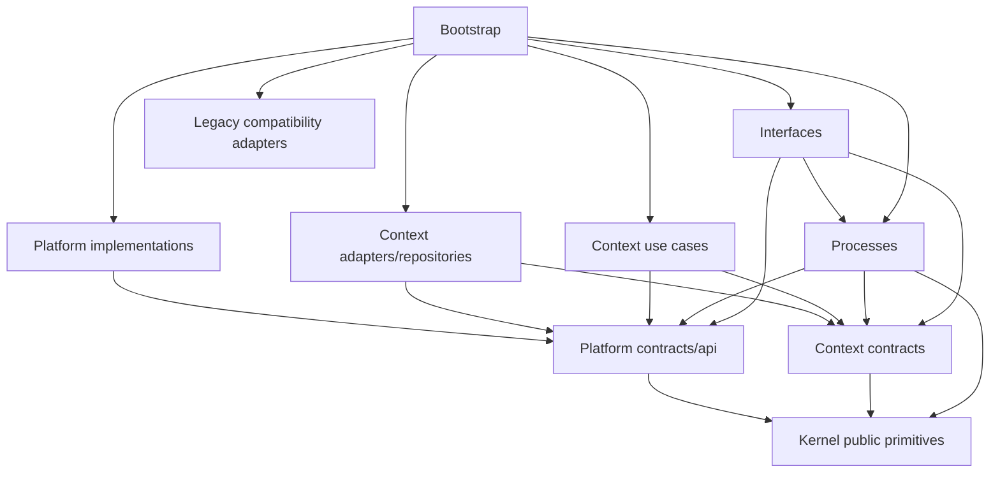
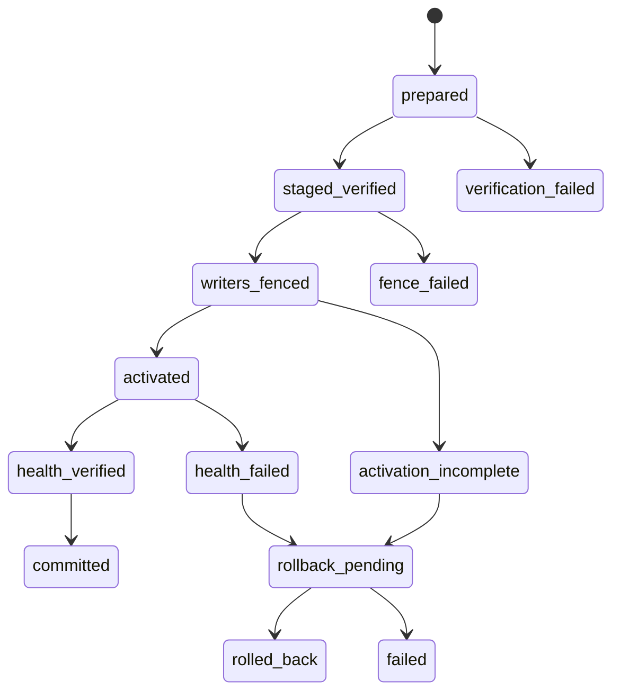
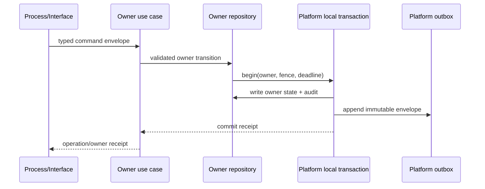
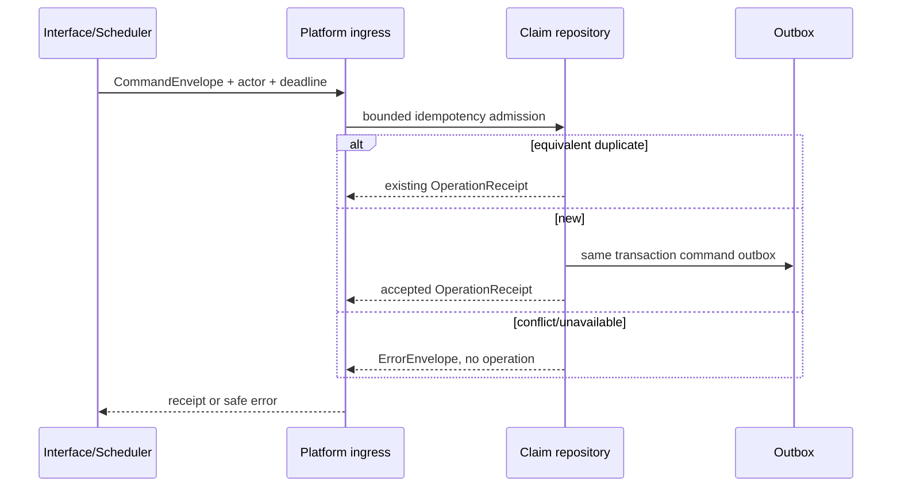
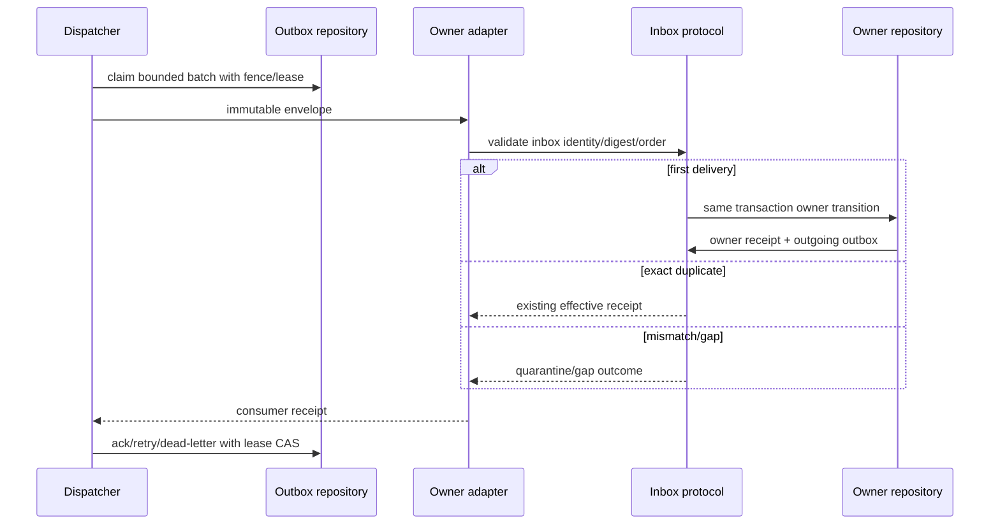
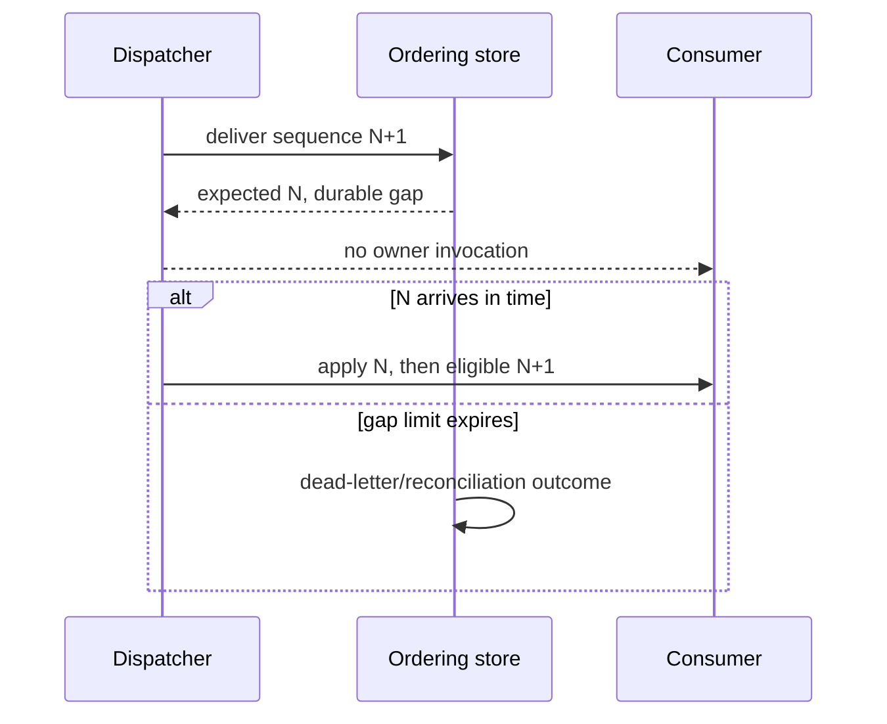
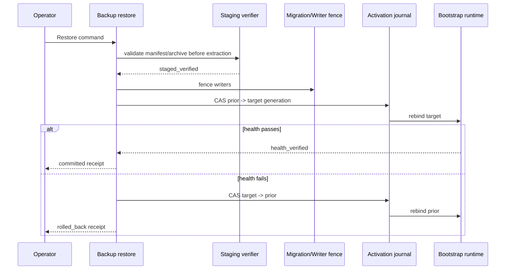

# Platform Persistence, Events and Bootstrap Foundation

## Context

This child is the third prerequisite in the strict-approved
`restructure-trade-architecture-v1` sequence:

1. architecture guardrails and source baselines;
2. Kernel and public contracts;
3. Platform persistence, events and Bootstrap foundation;
4. formal PIT and revision semantics;
5. Capture, Datasets and Studies boundaries.

The architecture guardrails are merged at repository commit `4fa6113`. The
`kernel-and-public-contracts` change has strict design approval but is still an
implementation/merge prerequisite. This child consumes that change's
framework-free IDs, envelope metadata, `ActorContext`, `CommandEnvelope`,
`OperationReceipt`, `ErrorEnvelope`, policy references and shutdown/control
contracts. It does not duplicate them.

This is a design-only round. The audit read repository source and temporary
test fixtures only. It did not open real `data/`, a live SQLite database,
Parquet, backup archive or provider.

### Current-state audit

| Area | Verified source fact | Architectural consequence |
|---|---|---|
| SQLite construction | `TradeDB.__init__` selects/creates the DB directory, opens a writable shared connection, applies WAL pragmas, calls `_init_schema`, runs every migration, creates indexes and seeds defaults (`trade_py/db/trade_db.py:381-423`). | Construction cannot be used as a truthful read-only capability. Startup mode, schema mutation and repository access must become distinct. |
| Global facade | `TradeDB` is a 4,000+ line class plus EBRT/Signal/KG mixins and exposes direct `_conn` access to callers/tests (`trade_py/db/trade_db.py:391-507`; `tests/test_runtime_db_recovery.py:23-33`). | Do not replace it with another aggregate facade. Keep it as a legacy adapter while owner repositories are extracted independently. |
| Migration history | `run_migrations` reads one global `schema_migrations` set and runs v2-v22 in one function. Individual helpers commit before the migration marker is recorded (`trade_py/db/migrations.py:1179-1435`). | Existing history is not a context registration protocol and has interruption windows. A named legacy bridge must delegate it; new registrations require digest/checkpoint/fence evidence. |
| Event persistence | `event_log_insert` commits before handler identities are prepared; idempotent child/once insertion stores a synthetic handler marker (`trade_py/db/trade_db.py:3144-3312`). | Legacy rows are useful compatibility facts but are not a formal context state plus outbox transaction or generic inbox contract. |
| Handler recovery | Handler claims use `BEGIN IMMEDIATE`, a process identity marker, stale-time checks and cross-connection atomic tests (`trade_py/db/trade_db.py:3566-3621`; `tests/test_runtime_db_recovery.py:128-248`). | Retain tested claim concepts, but make lease/fence/state explicit and generic in Platform delivery. |
| Event dispatch | `EventBus` combines business topic constants, payload codec, SQLite delivery, channel selection, executor admission, handler factories, DAG orchestration, replay and global singleton binding (`trade_py/bus/__init__.py:143-215`, `313-407`, `1377-1752`). | Extract only technical delivery. Business topics and DAG use-case construction cannot move into Platform. |
| Delivery atomicity | `publish_with_outcome` first commits `event_log`, then discovers/prepares handlers and submits them (`trade_py/bus/__init__.py:425-447`, `527-607`). | A process crash can leave a persisted message but cannot prove an atomic owner transition plus outbox. Future owners need a local transaction port. |
| Terminal persistence | After a handler finishes, `_run_handler` retries terminal persistence in an unbounded loop (`trade_py/bus/__init__.py:859-903`). | A DB outage can retain a worker and block shutdown indefinitely. New delivery must bound synchronous retry and durably expose residual ownership. |
| Replay | Replay is bounded per call and rotates through durable rows; malformed payloads are quarantined and missing handlers remain pending (`trade_py/bus/__init__.py:1236-1329`). | Reuse bounded replay/quarantine behavior, but add explicit retry/DLQ/ordering contracts and do not infer formal metadata from incomplete legacy rows. |
| Web composition | `WebResourceContainer` constructs `TradeDB`, EventBus, inference, services, command runner and startup automation (`trade_web/backend/runtime/resources.py:34-186`). | It is a current compatibility composition root, not the target owner. |
| CLI composition | `trade start`, `trade run`, event/data/config/status commands independently instantiate `TradeDB` and the global bus (`trade_py/cli/start.py:43-78`; `trade_py/cli/run.py:82-175`). | Migration must be entrypoint-by-entrypoint; adding target Bootstrap cannot immediately remove existing constructors. |
| Web shutdown | The container starts daemon shutdown threads and returns at its deadline while a stage thread may remain (`trade_web/backend/runtime/resources.py:188-360`). | Platform foundation does not claim this is fixed. Formal lifecycle adoption is blocked on the shutdown hardening child. |
| Command shutdown | `RuntimeCommandRunner` has process-group TERM/KILL deadlines, but completion persistence retries until empty and `_close_start_executor` calls `shutdown(wait=True)` after the public deadline (`trade_web/backend/runtime/commands.py:393-476`, `633-683`). | This is the concrete close-hang/executor-tail prerequisite for `runtime-owner-shutdown-and-recovery-hardening-v1`. |
| FastAPI lifespan | `create_app` constructs the Web container and synchronously calls `resources.stop(wait=True)` in lifespan finalization (`trade_web/backend/app.py:178-214`). | An owner tail can hold Uvicorn process exit. The interface remains compatible until hardening proves signal-to-reap behavior. |
| Backup creation | `create_backup_snapshot` recursively tars a live data root and records per-file size/mtime but only hashes the whole archive (`scripts/backup.py:356-419`). | It does not prove a consistent SQLite generation or per-member content. |
| Restore | `restore_backup_snapshot` calls unrestricted `tar.extractall` into a created target and then marks the row `restored` without reading/verifying the manifest or activating through a writer fence (`scripts/backup.py:478-522`). | Restore needs pre-extraction member validation, staged re-hash, generation CAS, runtime rebind, health window and rollback. |
| Event data naming | `trade_py/db/event_db.py` is a business Parquet `HistoricalEvent` store with BTC/news taxonomy (`trade_py/db/event_db.py:1-180`). | It belongs to later Capture/Datasets/Studies classification, not Platform Events. Similar names do not imply ownership. |
| Tests | Event tests cover saturation, claim recovery, replay rotation, payload quarantine and shutdown races; Web tests cover shutdown ordering and retained DB ownership. Many fixtures use private `_conn` (`tests/test_event_bus.py`; `tests/test_web_runtime_resources.py`; `tests/test_runtime_db_recovery.py`). | Preserve these compatibility tests, add public Platform contract tests, and add a DB owner/private-connection guard before retiring legacy fixtures. |

### Current ownership inventory

The merged `architecture-baseline.toml` classifies `event_log`,
`event_handler_runs`, `schema_migrations`, `backup_snapshots`, `settings` and
`job_runs` as candidates for Platform. It deliberately leaves `pipeline_dag`
and mixed business tables deferred. Candidate means audit evidence only; it
does not authorize target SQL.

| Current record/artifact | Current writer | Current readers | Target treatment in this child |
|---|---|---|---|
| `event_log` | `TradeDB`/EventBus | CLI, Web, EventBus replay | Legacy-only; optional one-way bridge after digest tests |
| `event_handler_runs` | `TradeDB`/EventBus | replay/status tests and Web | Legacy-only; no formal inbox/lease inference |
| `schema_migrations` | global migration runner | `TradeDB` construction | Delegated only through `LegacySchemaBootstrapAdapter` |
| `job_runs` | jobs and Web command runner | CLI/Web operations | Mixed legacy execution evidence; no bulk ownership claim |
| `settings` | `TradeDB`, CLI and seeds | nearly every subsystem | Mixed semantics; migrate row families only in owning children |
| `backup_snapshots` and archives | `scripts/backup.py`/`TradeDB` | CLI/Web | Legacy uncertified backup surface; Platform creates new certification state |
| `pipeline_dag`/`agenda_queue` | migrations, CLI, bus scheduler | EventBus and operations UI | Deferred between Platform scheduling and Processes; unchanged |
| `historical_events.parquet` | `EventDatabase` | event research pipeline | Business data, excluded from Platform |
| Web resource/process locks | Web runtime | Web runtime/status | Compatibility runtime until Bootstrap/hardening cutover |

## Goals / Non-Goals

**Goals:**

- Give every extracted owner a same-database local transaction that can commit
  state, owner audit/inbox and outbox atomically.
- Make command admission, delivery, retry, ordering, dead letter and redelivery
  durable, bounded and independent of business payload semantics.
- Separate read-only observation, compatible writing and schema migration.
- Preserve the v2-v22 history behind one narrow legacy adapter while allowing
  owner-specific additive registrations to replace it incrementally.
- Make backup/restore safe against live-copy inconsistency, corrupt archives,
  path traversal, split-brain activation and crash windows.
- Establish one target Bootstrap owner without forcing immediate delegation of
  every CLI/Web entrypoint.
- Give all later children comparable capacity evidence and explicit overload.
- Keep code dependencies acyclic while runtime delivery supports branches,
  convergence, retries and feedback.

**Non-Goals:**

- No production implementation, package move, import rewrite, schema migration,
  data access, backup execution or behavior change in this design round.
- No business repository, Context aggregate, Process manager, provider adapter,
  scheduler policy or Dataset/Study semantics in Platform.
- No replacement of `pipeline_dag`, all `job_runs`, all `settings` or every
  `TradeDB` caller in one change.
- No exactly-once transport claim. The contract is at-least-once delivery with
  exactly-once effective owner transition under inbox idempotency.
- No distributed transaction, Kafka requirement, remote worker protocol or
  cross-database atomic commit.
- No claim that current shutdown hangs are fixed. Adoption remains gated.
- No automatic restore of real data and no destructive retirement.

## Design Quality Brief

### Requirements and acceptance

The design is accepted only when:

1. every public Platform contract is framework-free and consumes the approved
   Kernel generation rather than redefining IDs/envelopes/receipts;
2. the local owner transaction proves all-or-nothing state/audit/inbox/outbox
   behavior with crash injection;
3. duplicate command and duplicate message fixtures produce one effective
   transition, while identity/payload conflict fails closed;
4. lease expiry, stale fence, retry exhaustion, DLQ and redelivery are durable;
5. ordered N+1-before-N, stale epoch and gap exhaustion fixtures never reorder;
6. read-only startup creates or mutates nothing;
7. migration leader/follower, interrupted checkpoint and legacy-unfenced-writer
   fixtures fail safely;
8. corrupt, unsafe and incompatible archives fail before extraction/activation;
9. crash injection at every restore transition reconciles to one active writable
   generation and a truthful receipt;
10. Bootstrap architecture fixtures show one concrete composition root and
    preserve non-delegated legacy entrypoints;
11. 1x/10x delivery/migration/restore fixtures emit valid CapacityEnvelopes;
12. legacy CLI/HTTP/EventBus/backup behavior is unchanged until its selected
    compatibility slice passes;
13. diagnostic design-check, six-role review and strict approval pass; and
14. actual runtime adoption remains blocked until shutdown hardening passes.

The implementation PRs, not this design PR, own the behavior tests above. This
change is complete when those obligations are specified, reviewable and strict
approved, while production code remains unchanged.

### Ownership and boundaries

#### Target packages

```text
src/trade/
├── platform/
│   ├── contracts/                  # framework-free public DTOs/protocols
│   ├── api/                        # public capability handles
│   ├── persistence/
│   │   ├── runtime.py              # DatabaseRuntime modes/handles
│   │   ├── transactions.py         # local owner transaction primitive
│   │   ├── migrations.py           # generic coordinator/registration
│   │   └── adapters/
│   │       ├── sqlite/
│   │       └── legacy_schema_bootstrap.py
│   ├── events/
│   │   ├── ingress.py
│   │   ├── delivery.py
│   │   ├── ordering.py
│   │   ├── dead_letter.py
│   │   └── adapters/sqlite/
│   ├── backup/
│   │   ├── create.py
│   │   ├── restore.py
│   │   └── adapters/
│   ├── execution/                  # later generic operation/process mechanics
│   ├── scheduling/                 # later technical schedule/lease mechanics
│   └── settings/                   # technical settings only
└── bootstrap/
    ├── profiles.py
    ├── lifecycle.py
    └── compatibility.py
```

`platform/contracts` and `platform/api` may depend on Kernel only.
Implementations depend on their public contracts and standard/approved
technical libraries. Platform never imports a business Context or Processes.
Only Bootstrap imports concrete Platform adapters and legacy bridge code.

#### Responsibility matrix

| Concern | Owner | Owns | Must not own |
|---|---|---|---|
| Connection/runtime | Platform Persistence | DB identity, mode, capability range, fence/lease, transaction primitive | business SQL, aggregate state |
| Context persistence | owning Context adapter | tables, repositories, state invariants, migrations | Platform delivery tables or another Context |
| Command admission | Platform execution/ingress | idempotency claim, operation identity/receipt, command outbox | command business execution |
| Message delivery | Platform Events | outbox lease, delivery attempts, inbox protocol, ordering heads, DLQ | business topic meaning/handler logic |
| Process flow | Processes child | cross-Context process state and command choices | Context state transitions or Platform transport |
| Backup/restore | Platform Backup | certification, staging, restore operation, activation journal | business interpretation or data repair |
| Composition | Bootstrap | concrete graph, profiles, lifecycle and compatibility selection | business behavior or response mapping |
| Interfaces | CLI/HTTP/SDK/event/schedule adapters | parsing, auth, DTO mapping, response shape | DB/provider access or full workflow |

#### Code dependency graph



Forbidden edges include Platform to Context/Processes/legacy business modules,
Context to concrete Platform adapters, Interface to repositories, and every
module except Bootstrap to the legacy schema bridge.

### Data and state invariants

#### Identity and time

- All public identities and envelope metadata use the approved Kernel types.
- Durable database time is UTC. Wall-clock timestamps are audit facts; lease,
  deadline and local wait calculations use monotonic time.
- A stored deadline includes an absolute UTC audit value plus the admission
  contract's bounded remaining duration. Restart recalculates eligibility from
  durable UTC policy; it never attempts to persist a process-local monotonic
  clock.
- Owner instance IDs are never reused. Fence generations are positive,
  monotonic integers.
- Raw idempotency keys, credentials, payload bodies and traceback are never
  projected into status/audit logs.

#### Atomicity

One local owner transaction has exactly one owner namespace and one current
writer fence. It may update that owner's records plus Platform-owned inbox,
outbox and immutable receipt rows because those are technical participants in
the same physical SQLite transaction. This is a narrow protocol exception, not
shared business ownership: Platform defines the technical row API and the
owner repository supplies the business transition.

The primitive cannot span files/databases. If a future Context moves to another
physical database, it must colocate an outbox there and deliver to Platform
asynchronously; it cannot call the central Platform DB in the same transaction.

#### Command admission state

The Kernel child owns the operation state graph. This child only persists it:

```text
requested -> accepted | failed | cancelled | deadline_exceeded
accepted  -> running | waiting | retry_scheduled | blocked
          -> completed | failed | cancelled | deadline_exceeded
```

Duplicate equivalent admission returns the existing receipt. Conflict/corrupt
claim/contention/audit unavailable creates no operation. Refusal-audit outcome
priority, transaction count and key rotation follow the exact approved Kernel
contract.

#### Delivery state

```text
pending -> leased
leased -> delivered
leased -> retry_scheduled
leased -> dead_lettered
leased -> cancelled
leased -> pending            # only proven expired/revoked lease recovery
retry_scheduled -> pending   # when durable not-before becomes eligible
```

Terminal `delivered`, `dead_lettered` and `cancelled` rows never reopen. A
redelivery command creates a new linked attempt/generation. A stale lease token
or fence cannot ack or terminalize.

#### Inbox state

The inbox effective identity is `(consumer_namespace,
consumer_contract_version, message_id)`:

- absent: owner transition may run;
- present with same target/schema/digest: return first effective receipt;
- present with any mismatch: corruption/quarantine;
- owner transaction rollback: inbox remains absent.

This is exactly-once effective application, not exactly-once delivery.

#### Ordering state

An ordered producer maintains `(scope_digest, producer_epoch, next_sequence)`.
An ordered consumer maintains `(consumer, scope_digest, producer_epoch,
expected_sequence)`. Sequence is allocated with outbox append. Expected
sequence advances with inbox plus owner transition. N+1 never applies while N
is required. Gap state is durable and bounded by count, bytes and time.
Unordered messages explicitly carry `unordered`; absence is invalid.

#### Migration state

```text
planned -> lease_acquired -> applying -> validating
        -> compatibility_ready -> activated -> completed
        -> paused | failed | rollback_pending -> rolled_back
```

Every step records registration digest and checkpoint. Capability generation
changes only after validation/compatibility readiness. A partially applied
additive schema remains hidden from incompatible writers and resumable. A
legacy-unaware writer blocks incompatible cutover.

#### Restore state



Only the activation journal selects the active generation. Directory presence,
an extracted archive or a legacy `status=restored` row cannot select it.

### Contracts and compatibility

#### Public Platform contracts

| Contract | Key fields/purpose | Compatibility rule |
|---|---|---|
| `DatabaseRuntimeRequest/Handle` | DB identity, mode, capability range, owner/fence/lease | additive schema version; no raw connection |
| `LocalTransactionContext/Result` | owner, transaction/operation/correlation/causation, deadline, fence, outcome | protocol capability, not a generic unit of work |
| `MigrationRegistration/Plan/View` | owner, migration/digest, generations, dependencies, checkpoint/cutover/rollback | registration identity immutable; changed digest rejected |
| `OutboxEnvelopeRecord` | Kernel envelope plus owner, digest/ref, ordering, deadline, retry policy | payload schema remains owner-owned |
| `DeliveryLease/Receipt` | dispatcher owner/fence/token/expiry, attempt and closed outcome | stale token/fence rejected |
| `InboxReceipt` | consumer/version/message/digest/effective receipt | mismatch is corruption |
| `OrderingContract/Ref` | scope/key, epoch, sequence, expected sequence, gap/HOL policy | contract digest pinned per envelope |
| `DeadLetterView/RedeliverMessage` | bounded safe evidence and audited control | redelivery creates new attempt |
| `BackupManifest/Certification` | generation, capability, archive/member hashes | old manifest not silently upgraded |
| `RestoreOperation/View` | state/step, source/prior/target generation, fence/journal/health | transition append-only |
| `CapacityEnvelope` | fixture/resource/load/latency/backlog/threshold/outcome | versioned and deterministic |
| `BootstrapProfile/Capabilities` | concrete graph requirements and compatibility selections | internal developer/runtime contract |

All codecs use the Kernel child's canonical bounded JSON policy. Payload codecs
are owner-specific. Platform validates schema identity and digest but does not
decode business payload semantics.

#### Existing surface matrix

| Existing surface | Current behavior | Foundation compatibility |
|---|---|---|
| `trade run`, `trade event`, `trade start` | instantiate `TradeDB`/global bus, wait on legacy events | unchanged; later CLI compat delegates one command at a time |
| `trade status`, `trade show` | construction may run migrations/seeds | unchanged until read-only Bootstrap profile and snapshots pass |
| `trade config` | mixed rows in global settings | unchanged; no global settings ownership transfer |
| `trade backup *` | legacy create/push/extract/list | unchanged and explicitly uncertified |
| FastAPI `create_app` and runtime routes | WebResourceContainer owns DB/bus/commands | unchanged until HTTP/lifecycle compatibility and hardening |
| EventBus topic/publish/replay | legacy event/handler rows, business handlers | unchanged; optional one-way bridge only |
| Web frontend/SSE | existing URLs/payload/status | no frontend change in this child |
| SDK/notebooks | current Python imports/repository access | no immediate change; formal surface belongs to interface child |
| Scheduler | emits legacy EventBus topics | unchanged; later emits commands through Bootstrap |
| C++ engine | current native boundary | untouched |

No compatibility adapter may fabricate actor trust, formal operation receipts,
ordering or certified restore from absent legacy evidence.

### Persistent-write safety

#### Proposed logical tables

Names are design identities; implementation may refine a physical prefix only
if ownership and requirements remain unchanged and review is refreshed.

| Table/artifact | Logical owner | Target repository | Readers | Writers | Transaction boundary | Migration owner |
|---|---|---|---|---|---|---|
| `platform_schema_capabilities` | Platform Persistence | capability repository | Bootstrap/operators | MigrationCoordinator | capability activation | Platform |
| `platform_migration_runs` | Platform Persistence | migration repository | Bootstrap/operators | MigrationCoordinator | one transition/checkpoint | Platform |
| `platform_writer_leases` | Platform Persistence | fence repository | owner transactions | DatabaseRuntime | claim/renew/revoke CAS | Platform |
| `platform_operation_claims` | Platform execution/ingress | ingress repository | operation query | ingress only | idempotency admission | Platform |
| `platform_operation_receipts` | Platform execution/ingress | receipt repository | Interfaces/Processes | ingress/owner transition | operation transition | Platform |
| `platform_refusal_audits` | Platform execution/ingress | operator audit repository | authorized operators | ingress audit only | bounded refusal audit | Platform |
| `platform_outbox` | Platform Events | outbox repository | dispatcher/operator | owner local transaction | owner state + outbox | Platform |
| `platform_delivery_attempts` | Platform Events | delivery repository | dispatcher/operator | dispatcher | lease/ack/retry terminalization | Platform |
| `platform_inbox_receipts` | Platform Events | inbox protocol repository | owner/dispatcher | owner local transaction | inbox + owner state | Platform |
| `platform_ordering_producers` | Platform Events | ordering repository | owner producer | owner local transaction | sequence + outbox | Platform |
| `platform_ordering_consumers` | Platform Events | ordering repository | owner consumer | owner local transaction | expected sequence + inbox/state | Platform |
| `platform_dead_letters` | Platform Events | dead-letter repository | operator/status | dispatcher | terminal delivery | Platform |
| `platform_redelivery_runs` | Platform Events | redelivery repository | operator/status | redelivery command | CAS + new attempt | Platform |
| `platform_backup_manifests` | Platform Backup | backup repository | operator/restore | backup certification | certification commit | Platform |
| certified archive/staged root | Platform Backup | artifact adapter | restore/operator verifier | backup/restore only | stage/verify/commit marker | Platform |
| `platform_restore_operations` | Platform Backup | restore repository | Bootstrap/operators | restore coordinator | one restore transition | Platform |
| `platform_activation_journal` | Platform Backup/Persistence | activation repository | DatabaseRuntime/Bootstrap | restore coordinator | generation CAS | Platform |
| `platform_capacity_results` | Platform status | capacity repository | operators/children | harness only | immutable result append | Platform |

Each table has one writer API. Interfaces and Contexts never query it directly.
The physical SQLite file may remain shared during transition.

#### Write safety

- **Authoritative writer:** named repository above; no `TradeDB` replacement
  facade.
- **Idempotency:** command fingerprint/claim, message ID/inbox, registration
  ID+digest, backup ID+manifest digest, restore ID+generation CAS.
- **Concurrency:** `BEGIN IMMEDIATE` or an equivalent SQLite CAS only inside
  repository methods; fence/lease tokens are compared on every mutation.
- **Staging:** migrations use additive/checkpointed generations; backups and
  restore use no-follow temporary staging and digest verification.
- **Visibility:** owner state/outbox and inbox/owner transition are atomic;
  backup becomes certified only after hash; restore becomes active only through
  journal CAS.
- **Crash windows:** every externally visible transition has a durable state
  and restart reconciliation rule. No directory scan becomes authority.
- **Corrupt predecessor:** digest/schema/claim mismatch quarantines or blocks;
  no substitution from "latest".
- **Partial result:** explicit preparing/retry/gap/dead-letter/unavailable
  states; no success with missing evidence.
- **Reader consistency:** old readers remain selected until dual-read parity;
  target readers bind one schema/active generation.
- **Backup/hash verification:** per-member plus archive digest and SQLite
  capability validation before activation.
- **Sample verification:** all migration/restore rehearsals use temporary roots
  with representative legacy v2-v22 fixtures.
- **Rollback:** previous generation and legacy selection remain available;
  immutable new evidence is retained.
- **Audit:** actor, correlation/causation, policy/digest, state transition and
  safe reason are append-only/bounded.

### Schema migration compatibility

The first implementation is additive:

1. preserve `schema_migrations` and all existing tables;
2. add Platform tables under a new schema capability generation;
3. use `LegacySchemaBootstrapAdapter` only for explicit migration-mode new or
   legacy DB initialization;
4. introduce target readers/writers behind Bootstrap feature/capability
   selection;
5. run dual-read comparisons where a legacy projection is bridged;
6. switch one entrypoint/owner at a time;
7. retain the previous generation and old reader for at least 30 days;
8. retire only after consumer evidence and rollback rehearsal.

Forward compatibility means an older supported read-only binary may observe a
generation in its read range. Backward compatibility means the new binary can
read the prior generation during the window. Write compatibility is narrower:
only binaries whose write range contains the active generation and that hold
the current fence may write. An unaware legacy writer cannot be fenced by a
table it never checks; incompatible migration waits for proven exclusive
maintenance or legacy adoption.

Backfill is checkpointed, idempotent shadow copy/replay. Cutover is
dual-read-compare plus readiness gate. Rollback selects the previous generation
or verified backup; it never deletes new immutable receipts.

### Query/command separation

Platform queries return bounded immutable views and cannot:

- run migrations, claim delivery, redeliver, restore or repair;
- instantiate `TradeDB` or trigger constructor schema writes;
- start a provider or business use case;
- advance an operation, delivery, ordering or restore state;
- expose payload bytes, SQL, credentials or raw errors.

Commands carry actor, idempotency, correlation/causation and a finite deadline.
They return a durable receipt or explicit admission failure promptly. Long
work is observed through operation/process/delivery/restore views.

### Runtime command/event flow

#### Context transition and outbox



Provider calls and long computation occur before or after a transaction through
owner ports; they are never held inside the DB transaction.

#### Command ingress



#### At-least-once delivery, exactly-once effect



#### Ordered gap



#### Restore activation



### Failure and recovery

| Failure | Required outcome | Recovery owner |
|---|---|---|
| DB absent on read-only query | explicit unavailable, no creation | caller/operator |
| incompatible schema/write range | reject writer or read-only fallback | Bootstrap/MigrationCoordinator |
| legacy unaware writer possible | block incompatible migration | operator maintenance/adoption |
| owner tx fails | rollback state/audit/inbox/outbox | owning Context |
| dispatcher dies pre-ack | lease expiry and reclaim | Platform Events |
| consumer duplicate | existing inbox receipt, no transition | owner adapter |
| payload identity conflict | quarantine/dead-letter corruption | Platform Events/operator |
| sequence gap | bounded wait then contract outcome | Platform Events/operator |
| retry exhaustion | dead-letter, no silent drop | Platform Events |
| ack persistence outage | stop at deadline, retain residual/lease | Platform Events |
| migration interruption | digest/checkpoint resume or rollback | MigrationCoordinator |
| corrupt/unsafe archive | verification_failed before extraction | Platform Backup |
| crash after writer fence | activation journal reconciliation | Platform Backup/Persistence |
| target health fails | CAS prior generation and rebind | Platform Backup/Bootstrap |
| partial Bootstrap startup | reverse unwind acquired generation | Bootstrap |
| current runtime shutdown tail | legacy behavior; hardening child required | runtime hardening child |

No event handler embeds all business logic. It decodes/validates, invokes one
owner handle and records delivery outcome. Process managers, not Platform
events, decide feedback, branching and convergence.

### Performance and capacity

This design makes no throughput promise before measurement. It sets safety
ceilings and requires each deployment profile to reserve lower measured limits.

#### Contract safety ceilings

| Dimension | V1 safety ceiling | Basis/use |
|---|---:|---|
| envelope encoded bytes | 65,536 | approved Kernel bounded codec |
| one dispatch claim batch | 1,000 records | current replay hard clamp; lower default measured |
| one replay/recovery invocation | 1,000 records | current bounded replay behavior |
| one status/history page | 50 transitions/attempts | approved Kernel ProcessView bound |
| one dead-letter query page | 100 records | prevents unbounded operator query |
| one gap buffer per ordering key | 1,000 messages and 64 MiB | hard refusal ceiling, not default |
| one dispatcher policy attempts | 100 | schema ceiling; normal profile lower |
| one lease duration | 1 second to 15 minutes | rejects zero/unbounded leases |
| one restore manifest | 100,000 members, 2 TiB declared bytes | pre-allocation refusal ceiling; deployment lower |
| one restore path | 4,096 UTF-8 bytes, 128 normalized segments | archive parser bound |
| one CapacityEnvelope | 256 KiB canonical bytes | bounded evidence |

These are parser/admission ceilings, not approved production defaults. The
implementation must choose initial worker, queue, batch, retry, gap and restore
budgets from 1x/10x temporary fixtures and record them in a versioned
`CapacityProfile`. Increasing any reserved limit requires new evidence.

The 1x/10x event fixture measures:

- command admissions and duplicates;
- owner transition plus outbox write latency;
- claim/ack SQLite lock and write time;
- backlog under one hot ordered key and many unordered keys;
- crash reclaim/recovery duration;
- retry/DLQ rate and no starvation across keys;
- CPU, RSS, disk and DB/WAL growth.

Migration measures lock acquisition, checkpoint throughput, old/new reader
latency and recovery. Backup/restore measures staging bytes/sec, CPU/RSS/disk,
manifest parse, hash, fence, rebind, health and rollback. Results are `pass`,
`defer` or `overload`; missing measurement is `defer`, never zero/pass.

### Observability and operations

Low-cardinality metrics:

- command admission outcomes by stable reason/owner;
- owner transaction commit/rollback/stale-fence;
- outbox pending/leased/retry/dead-letter counts and oldest age;
- delivery attempts, lease expiry/reclaim and terminal-persistence unavailable;
- inbox duplicate/conflict and ordering gap/expiry;
- migration generation/state/checkpoint/fence conflicts;
- backup certification/corruption/remote publication;
- restore state, activation/rollback and health duration;
- Bootstrap profile lifecycle/residual owner;
- CapacityEnvelope pass/defer/overload.

Structured logs include operation/message/migration/restore identity,
correlation/causation, owner, state transition, attempt, fence generation,
policy version and safe reason. They exclude payload, command body, raw
idempotency key, actor credential, archive content, service-account path, SQL
and traceback in public/operator summaries.

Bounded operator queries distinguish:

- observed empty from unavailable;
- pending from stuck/lease-expired;
- retry scheduled from dead-lettered;
- sequence gap from no traffic;
- migration follower from incompatible writer;
- certified local backup from remote unavailable;
- staged restore from active/rolled back;
- Bootstrap stopping with residual owners from stopped.

Runbooks map each stable reason to inspect, retry/redeliver, reconcile,
rollback or operator intervention. Querying a runbook/status view never
executes the action.

### Validation strategy

#### Unit and contract

- canonical Platform DTO/codecs and forbidden framework/business vocabulary;
- startup mode and read-only no-side-effect contracts;
- transaction owner/fence and allowed participant set;
- exact state transition products;
- envelope/payload digest, inbox conflict and ordering arithmetic;
- safe archive path/member parser and manifest bounds;
- CapacityEnvelope invariants and unavailable measurement.

#### Integration and crash fixtures

- temporary SQLite owner transition + audit/inbox/outbox atomicity;
- duplicate ingress across two connections;
- dispatcher crash before/after lease, consumer commit and ack;
- exact duplicate, digest conflict and stale fence;
- N+1-before-N, epoch regression, gap timeout and hot-key fairness;
- retry exhaustion, DLQ and concurrent redelivery CAS;
- migration leader race, interrupted checkpoint, changed registration and
  legacy-unfenced-writer block;
- v2-v22 legacy bootstrap fixture with no query-side bootstrap;
- malicious/corrupt/incompatible archive, crash at each restore state,
  activation/rebind health rollback and stale writer;
- Bootstrap partial startup/reverse cleanup and sole-root architecture tests.

#### Compatibility

- existing CLI help/parse/exit snapshots;
- EventBus publish/replay/admission/status tests;
- HTTP/OpenAPI/SSE/Web BFF snapshots;
- backup CLI/function/API legacy snapshots;
- no `TradeDB` construction in migrated read-only query profiles;
- no direct `_conn`, Platform table or concrete adapter use outside owners.

#### Capacity and shutdown

- fake-clock 1x/10x deterministic capacity fixtures;
- process-level crash/restart SQLite fixtures;
- no remaining subprocess/thread after each fixture;
- shutdown adoption tests are explicitly owned by
  `runtime-owner-shutdown-and-recovery-hardening-v1`, including real Uvicorn
  signal-to-reap and executor-tail tests.

Tests use temporary roots. No real data probe is required for this foundation.

### Alternatives and trade-offs

#### A. Extract Capture first

Rejected. Capture would need to invent its own transaction/outbox, idempotency,
delivery and runtime ownership, making later Contexts incompatible.

#### B. Fix shutdown only, then extract Contexts

Rejected as the foundation sequence. Shutdown hardening is necessary and stays
an independent prerequisite for adoption, but it does not provide durable
Context handoff, migration fencing or restore safety.

#### C. Replace EventBus with Kafka or another broker now

Rejected. It introduces an operational dependency and still does not solve
same-database owner transition/outbox atomicity or legacy migration. The public
envelope/delivery ports allow a future adapter after measured need.

#### D. Keep one improved global TradeDB

Rejected. A new facade would preserve cross-domain SQL ownership and make
Context transactions indistinguishable. Platform provides primitives; owner
repositories remain separate.

#### E. One database per Context immediately

Rejected for this migration phase. It forces distributed consistency and a
large data move. A shared physical SQLite file with one logical owner per table
supports incremental extraction and local atomic outbox.

#### F. Use SQLite triggers for every outbox

Rejected as the primary contract. Triggers cannot construct/validate typed
owner envelopes and hide business transition intent. Explicit owner repository
transactions are testable. Triggers may enforce narrow integrity constraints.

#### G. Treat EventBus rows as the formal event store

Rejected. Legacy rows lack trusted actor, generic inbox, ordering contract and
atomic owner transition provenance. A one-way compatibility bridge is safer.

#### H. Extract archive and verify afterward

Rejected. Traversal and corrupt bytes have already crossed the safety boundary.
Restore verifies directory/manifest before extraction and bytes before
activation.

#### I. Let every Interface build a small container

Rejected. It recreates competing owners and lifecycle drift. Bootstrap profiles
allow tailored graphs while preserving one composition authority.

### Risks / Trade-offs

- **Shared SQLite can become a write bottleneck.** -> Measure lock/write time,
  bound batches, keep transactions short and expose overload. Do not promise
  scale before CapacityEnvelope results.
- **Inbox/outbox technical rows in a Context transaction can look like
  cross-owner writes.** -> Restrict the participant set in the transaction
  API and architecture tests; no second business Context is permitted.
- **An unaware old binary bypasses a new fence.** -> Block incompatible
  migrations until exclusive maintenance or adoption is proven.
- **Legacy and target delivery can duplicate work.** -> One-way bridge identity,
  digest comparison and one selected route per message family.
- **Ordered hot keys cause head-of-line blocking.** -> Per-key bounded buffers,
  fair dispatcher scheduling, explicit gap expiry/DLQ and 10x hot-key fixture.
- **Retry/DLQ policy may classify business errors incorrectly.** -> Platform
  owns technical classes; owner contracts supply stable failure category and
  policy ref. Unknown fails to dead-letter/operator review, not infinite retry.
- **Backup consistency across SQLite and external artifacts is complex.** ->
  Manifest one committed generation/ref per owner; no live recursive copy as
  authority.
- **Restore activation can strand writers.** -> Durable fence, journal CAS,
  restart reconciliation, prior-generation rollback and bounded health window.
- **Bootstrap can become a service locator.** -> Expose typed immutable profile
  handles, no arbitrary lookup/global mutation, architecture guard.
- **Foundation scope can grow into Processes.** -> Platform transports and
  persists technical state only; branching/feedback stays in a later Process
  child.
- **Shutdown remains an observed production pain.** -> Keep a visible hard gate
  and prioritize the independent hardening child before runtime delegation.
- **Kernel PR dependency can drift.** -> Pin reviewed digest and do not
  implement until merged/present; re-review on contract drift.

### Rollout and rollback

#### Design and implementation slices

1. Approve this design only; no production change.
2. Merge the exact Kernel/public contracts prerequisite.
3. `platform-persistence-runtime`: add contracts, read-only runtime,
   capability/fence/migration tables and legacy bootstrap bridge; no Context
   cutover.
4. `platform-command-and-delivery-store`: add ingress/outbox/inbox/order/DLQ
   repositories and crash fixtures; no legacy topic rerouting.
5. `platform-backup-certification-and-restore`: add certified temporary-root
   create/restore and activation journal; legacy CLI remains selected.
6. `platform-bootstrap-profiles`: compose target test/worker profiles; current
   entrypoints remain compatibility paths.
7. Strictly approve and implement
   `runtime-owner-shutdown-and-recovery-hardening-v1`.
8. Pilot one non-business or later Capture command through Platform with
   dual-observation and a kill switch.
9. Delegate CLI/HTTP/scheduler entrypoints one at a time in the interface child.
10. Retire legacy state only after consumer evidence, 30-day compatibility
    window and rollback rehearsal.

Each implementation slice is one reviewable PR, independently disabled and
does not depend on future package moves.

#### Rollback triggers

- any duplicate effective owner transition;
- stale fence accepted;
- lost/reordered message outside its contract;
- unbounded retry/wait or live process/thread after deadline;
- old/new reader mismatch;
- incompatible legacy writer not blocked;
- corrupt archive reaches staging/activation;
- two writable restore generations;
- failed target health/compatibility snapshot;
- missing CapacityEnvelope evidence or overload.

#### Rollback actions

- disable the target Bootstrap profile/message route;
- stop new target admissions while retaining immutable receipts/outbox/DLQ;
- select legacy EventBus/TradeDB/interface path;
- resume/reconcile target delivery without deleting evidence;
- revert active generation through activation journal to the verified prior
  generation;
- keep additive tables and immutable records for audit;
- never delete or mutate real artifacts as rollback.

## Migration Plan

The migration plan is additive and compatible with the parent sequence:

1. source baseline gains exact approved Platform bindings and bridge symbols;
2. target Platform tables are created under an additive capability generation;
3. no legacy reader/writer is removed;
4. read-only target profile proves no initialization side effects;
5. Platform delivery runs only on target-generated fixture/pilot messages;
6. owner Context children register their migrations independently;
7. interface shims delegate after snapshots;
8. compatibility evidence and rollback source remain for at least 30 days.

No live migration is authorized by this OpenSpec design. A future approved
implementation requiring a live maintenance window must separately record
backup, actor, scope, preflight, dry run, sample verification and rollback.

## Open Questions

No unresolved question blocks design approval. Implementation children must
select and review:

1. the initial measured `CapacityProfile` worker/queue/retry/gap values;
2. whether SQLite activation uses a generation-directory pointer or another
   atomic same-filesystem indirection, while preserving the journal contract;
3. the first pilot command/message family after Capture contracts exist; and
4. the final owner split for legacy `job_runs`, `settings`, `pipeline_dag` and
   `agenda_queue`, which remains deferred rather than guessed here.

## Child change plan

| Order | Child | Exit evidence | Rollback |
|---:|---|---|---|
| 1 | `platform-persistence-runtime` | read-only/no-write, fence, migration leader/checkpoint, v2-v22 bridge | disable target runtime; legacy selected |
| 2 | `platform-command-and-delivery-store` | duplicate/crash/order/DLQ/redelivery and 1x/10x fixtures | stop new ingress; retain records |
| 3 | `platform-backup-certification-and-restore` | unsafe/corrupt rejection and crash/health rollback | legacy backup selected; prior generation active |
| 4 | `platform-bootstrap-profiles` | sole-root architecture and compatibility-only profiles | entrypoints stay legacy |
| 5 | `runtime-owner-shutdown-and-recovery-hardening-v1` | bounded retry/join, takeover and signal-to-reap | do not adopt formal control |
| 6 | `formal-pit-and-revision-semantics` | parent next domain prerequisite | retain legacy non-formal reader |

These are implementation children of this design and the parent architecture.
They may be combined only if the resulting PR remains independently testable,
reversible and within the approved artifact digest; broad source movement is
not authorized.
