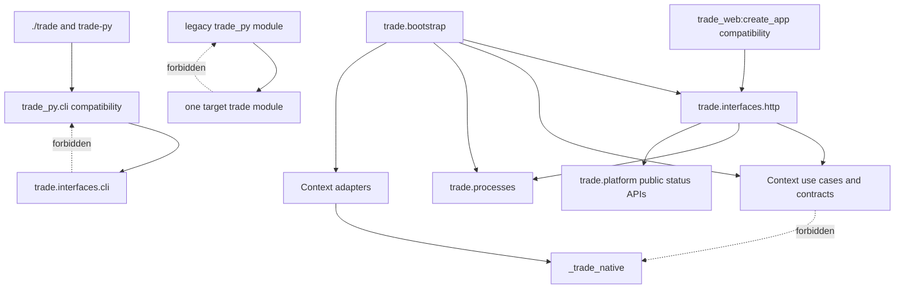
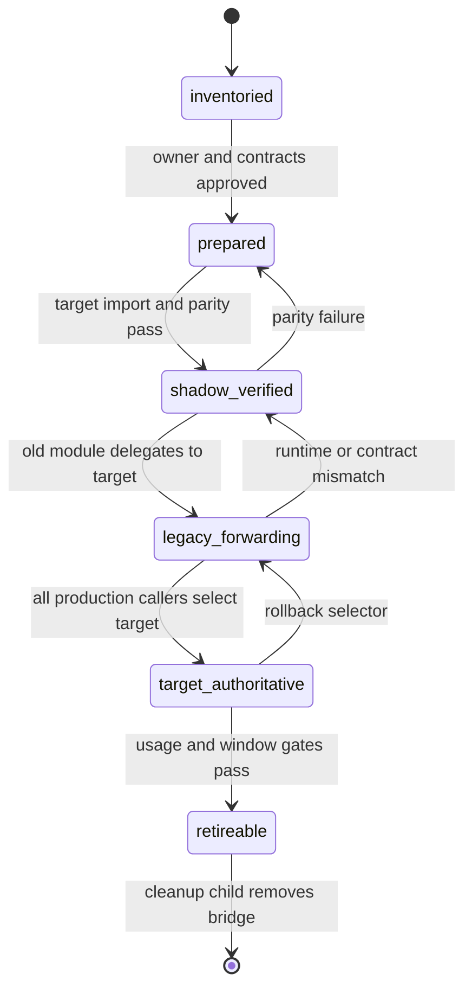
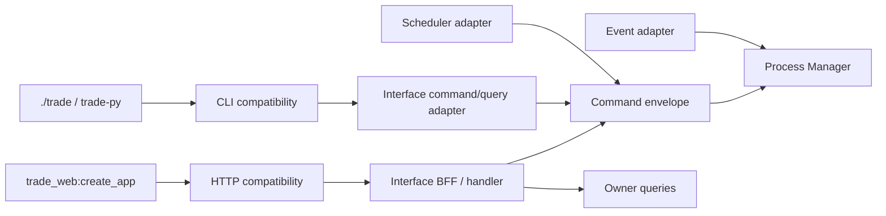
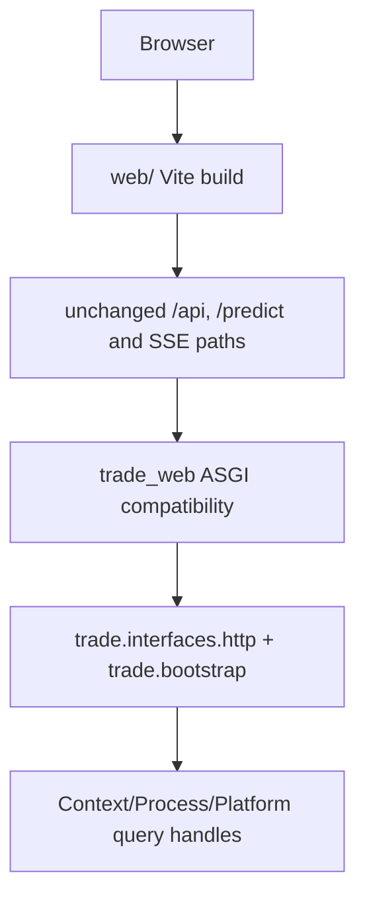

# Python Package and Web Layout Design

## Decision Summary

Adopt a staged authority-transfer model:

1. keep the distribution name `trade-py`;
2. add the installed Python namespace `trade` under `src/trade`;
3. retain `trade_py` and `trade_web` as compatibility roots;
4. move only modules whose semantic owner and interface adapter have already
   been approved and implemented;
5. make every compatibility dependency point from legacy to target;
6. reserve `_trade_native` for the optional native extension and use it only
   behind Context-owned adapter Ports;
7. move the Vite workspace independently from the ASGI package;
8. retire bridges only in `tests-and-legacy-cleanup` after measured use and
   contract evidence satisfy the exit criteria.

The directory layout is an output of semantic migrations, not the mechanism
that creates ownership.

## Design Quality Brief

### Requirements and acceptance

The change succeeds only when source, editable and clean-wheel environments
resolve the declared legacy and target imports from reviewed origins; each
migrated logical module has one implementation authority; root/console, ASGI,
HTTP/SSE/capability, Web asset, SDK/notebook and native contracts pass their
focused matrices; and every slice restores its preceding generation without
database or business-artifact rollback. A green checkout-only import is not
acceptance, and no requirement authorizes movement before its semantic owner
child is implemented.

### Ownership and boundaries

Package/build configuration owns discovery and installed artifacts; the
architecture guard owns module-authority evidence; Contexts own business
behavior and repositories; Interfaces own CLI/HTTP/SDK adapters; Bootstrap owns
concrete runtime construction and shutdown; `web/` owns frontend source/build;
and `engine/` plus Context native adapters own optional C++ calculation. Legacy
roots contain explicit compatibility modules only after an authority transfer
and never become a second implementation owner.

### Data and state invariants

Runtime business data and durable data contracts remain untouched. Authority
generations are immutable, one logical module has one implementation owner,
compatibility dependencies point legacy-to-target only, optional native
unavailability remains explicit, unknown bridge use blocks retirement, and
rollback retains all databases and immutable business artifacts. Evidence uses
UTC timestamps and content-bound package/Web/native identities.

### Contracts and compatibility

Distribution `trade-py`, existing `trade_py` imports, root `./trade`, installed
`trade-py`, `trade_web:create_app`, reviewed backend imports, HTTP route and
OpenAPI state, payload/error/SSE/capability behavior, Web proxy/assets/deep
links, SDK/notebook semantics and component test runners remain compatible.
New `trade` and `_trade_native` names are additive until an owning slice passes
all source/editable/wheel or differential evidence.

### Failure and recovery

A missing wheel member, checkout-dependent origin, duplicate module owner,
unknown consumer, ASGI/reload/child import failure, route/SSE/asset mismatch,
native differential mismatch, notebook prohibited access or residual process
leaves the previous generation authoritative. Finite validation deadlines
terminate owned process groups and report timeout separately from assertion,
contract and tool failures. Recovery selects the prior package, ASGI, Web or
native generation and reruns its focused matrix.

### Performance and capacity

One authority slice is limited to 50 production modules and 500 consumer
records, uses sorted tracked paths, never randomly samples or silently
truncates, and runs at most two isolated install environments concurrently.
Package, native and Web checks have finite reviewed deadlines and process-tree
cleanup. Inputs at ten times the admitted slice size fail closed into smaller
reviewable slices instead of consuming unbounded memory or CI time.

### Observability and operations

Reports expose package generation, wheel/member digest, module origins and
authority, duplicate/reverse/unclassified consumers, CLI parity, ASGI/reload/
child status, route/OpenAPI/SSE/capability parity, Web manifest/assets, native
availability/differential state, notebook clean-run state, bridge age/use and
early-stop reason. `not_run`, `unavailable`, `failed`, `timeout`, `mismatch`,
`passed`, `rolled_back` and `retireable` remain distinct.

### Validation strategy

Validation combines static dependency/authority guards; source, editable and
clean-wheel import/console checks; old/new import-order and side-effect tests;
ASGI/reload/child-process and complete HTTP compatibility fixtures; Vite
typecheck/unit/build/bundle/asset smokes; SDK/notebook clean-environment tests;
native absent/present plus C++/Python differential fixtures; collection mapping;
compileall; repository quality gates; strict design checking; and six-role
implementation review. All data fixtures are temporary and offline.

### Alternatives and trade-offs

An atomic rename is shorter but couples 1,531 import bindings, dynamic patch
strings, wheel membership, ASGI reload, child processes, Web output and native
ABI into one rollback. Permanent legacy roots preserve mixed ownership, while
mirrored trees create duplicate modules and side effects. Staged authority
transfer adds temporary bridge maintenance but is the only option that follows
semantic owners, proves installed behavior and permits independent rollback.

### Rollout and rollback

Rollout freezes prerequisites and consumers, proves dual-root packaging, adds
authority guards, isolates native naming, migrates bounded owner-ready Python
slices, then independently migrates SDK/notebook, ASGI/backend, frontend and
test/tool paths. No global switch activates all roots. Each slice keeps the old
path and prior generation selectable; cleanup waits at least 30 days, requires
known zero supported use, and belongs to `tests-and-legacy-cleanup`.

## Current-State Audit

The audit was source-only. It read Git-tracked source, configuration and tests;
it did not open a database, parquet file, provider connection or real data root.

### Python distribution and import roots

`pyproject.toml:1-60` names the distribution `trade-py`, exposes only the
`trade-py = trade_py.cli.main:main` console script and discovers only
`trade_py*` and `scripts*`. Ruff considers `trade_py` and `trade_web`
first-party, while BasedPyright includes `trade_py`, `trade_web/backend` and
`tests` (`pyproject.toml:66-93`).

The tracked source inventory on 2026-07-27 is:

| Root | Tracked paths | Relevant detail |
|---|---:|---|
| `trade_py/` | 334 | 318 Python files |
| `trade_web/backend/` | 18 Python files | ASGI, BFF, runtime and capability code |
| `trade_web/frontend/` | 129 | React/Vite application and tool configuration |
| `tests/` | 94 paths | 91 Python files |
| `scripts/` | 4 | package marker, backup and two migrations |
| `research/` | 2 | paired BTC notebook files |
| `_bmad-output/` | 6 | historical planning material |
| `engine/` | 185 | C++, CMake, tests and vendor metadata |

A tracked-source scan finds 347 Python files containing `trade_py` import or
attribute references and 1,531 matching lines. These include dynamic imports,
`sys.modules` fixtures and string-valued `monkeypatch` targets, so ordinary
static import replacement is not a complete migration.

The root facade calls `python -m trade_py.cli.main` for help and all Python
domains (`trade:6-81`, `trade:175-220`). The CLI dynamically imports
`trade_py.cli.<domain>` (`trade_py/cli/main.py:90-92`). Direct execution also
rewrites `sys.path` based on the literal `/trade_py/cli` suffix
(`trade_py/cli/main.py:22-26`).

### Native namespace collision

`trade_py/__init__.py:6-20` imports `trade_py` while already initializing that
same package and treats the result as the C++ extension. CMake separately names
the nanobind target `trade_py` (`engine/cmake/python_bindings.cmake:11-22`).
The package and extension therefore compete for one import name, and the
current probe cannot prove that native code was loaded.

The engine binding source paths referenced by CMake are not tracked in this
worktree. That is an implementation blocker, not permission to invent or
regenerate bindings. The native slice must first reconcile the target sources,
the nanobind module initializer name, built artifact name and wheel contents.

### ASGI, Web assets and process imports

`trade_web/__init__.py` and `trade_web/backend/__init__.py` re-export
`create_app` and `InferenceService`. `trade_py/cli/web.py:148-155` starts
Uvicorn from the string `trade_web:create_app`, including reload mode. Runtime
commands spawn the string module
`trade_web.backend.runtime.command_child`
(`trade_web/backend/runtime/commands.py:277-294`). A source scan identifies 17
non-document files with `trade_web/backend` or `trade_web/frontend` path
dependencies.

The Web CLI computes the frontend root from its own location, may run `npm
build`, sets `TRADE_WEB_DIST`, and defaults to
`trade_web/frontend/dist` (`trade_py/cli/web.py:101-142`). The FastAPI factory
independently computes the same legacy default, mounts `/assets`, retains an
optional `/static` fallback and serves `index.html` for `/` and non-API SPA
paths (`trade_web/backend/app.py:1384-1403`, `trade_web/backend/app.py:3771-3779`).

The Vite project has local relative TypeScript project references and a build
that runs TypeScript, Vite and a bundle check
(`trade_web/frontend/package.json:6-17`). Its development server exposes the
existing `/api` and `/predict` proxy routes. Both point to port 8080
(`trade_web/frontend/vite.config.ts:9-15`). Moving it changes the tool working
directory and output location even if source code is unchanged.

### Runtime lifecycle coupling

The Web launcher installs a Ctrl+C watchdog, supplies Uvicorn's graceful
shutdown timeout and schedules forced termination when non-daemon threads
remain (`trade_py/cli/web.py:57-89`, `trade_py/cli/web.py:146-166`).
FastAPI lifespan owns `WebResourceContainer.start/stop`
(`trade_web/backend/app.py:191-214`). The container drains command admission,
EventBus admission, commands, bus and DB in order against a shared deadline
(`trade_web/backend/runtime/resources.py:188-360`).

This child does not alter those semantics. It prevents path movement from
creating a second lifecycle owner. Bootstrap migration remains owned by the
Platform/Bootstrap child, and the compatibility ASGI module delegates to that
single owner after it exists.

### Notebook, scripts and historical material

The BTC notebook searches parent directories for `trade_py` and mutates
`sys.path` before importing an internal Observatory SDK
(`research/notebooks/btc_h1_observatory.py:43-69`). This is not an installed SDK
contract and fails outside a repository checkout.

`scripts/backup.py` combines a Google Drive driver, snapshot behavior and
`TradeDB` access (`scripts/backup.py:1-24`). It is not a generic tool until its
Platform Backup and owner repository boundaries are separated.
`scripts/migrate_kline_consolidate.py` is a destructive data-layout migration
with direct Datasets/DB imports and parallel writes
(`scripts/migrate_kline_consolidate.py:1-31`). `scripts/migrate_paths.sh`
moves data directories, copies databases and instructs operators to delete old
roots (`scripts/migrate_paths.sh:1-48`). Neither migration is moved or invoked
by this child.

`_bmad-output` contains historical plans. The governed OpenSpec and actual code
remain authoritative; individual historical files require reference and
retention checks before removal.

### Tests and hidden consumers

Tests import both legacy roots, inject fake modules into `sys.modules`, patch
string module paths and assert lazy import sets. Web tests also import the
runtime child module by its current name. A passing test suite from the
repository root can therefore hide a broken wheel or a second module object.

The migration requires independent source, editable and clean-wheel
environments and explicit `sys.path`, `__spec__.origin`, module identity,
console, ASGI child-process and test-collection checks.

## Problems and Root Causes

1. **Filesystem location is used as composition metadata.** CLI, Web asset and
   notebook code derive behavior from `__file__` or repository search.
2. **Legacy names mix public contracts with implementation ownership.**
   `trade_py` contains domain, data, DB, execution, CLI and developer tooling;
   `trade_web/backend` mixes BFF, composition and runtime ownership.
3. **There is no module authority protocol.** Copying a module can create two
   registries, two singleton instances or import-order-dependent behavior.
4. **Packaging is tested mainly from the checkout.** Repository-root imports
   do not prove editable or wheel behavior.
5. **Native and Python names collide.** The extension cannot be independently
   identified or isolated behind a Port.
6. **Web backend and frontend moves have different failure surfaces.** Treating
   them as one rename couples ASGI reload/process imports with Node build output
   and static serving.
7. **Mixed directories cannot be assigned by name.** Current `analysis`,
   `evaluation`, `observatory`, `scripts` and backend files span owners.
8. **Compatibility retirement has no measured exit condition.** A target path
   existing is not proof that all imports, deployment commands or notebooks
   stopped using a legacy path.

## Alternatives Considered

### A. Atomic root rename

Rename `trade_py` to `src/trade`, move `trade_web/frontend` to `web`, rewrite
all imports and update configuration in one branch.

Benefits: shortest apparent transition and no long-lived shims.

Costs: combines package metadata, 1,531 import bindings, monkeypatch strings,
ASGI reload, process children, frontend output, docs and native ABI. A partial
failure has no narrow rollback. It also moves modules before Context ownership
exists. Rejected.

### B. Permanent legacy roots

Leave `trade_py` and `trade_web` as the architecture and apply only import
guards.

Benefits: minimum packaging risk.

Costs: preserves mixed ownership and native collision, prevents the selected
Context Cell layout, and leaves interfaces/runtime composition interleaved.
Rejected as the target; retained only as rollback during migration.

### C. Namespace aliasing or mirrored trees

Expose both roots by adding package paths, aliasing entries in `sys.modules` or
copying implementation files.

Benefits: low initial import churn.

Costs: import order determines class/module identity, reload can execute side
effects twice, resources can have two owners, and wheel membership is
ambiguous. Rejected.

### D. Staged authority transfer

Add target packaging, select one implementation authority per logical module,
make old modules one-way forwarders, preserve external surfaces, and retire
only after measured evidence.

Benefits: owner-aligned, reversible and independently testable. It supports
source/editable/wheel parity and separates Python, ASGI, frontend and native
risks.

Costs: temporary compatibility code and a longer transition. Selected because
these costs are bounded and observable.

## Selected Architecture

### Target physical structure

```text
src/trade/
├── kernel/
├── capture/
├── datasets/
├── studies/
├── decision_support/
├── processes/
├── platform/
├── interfaces/
└── bootstrap/

web/
engine/
tests/
tools/
examples/
docs/
openspec/
config/
deployment/
```

The target tree is populated only by the owning children. This child owns
package/layout transition mechanics and compatibility evidence, not business
module classification.

### Code dependency graph



### Package and native ADR

| Decision | Selected value | Reason |
|---|---|---|
| Distribution | `trade-py` during compatibility window | avoids package-manager breakage |
| New import namespace | `trade` from `src/trade` | matches target architecture |
| Existing import namespace | `trade_py` retained as compatibility | 347 tracked Python consumers |
| Root command | `./trade` retained | stable user facade |
| Console command | `trade-py` retained | existing installed contract |
| Future additional console alias | deferred to `cli-http-sdk-compatibility` | avoid unreviewed public command |
| Native module | `_trade_native` | avoids package collision and signals private adapter API |
| ASGI compatibility | `trade_web:create_app` retained | preserves Uvicorn/deployment/reload string |
| Frontend target | `web/` | independent product workspace |
| Versioning | one distribution version plus compatibility manifest generation | avoids split-package skew |

No target `trade` package may extend its `__path__` into `trade_py`, and no
legacy package may use a broad module-level `__getattr__` or `sys.modules`
alias to conceal unresolved imports. Forwarders are explicit per module and
export.

### Module authority state machine

Each logical module has a migration record with:

```text
logical_module
source_module
target_module
semantic_owner
contract_generation
authority
compatibility_direction
consumer_inventory_ref
source_digest
target_digest
activation_plan_ref
migration_evidence_ref
bridge_coverage_ref
rollback_target
retirement_deadline
state
```



At every non-inventory state:

- exactly one implementation is authoritative;
- forwarders contain no mutable registry, singleton, handler registration,
  background worker, repository, provider call or duplicated side effect;
- importing old then new, new then old and both concurrently yields the same
  public object identity where identity is contractual;
- unsupported private imports fail explicitly instead of falling through to a
  second implementation;
- a migration record cannot advance when its consumer inventory is incomplete,
  stale or changed after validation;
- activation and rollback consume one immutable evidence generation rather than
  an uncorrelated set of successful command logs.

### Consumer inventory identity and freshness

`ConsumerInventoryRef` binds:

- repository commit and tree digest;
- scanner name, version and executable/source digest;
- included roots, explicit exclusions and selection-rules digest;
- UTC generation time and a 24-hour maximum activation age;
- production-module, consumer and unclassified-consumer counts;
- `complete`, `incomplete`, `tool_failed` or `over_budget` completeness state;
- sorted entry digest and full report digest.

Only `complete` is admissible. Any repository-tree, scanner, rules or scope
change invalidates the reference immediately; the UTC age bound is additional,
not a substitute for content identity. A failed scan is `tool_failed`, never an
empty inventory. More than 50 modules or 500 consumers is `over_budget` and
requires deterministic subdivision.

### Typed execution, migration and rollback state

Operational reports use independent axes:

```text
migration_state:
    inventoried | prepared | shadow_verified | legacy_forwarding |
    target_authoritative | retireable

execution_state:
    not_run | running | passed | failed | stopped

failure_class:
    none | unavailable_prerequisite | timeout | test_failure |
    contract_mismatch | tool_failure | capacity_refusal |
    process_cleanup_incomplete

rollback_state:
    not_required | ready | requested | running | succeeded |
    failed | unknown

operator_action:
    none | retry | repair_prerequisite | narrow_slice |
    restore_previous | investigate
```

Each report also carries the tool exit code when one exists, bounded failure
detail, `partial_evidence_ref`, and the active/prior generation identities.
`retireable` is only a migration state; `rolled_back` is represented by
`rollback_state=succeeded`; neither can mask timeout, tool failure or contract
mismatch. Unknown or malformed combinations fail validation.

### Activation and selector contract

Every slice produces an immutable `LayoutActivationPlanV1` before cutover. It
names the current and target generation, authority scope, exact selector
mechanism, precedence, activation command, rollback command, evidence ref,
operator, deadline and post-action checks. The allowed mechanisms are:

| Scope | Selector and precedence | Atomic activation and rollback |
|---|---|---|
| Python/module | exact immutable virtualenv or container generation containing the reviewed wheel and authority manifest; no moving package specifier | build a fresh generation, verify it, atomically switch the deployment service target, then restart; switch back to the retained prior generation |
| ASGI/backend | stable external module string `trade_web:create_app`; its implementation generation is the selected Python deployment generation | switch the Python deployment generation; never edit the Uvicorn string during rollback |
| Web assets | `--web-dist` > `TRADE_WEB_DIST` > reviewed generation default | select an immutable `WebBuildRef` directory before process start; rollback selects the retained prior directory and restarts without changing backend generation |
| Native | Context adapter capability policy plus exact `_trade_native` artifact in the selected Python generation | activate only the reviewed adapter/artifact pair; rollback selects the prior Python generation or disables that owner adapter without changing domain code |

In-place package replacement, a `latest` path, mutable symlink without a
generation compare-and-swap, and one flag switching all scopes are forbidden.
An operator confirms the scope and expected current generation; a stale
expected generation fails without activation. The post-action diagnostic must
observe the requested generation and evidence digest before the slice advances.
These selector rules govern deployment cutover. They do not change the current
local-development `trade web --build` and source-newer auto-build behavior in
this layout child; that behavior remains a compatibility contract until a
separate Web developer-workflow change versions it. Deployment activation never
uses that mutable local build path as `WebBuildRef` evidence.

### Package discovery and installation model

The package backend must include both root-layout compatibility packages and
`src/trade` without installing test, data, notebook, build or frontend roots.
The implementation chooses the smallest setuptools configuration that proves
this in an isolated build. This design does not prescribe a fabricated syntax
before the build backend is exercised.

The proof matrix is:

| Environment | Repository CWD | Installation | Required result |
|---|---|---|---|
| source smoke | repository root | project tooling | legacy and target imports resolve intentionally |
| editable | outside repository | editable wheel | same public modules and console behavior |
| wheel | fresh temp venv outside repository | built wheel only | exact member allowlist, imports and console behavior |
| wheel without optional native | outside repository | pure Python artifact | target imports work; native capability is explicitly unavailable |
| wheel with native | outside repository | supported native artifact | `_trade_native` imports; no `trade_py` collision |

The wheel test records `distribution.version`, `module.__spec__.origin`,
`module.__file__`, public export identity and console entry points. Any origin
inside the checkout in the clean-wheel case is failure.

## Bounded Context Definitions

This child does not redefine the parent Contexts. It enforces that physical
movement follows these approved semantic owners:

| Target root | Admitted content | Required prerequisite |
|---|---|---|
| `kernel` | framework-free stable primitives | `kernel-and-public-contracts` |
| `capture` | Capture owner cell | `capture-boundary` |
| `datasets` | Dataset product owner cell | formal PIT plus `dataset-product-boundary` |
| `studies` | Study owner cell | Dataset contracts plus `study-boundary` |
| `decision_support` | decision-support owner cell | `decision-support-boundary` |
| `processes` | cross-Context process managers | Platform and Context contracts |
| `platform` | business-neutral technical implementations | Platform foundation |
| `interfaces` | CLI/HTTP/SDK/events/schedules/import adapters and BFF | interface compatibility child |
| `bootstrap` | concrete composition and lifecycle | Platform/Bootstrap foundation |

`Observatory`, Today, Research and BTC workspaces remain product surfaces in
Interfaces/Web. They are not target Context packages.

## Aggregate and State-Machine Definitions

No business aggregate is introduced. The only state machine owned by this
change is `ModuleMigration` above, plus:

### Web root transition

```text
legacy_active
→ target_built
→ dual_path_verified
→ target_default
→ legacy_retireable
```

The `TRADE_WEB_DIST` explicit override has higher precedence than either
default throughout the transition. A default changes only after both roots
produce matching route/asset smoke evidence. The old root remains a fallback
for the compatibility window.

### ASGI transition

```text
trade_web_authoritative
→ target_factory_shadow_verified
→ trade_web_forwarding
→ target_factory_authoritative
→ trade_web_retireable
```

The legacy module string remains importable through reload and child process
spawn until cleanup. Only Bootstrap owns runtime construction and shutdown.

### Native transition

```text
unavailable_or_legacy_collision
→ _trade_native_built
→ adapter_differential_verified
→ legacy_probe_deprecated
→ legacy_probe_retireable
```

Native unavailability is explicit and never causes a domain/use-case fallback
to a different algorithm without owner policy.

## Immutable Reference Model

Layout migration evidence uses content digests but does not create business
Dataset or Study references.

`PackageGenerationRef` identifies:

- distribution name and version;
- Python ABI/platform tag;
- wheel SHA-256;
- sorted wheel member digest;
- compatibility manifest digest;
- optional native artifact name and digest.

`WebBuildRef` identifies:

- lockfile digest;
- Node and package-manager versions;
- source generation;
- build manifest digest;
- `index.html` digest;
- sorted asset path/digest set.

`ModuleAuthorityRef` identifies:

- logical, source and target module;
- owner child;
- contract generation;
- implementation source digest;
- `ConsumerInventoryRef`;
- activation-plan digest.

`MigrationEvidenceRef` identifies one complete activation or rollback proof:

- schema version, migration ID, slice ID and attempt ID;
- source commit/tree, policy digest and approved OpenSpec artifact digest;
- `ConsumerInventoryRef`, `ModuleAuthorityRef` and applicable
  `PackageGenerationRef`/`WebBuildRef`/native artifact refs;
- activation-plan digest and selectors observed before and after;
- toolchain versions, ordered command identities and monotonic deadline policy;
- per-check typed execution/failure/rollback status and partial-evidence refs;
- UTC started/finished observations and sorted report-entry digest;
- final evidence-manifest digest.

Authority may advance only from one `passed` evidence manifest whose observed
post-selector equals the plan target. A rollback produces a new
`MigrationEvidenceRef` linked to the failed attempt and prior generation; it
does not rewrite the failed evidence.

`BridgeUseCoverageRef` identifies:

- bridge and generation identity;
- declared supported-consumer set digest;
- deployment population/scope digest;
- coverage start/end and UTC report time;
- source-scan and supported-facade observation digests;
- collector version, health and last successful observation;
- `complete`, `partial`, `unavailable` or `stale` coverage state;
- last observed supported use and report digest.

These references are test/deployment evidence. They contain no mutable
`latest`, arbitrary path or real data identity.

## Code Dependency Graph

The parent dependency graph remains authoritative. Additional transition
rules are:

```text
legacy compatibility module → target public module
target module               ↛ legacy implementation
target module               ↛ trade_web
domain/use_cases            ↛ _trade_native
Context adapter             → own Port + _trade_native (optional)
trade_web compatibility     → trade.interfaces.http / trade.bootstrap
web                          → HTTP contracts only
notebook                    → trade.interfaces.sdk only
```

The architecture guard must reject:

- target-to-legacy imports;
- broad `sys.modules` aliasing between roots;
- target package `__path__` extension into legacy roots;
- native imports outside approved adapter paths;
- runtime/bootstrap construction in compatibility forwarders;
- direct frontend source coupling from Contexts;
- moved modules without an authority record.

## Runtime Command and Event Graph

Directory movement does not change business runtime flow. Entry surfaces retain
their current contracts and delegate after their owning child is ready:



No compatibility module orchestrates a workflow or opens a cross-Context
transaction.

## Process Manager Design

No Process Manager is created by this child. The package migration itself is a
developer/deployment operation represented by immutable validation evidence,
not a runtime business Process.

Existing `refresh_dataset`, `close_evidence_gap`, `propagate_revision` and
other runtime processes remain under their owning child changes. Moving their
files later must not change process IDs, idempotency identities, event names or
durable state.

## Database and Table Ownership

This child creates no database table and runs no migration. Physical co-location
and ownership ledgers remain as specified by the parent.

Compatibility modules may not query another Context's table to preserve an old
import. A module that still depends on `TradeDB` or `db._conn` is not
owner-ready and remains at its old path until its owner repository migration.

## Artifact Ownership

The child creates only build/test reports in temporary or CI artifact roots:

| Artifact | Owner | Durable runtime authority |
|---|---|---|
| wheel and member manifest | package build/CI | no |
| compatibility manifest | architecture/package gate | no |
| Web build manifest/assets | Web build | deployable static artifact only |
| import/console/route goldens | contract tests | no |
| native differential report | owning Context adapter tests | no |
| migration evidence | OpenSpec/CI | no |

No market-data, model, research, decision or catalog artifact moves.

## Query and Command Separation

- Package and authority checks are read-only source/build queries.
- The Web BFF remains query composition only.
- CLI/HTTP command delegation remains owned by
  `cli-http-sdk-compatibility` and Process Managers.
- Notebook target code uses SDK queries and explicit import commands only.
- Package compatibility imports do not execute provider, DB repair, dataset
  publication, Study execution or lifecycle pointer mutation.

## Interface Compatibility

### CLI and console

Preserve:

- root `./trade`;
- installed `trade-py`;
- canonical and hidden compatibility domains;
- parser choices, defaults, help shape, stdout/stderr and exit status;
- `./trade dev` frozen/no-sync behavior;
- C++ configure/build/test/CLI paths.

The console target changes only after source/editable/wheel parity tests prove
the root facade and installed console resolve the same authoritative CLI.
Legacy `trade_py.cli` modules remain explicit compatibility adapters until each
command's owning interface migration is complete.

### HTTP and ASGI

Preserve:

- `trade_web:create_app` and `trade_web.backend` imports during the window;
- route path, method, parameter, status, header, body, error and SSE fixtures;
- capability-off, enabled and registration-error modes;
- Uvicorn factory and reload operation;
- runtime child module spawn;
- startup/shutdown order and force-exit behavior.

The compatibility factory contains no second resource container. It imports
and calls the one Bootstrap factory selected by the current generation.

### SDK and Notebook

The target SDK is installed under `trade.interfaces.sdk` (or a narrower
approved public import selected by the interface child). The notebook:

- never mutates `sys.path`;
- never searches the repository;
- never imports adapters/repositories;
- never reads parquet directly;
- resolves immutable refs through SDK queries;
- runs from a clean working directory against temporary fixtures.

The current notebook stays unchanged until that SDK exists.

### Schedules, events and imports

Scheduler/event/import adapter strings and command DTOs are public compatibility
facts. Their files move only after Platform/Process/Capture owners exist and
contract fixtures cover old/new module names. File imports continue to become
`RequestCapture(mode="import")`; layout movement cannot introduce a direct
Dataset build path.

## Web Page Compatibility

The Vite move changes no product design. Today, Observatory, Assurance/Data
Quality, Research, Symbol Workspace, Signals/Candidates, Actions, Trust, Data
Ops, Operations and Settings retain:

- client route/deep-link behavior;
- API/SSE URLs;
- capability gates;
- request/response mapping;
- loading, empty, unavailable and error states;
- responsive, accessibility and BTC canvas goldens owned by their UI changes.



Vite movement is accepted only if both direct dev proxy and FastAPI static-host
smokes pass. The explicit `--web-dist`/`TRADE_WEB_DIST` override remains the
rollback and deployment escape hatch.

## SDK and Notebook Compatibility

SDK wire DTOs, immutable-ref serialization and errors are shared by CLI/HTTP
and notebook consumers. Notebook parity compares snapshot identity, quality
state, lifecycle state, bars/findings and research metadata against the old SDK
on a temporary immutable fixture. It does not compare mutable current/latest
data.

## C++ Integration Boundary

`engine/` stays at the repository root. C++ remains a calculation adapter, not
a business Context.

Before `_trade_native` is enabled:

1. locate or restore the actual binding sources referenced by CMake;
2. make the nanobind initializer and target/output name agree;
3. build the module in isolation;
4. install it into a clean environment;
5. prove that importing `trade` and `trade_py` does not import native code;
6. prove only approved `*/adapters/native/` modules import `_trade_native`;
7. run C++/Python differential fixtures for every exposed operation;
8. make missing/unsupported native capability explicit.

The old self-import probe may become a deprecation adapter only after clean
native proof. No domain or use case imports `_trade_native`.

## Directory Target and Per-Path Disposition

| Current path | Target | Gate before movement | Rollback |
|---|---|---|---|
| `trade_py/<owner-ready module>` | `src/trade/<context cell>` | owner child implemented; authority and import parity | restore old authority; keep target unused |
| `trade_py/cli` | `src/trade/interfaces/cli` plus `trade_py/cli` compat | interface baseline and command delegation | select legacy CLI modules |
| `trade_py/db` | owner repositories/adapters, Platform primitives only | per-table migration and DB-owner proof | retain legacy repository bridge |
| `trade_py/bus` | Platform events/scheduling plus owner handlers | Platform/process child | retain legacy EventBus selector |
| `trade_web/backend` | Interfaces HTTP/BFF plus Bootstrap and owner adapters | interface and Bootstrap children | keep `trade_web` authoritative |
| `trade_web/frontend` | `web/` | build/test/asset parity | point default and npm root back |
| `research/notebooks` | `examples/notebooks` | installed SDK and clean run | retain old notebook path |
| `scripts/backup.py` | Platform backup adapter/tool after split | backup owner contract | retain script and CLI import |
| `scripts/migrate_kline_consolidate.py` | owner migration tooling or archived docs | Dataset migration reconciliation evidence | do not move/run/delete |
| `scripts/migrate_paths.sh` | archived migration evidence or delete in cleanup | usage/reference/retention and safety review | retain inert script |
| `_bmad-output/*` | governed docs extraction or deletion | source-link and retained-decision ledger | restore file from Git |
| `tests/*` | gradual category/component ownership | production path stable first | keep existing collection path |
| `engine/` | unchanged root; adapter consumption from Contexts | native Port and differential tests | disable optional native adapter |

## File-by-File Classification Method

Every candidate file is classified by:

1. public imports, dynamic import strings and entrypoint consumers;
2. state/aggregate transitions it performs;
3. tables, artifact paths and transaction primitives it reads/writes;
4. provider, framework and native dependencies;
5. commands/events/queries it accepts or emits;
6. runtime resources and side effects created at import or call time;
7. semantic owner under the parent architecture;
8. target cell (`contracts`, `domain`, `use_cases`, `ports`, `adapters`);
9. compatibility obligation and retirement condition;
10. focused tests, failure states and rollback selector.

Names alone are not evidence. Files with multiple owners are split by behavior
in their owning child; they are never copied whole into a target Context.

## Requirements and Acceptance

### Observable success criteria

1. Source, editable and clean-wheel environments import all declared legacy and
   target modules from expected origins.
2. Each migrated logical module has exactly one implementation authority and no
   duplicate import-time side effect.
3. `./trade` and `trade-py` retain command/help/exit parity.
4. `trade_web:create_app`, Uvicorn reload and runtime child process imports
   remain usable through the compatibility window.
5. Route/OpenAPI/error/SSE/capability fixtures remain compatible.
6. `web/` produces a valid manifest and assets; dev proxy and FastAPI-hosted SPA
   deep links work.
7. Notebook/SDK execution works outside the repository without `sys.path`
   mutation.
8. `_trade_native` is optional, isolated and differentially tested.
9. No moved file lacks a semantic owner or explicit tool/example/docs
   disposition.
10. Every slice can return to its immediately preceding generation without
    database or artifact rollback.

### Non-goals and blocked acceptance

No acceptance criterion authorizes moving a business file before its owner
child is implemented. Passing import tests does not prove ownership. A clean
wheel that omits expected modules, contains duplicate implementation paths or
depends on repository CWD fails the change.

## Ownership and Boundaries

| Concern | Owner | Non-owner behavior |
|---|---|---|
| package discovery/version | package/build configuration | Contexts do not inspect checkout layout |
| module authority manifest/guard | architecture developer tooling | compatibility modules consume explicit records |
| business behavior | owning Context cell | package change does not rewrite semantics |
| CLI/HTTP/SDK adapters | Interfaces | Contexts expose contracts/use cases/queries |
| runtime construction/shutdown | Bootstrap with Platform primitives | CLI/ASGI compatibility delegates once |
| Web product source/build | `web/` | backend serves immutable build output |
| native implementation | `engine/` plus Context native adapter | domain/use cases depend on Port |
| compatibility bridge | legacy root, narrowly scoped | no new business behavior |
| bridge retirement | `tests-and-legacy-cleanup` | this child records criteria only |

## Data and State Invariants

- No runtime business data or schema changes.
- A module authority generation is immutable once validated.
- One logical module maps to exactly one implementation authority per
  generation.
- Compatibility direction is legacy to target only.
- Package, Web and native evidence binds exact content and environment.
- An unavailable optional native module is not represented as available.
- A missing Web build yields the existing explicit fallback/API behavior, not a
  fabricated healthy UI.
- Unknown legacy usage blocks retirement.
- Rollback never deletes immutable market/research/decision artifacts.
- All timestamps in evidence are UTC; monotonic time bounds local subprocess
  waits.

## Contracts and Compatibility

Compatibility matrices are generated from the parent baseline plus this
child's path consumers. Exact preserved contracts include distribution name,
legacy imports, root/console commands, ASGI module, HTTP registry, OpenAPI
status (including known failures), payload/error/SSE goldens, capability modes,
Web asset URLs, SDK values, CMake/native import name transition and test
collection.

Forwarders preserve public object semantics but are not required to preserve
private implementation filenames. Any consumer depending on a private module
must be inventoried and migrated explicitly; it cannot be hidden through broad
fallback imports.

## Failure and Recovery

| Failure | Required state | Recovery |
|---|---|---|
| target package omitted from wheel | no authority advance | revert package discovery and fix build |
| source/editable/wheel origin differs | `prepared` | reject checkout-dependent proof |
| duplicate module/registry/handler | no forwarding | remove duplicate; retain old authority |
| unknown private import consumer | no retirement | add consumer and owner migration |
| ASGI factory/reload import failure | legacy ASGI remains selected | restore old module string/default |
| runtime child cannot import | old process module retained | revert child module selector |
| route/OpenAPI/SSE mismatch | no ASGI cutover | retain legacy factory |
| Vite build or asset mismatch | legacy Web root/default | restore npm root and dist default |
| native build/source mismatch | native unavailable | disable adapter; retain Python path |
| notebook clean run failure | old notebook remains | do not move/remove path logic yet |
| shutdown/lifecycle mismatch | no Bootstrap forwarding | restore legacy owner and rerun runtime tests |
| migration interrupted | previous generation remains authoritative | discard incomplete target/shadow evidence |

No exception is classified as a successful migration or killed compatibility
requirement. Tool failures and contract mismatches are reported separately.

## Performance and Capacity

This is not a throughput redesign. The migration guard and validation are
bounded:

- operate on Git-tracked source, not data/build/vendor trees;
- cap one authority slice to 50 production modules and 500 consumer records;
- process deterministic sorted paths;
- build one wheel per Python ABI/platform validation job;
- allow at most two isolated install environments concurrently;
- bound every subprocess and terminate its process group on timeout;
- compare Web asset manifests by path/digest without loading all assets into
  memory;
- use a 5-minute per packaging smoke, 10-minute native build smoke and
  15-minute Web build/test smoke unless repository baseline evidence justifies
  a reviewed change;
- at 10x current module count, fail with a capacity diagnostic and require
  smaller slices rather than silently truncating evidence.

Runtime import startup, CLI help and ASGI factory baselines are recorded before
and after each slice. A regression budget must be justified from measured
variance; this design invents no absolute latency claim.

## Observability and Operations

The package/build authority guard owns immutable evidence-manifest generation.
Owner Interface adapters expose bounded compatibility-use observations only at
already-owned CLI, ASGI, SDK, scheduler, event and import facades; compatibility
module import itself performs no network, file or metric I/O. The deployment
observability adapter owns population coverage and retention in the existing
operator telemetry system. The cleanup child consumes
`BridgeUseCoverageRef`; it does not infer zero from missing observations.

No new business database, artifact catalog or shared runtime facade is used for
these records. If a deployment has no approved observability adapter, bridge
coverage is `unavailable` and retirement is blocked. Supported consumers that
cannot be observed dynamically remain in the explicit consumer inventory until
their removal is source/deployment-proven.

The additive read-only command `./trade dev layout-status [--json]` reads only
the selected deployment evidence files and source manifests. It performs no
provider, DB, parquet, repair, build, activation or rollback operation. Human
and JSON output expose:

- package generation, wheel digest and member count;
- legacy/target module origins and selected authority;
- source commit/tree, inventory scanner/rules identities, completeness and age;
- migration evidence and activation-plan digests;
- missing, duplicate, reverse dependency and unclassified consumers;
- root/console command parity;
- ASGI/reload/child import status;
- route/OpenAPI/SSE/capability parity;
- Web build manifest and missing asset count;
- native capability/build/differential state;
- notebook clean-run state;
- compatibility bridge owner, population coverage, age, last observed use and
  deadline;
- independent migration, execution, failure and rollback states;
- tool exit code, operator action and partial-evidence ref;
- whether validation or rollout stopped early and why.

JSON uses a versioned schema and stable exit semantics: `0` means a complete,
internally consistent report, `1` means a valid report with failed, stopped,
unknown or non-retireable state, and `2` means the report or tool is invalid or
unavailable. Human output maps every nonzero condition to one operator action.
Empty inventory is success only when a complete report binds an explicitly
empty expected set.

## Validation Strategy

### Architecture and package

- static dependency and module-authority guards;
- source/editable/clean-wheel imports;
- wheel member allowlist and origin checks;
- old/new import-order and concurrency fixtures;
- no import-time DB/provider/thread/native side effects;
- console/root command snapshots.

### HTTP and Web

- ASGI factory/reload and runtime child subprocess smoke;
- complete route registry and OpenAPI failure/success baseline;
- payload/error/SSE/capability goldens;
- Vite typecheck, unit, build and bundle checks;
- manifest/asset/root/SPA deep-link smoke;
- Playwright desktop/mobile checks remain owned by product UI changes.

### SDK, notebook and native

- clean installed SDK/notebook run using temporary immutable fixtures;
- prohibited repo scan/path/adapters checks;
- native absent/present import tests;
- CMake build/ctest and Context-owned C++/Python differential fixtures.

### Repository and delivery

- existing test collection count before/after every test-layout slice;
- `python -m compileall` for both package roots and tests;
- `./trade dev check --show-plan`, `./trade dev check`;
- focused frontend and C++ checks as applicable;
- `git diff --check`, clean artifact review and six-role implementation review.

Tests never access real data or the network.

## Testing Strategy

The eventual target test structure is:

```text
tests/
├── unit/
├── integration/
├── contract/
├── architecture/
├── golden/
├── e2e/
└── fixtures/
```

Reclassification is separate from production movement. Existing pytest node IDs
and collection remain stable until a dedicated test slice records old/new
mapping. Python, frontend and C++ tests stay with their appropriate component;
the target tree does not force all tests into one runner.

Required package/layout fixtures include:

- import dependency guard;
- module authority and duplicate side-effect fixture;
- CLI compatibility snapshot;
- OpenAPI and Web BFF contract snapshot;
- ASGI reload/child process fixture;
- Web manifest/asset/deep-link fixture;
- SDK/notebook clean-environment fixture;
- native absent/present and differential fixture;
- migration generation rollback fixture;
- bridge usage/retirement guard.

## Migration Phases

### Phase 0: prerequisites and frozen evidence

Consume the merged architecture baseline, approved package ADR and completed
owner/interface/Bootstrap prerequisites. Refresh consumer inventory. No move.

Exit: all candidate modules name an implemented owner and compatibility
contract; otherwise remain legacy.

### Phase 1: package discovery and authority guard

Prove dual-root source/editable/wheel installation and add deterministic
authority/forbidden-dependency checks. Preserve all entrypoints.

Exit: wheel/member/origin/console matrix passes with no target business move.

### Phase 2: native namespace isolation

Reconcile binding sources, build `_trade_native`, add adapter-only guard and
differential tests. Keep native optional.

Exit: no package collision; absent/present states explicit.

### Phase 3: owner-ready Python modules

Move one bounded owner slice into `src/trade`, update target-internal imports,
replace old modules with explicit forwarders and verify module authority.

Exit: one implementation authority, legacy snapshots pass, rollback tested.

### Phase 4: SDK and notebook

Expose the approved installed SDK and move the paired notebook to
`examples/notebooks` only after a clean external run.

Exit: no `sys.path`, repo scan, direct parquet, repository or adapter import.

### Phase 5: ASGI/backend

Move only already-extracted HTTP/BFF and Bootstrap components. Retain
`trade_web:create_app` and runtime child compatibility modules.

Exit: complete HTTP/ASGI/reload/lifecycle parity and one runtime owner.

### Phase 6: frontend

Move the Vite workspace to `web/`, update tooling/default discovery and retain
explicit old-root rollback.

Exit: typecheck/unit/build/bundle/assets/dev proxy/FastAPI host pass.

### Phase 7: tools/examples/tests

Classify root scripts individually and migrate test categories without changing
business behavior or collection silently. Extract governed historical facts.

Exit: all moved paths have a non-cosmetic disposition.

### Phase 8: retirement

Owned by `tests-and-legacy-cleanup`. Remove a bridge only after its minimum
30-day compatibility window, zero observed supported use for the full window,
complete consumer scan, release-note/deprecation evidence and rollback drill.

## Observability

Package and layout rollout uses `MigrationEvidenceRef` and
`BridgeUseCoverageRef`, not runtime business metrics. Facade observations are
bounded to bridge/generation, supported-consumer class and outcome; they exclude
user data, command arguments, credentials, paths and stack traces. They use no
blocking external call on request or import paths. Collector health and
deployment-population coverage are part of the report. Any missing interval,
unknown deployment, failed collector or stale report produces non-complete
coverage and blocks retirement.

## Risks

| Risk | Severity | Mitigation |
|---|---|---|
| duplicate module objects or singleton owners | P0 | explicit authority records and import-order/process tests |
| source checkout hides broken wheel | P0 | clean-wheel environment outside repository |
| ASGI reload/child string breaks | P0 | retain legacy strings and process smoke |
| second Bootstrap/shutdown owner | P0 | compatibility factory delegates only; lifecycle tests |
| native initializer/output mismatch | P0 | reconcile source/target/output before enablement |
| owner-unready file moved by directory | P0 | prerequisite and file classification gates |
| route/SSE/capability regression | P0 | complete frozen interface baseline and goldens |
| frontend built but assets not served | P1 | manifest, path, SPA and FastAPI host smoke |
| string monkeypatch/dynamic consumer missed | P1 | source inventory plus runtime import tests |
| old script accidentally executed after movement | P1 | no movement until owner/safety classification |
| bridge never retired | P2 | age/use/owner/deadline report and cleanup child |
| historical document removed prematurely | P2 | reference/provenance/retention ledger |

## Rollback

Rollback is generation-based and per slice:

1. stop advancing the affected migration record;
2. verify the expected current generation, then execute the exact
   `LayoutActivationPlanV1` rollback for only the affected scope;
3. restore the legacy forwarder as implementation only if it was the prior
   authoritative generation;
4. for Python/ASGI select the retained prior immutable deployment generation;
   for Web set the prior `WebBuildRef` directory through the documented
   precedence; for native select the prior generation or disable only the owner
   adapter;
5. restart the affected process generation and run `./trade dev layout-status
   --json` plus the scope-specific contract checks;
6. require observed selector, authority and digest to equal the rollback target;
   otherwise mark `rollback_state=failed`, halt rollout and escalate P0;
7. retain failed target files and both evidence manifests for diagnosis or
   revert the isolated commit;
8. do not alter databases or immutable business artifacts.

Rollback triggers include any duplicate owner, import-origin mismatch,
entrypoint/route/SSE/asset contract regression, lifecycle residue, native
differential mismatch or unknown consumer discovered after cutover.

## Child OpenSpec Changes

This change is already a child of `restructure-trade-architecture-v1`. Its
implementation consumes, rather than duplicates:

1. `architecture-guardrails-and-baselines`;
2. `kernel-and-public-contracts` package proof;
3. `platform-persistence-events-and-bootstrap-foundation`;
4. implemented Context owner changes;
5. `process-manager-boundary`;
6. `cli-http-sdk-compatibility`;
7. `btc-observation-analysis-ui-v1`.

If the implementation exceeds one reviewable PR, create ordered implementation
children without changing this ADR:

1. `package-authority-and-native-isolation`;
2. `owner-ready-python-layout-slices`;
3. `http-bootstrap-layout-compatibility`;
4. `web-workspace-layout`;
5. `tool-example-test-layout`;

Final bridge removal stays in `tests-and-legacy-cleanup`.

## Rollout and Rollback

Rollout is off by default for each module/root until its shadow evidence passes.
There is no global flag that switches every package at once. Package generation,
ASGI factory and Web build selectors are independently reversible. Deployment
first creates `LayoutActivationPlanV1`, verifies a canary/temporary immutable
generation, confirms the expected-current selector, atomically enables one
bounded slice, verifies `MigrationEvidenceRef`, then observes compatibility and
only later permits cleanup.

The old root remains installed and importable for at least 30 days after target
authority for that contract, unless a later reviewed public-contract policy
sets a longer window. Rollback restores the immediately previous generation;
no big-bang reverse import rewrite is required.

