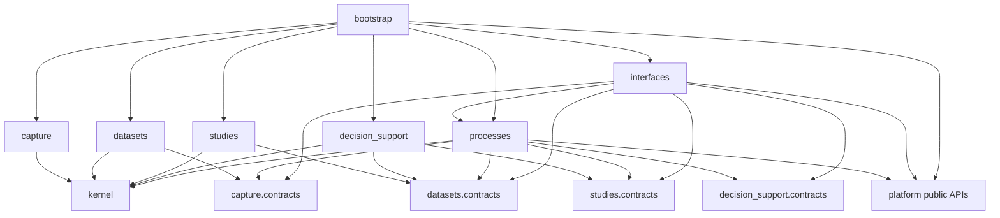
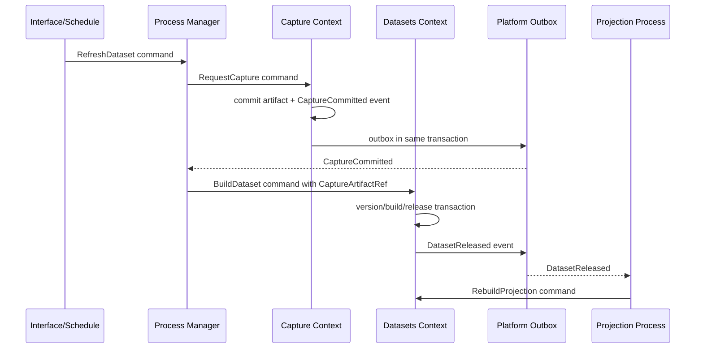
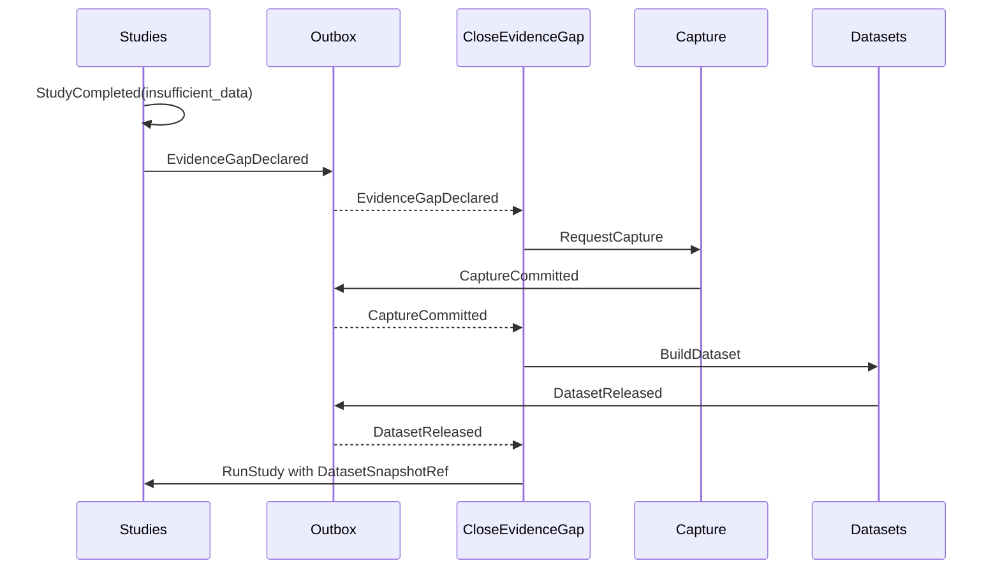
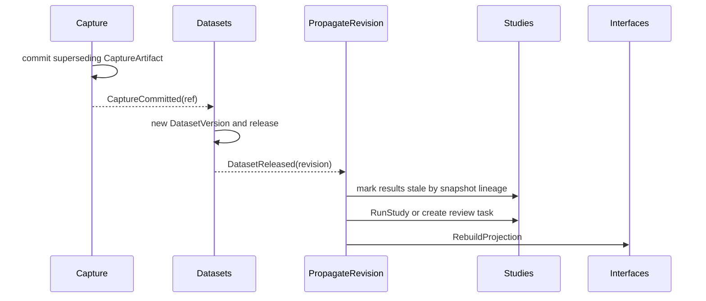
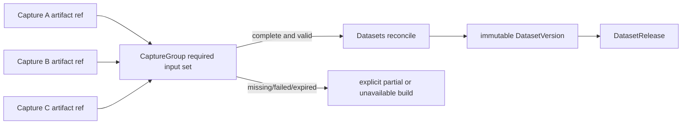
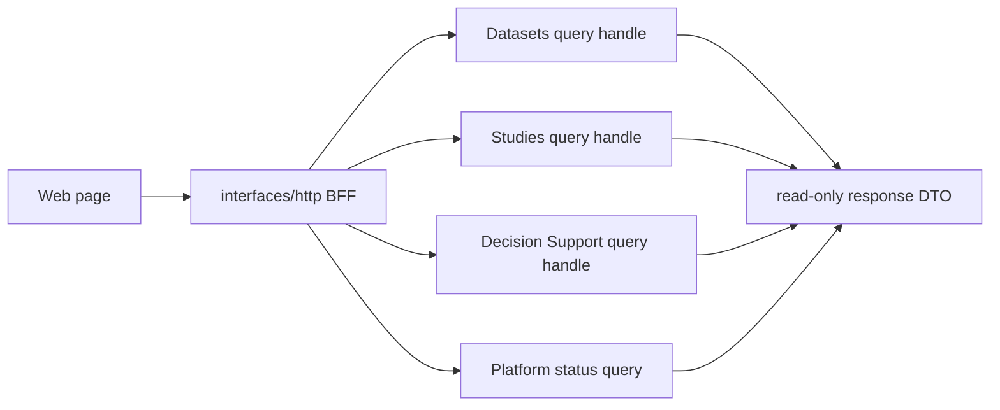
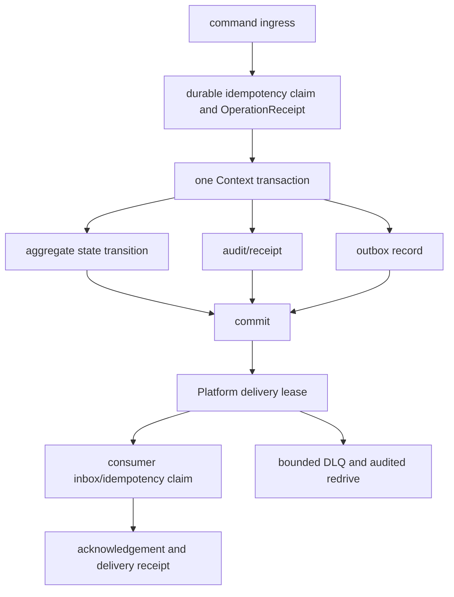

# Trade Architecture Restructure v1

## Context

This governed change designs the target architecture and migration controls for
Trade. It records no production source move, import edit, data migration or
runtime behavior change. The current `master` tree remains the implementation
baseline; this document is a contract for independently reviewable future
changes.

The design has two premises:

1. Code dependencies must be acyclic and locally understandable.
2. Runtime work can still be non-linear: capture may fan out to products,
   products may join multiple captures, a study may declare an evidence gap,
   and revision may invalidate downstream results.

The answer is not a new global service layer. It is a domain-modular monolith
with immutable cross-context references, explicit command/event contracts,
outbox delivery and stateful process managers.

## Current-State Audit

### Evidence and scope

The audit was source-only. It did not open, alter, migrate or write real data,
SQLite files, parquet files, provider endpoints or generated artifacts. The
historical architecture documents in `docs/` informed vocabulary only; all
current-state claims below derive from code and repository configuration.

Four source-audited attachments are normative inputs to this design:

- `current-state-inventory.md` records the repository, runtime, interface,
  state and test/CI inventory at the audited commit;
- `file-ownership-map.md` classifies mixed modules file by file and records
  the proof required before movement;
- `table-and-artifact-ownership.md` assigns the 56 discovered logical tables
  and eight artifact families to candidate or migration-blocked owners; and
- `interface-compatibility-matrix.md` accounts for all 13 canonical CLI
  domains, eight shims, the 68/77 business HTTP routes, both SSE streams,
  product BFFs, SDK/notebook/import and scheduler/event entries.

The attachments do not override a later child audit. A discovered mismatch
blocks movement until the attachment and child design are reconciled; it is
never silently treated as unused code.

| Audited area | Current code fact | Consequence for target design |
|---|---|---|
| CLI | Root `trade` is the stable Bash facade; `trade_py/cli/main.py` registers canonical `run`, `status`, `data`, `show`, `research`, `kg`, `observatory`, `config`, `event`, `backup`, `start`, `web`, `dev` plus legacy shims. | Keep external command names and aliases. Internal Context names do not become an immediate CLI rename. |
| Database | `trade_py/db/trade_db.py` is about 4,690 lines. Its constructor opens SQLite and schema setup spans settings, events, jobs, asset metadata, quality, research, causal decisions and KG. | Replace use of it gradually with context-owned repositories and compatibility delegates; never replace it with a renamed global facade. |
| Migrations | `trade_py/db/migrations.py` centrally changes unrelated tables and historical migrations include rename/alter operations. | New migrations must be owned by the context whose facts they change, remain additive/reversible and retain old readers through the compatibility window. |
| Read paths | `trade_py/data/access/gateway.py` documents readers that can fetch, repair and record work. `get_kline`, `get_fund_flow` and `ensure_sentiment_gold_date` can create side effects. | Formal query contracts are read-only; repair/backfill becomes a command routed through Capture and Processes. |
| Market artifacts | `trade_py/data/market/crypto/service.py` captures provider payloads with hashes and retry evidence. `store.py` stages manifest-bound artifacts, checks predecessor hashes, publishes a current pointer and supports rollback. | Preserve these useful primitives but separate provider interaction from canonical dataset construction/publication. |
| Warehouse | `trade_py/data/warehouse` materializes data and validation artifacts. | Reclassify each artifact as a Dataset product, a Study-local result or a compatibility projection, instead of moving the directory wholesale. |
| Observatory | `trade_py/observatory/domain/models.py` already models `ArtifactRef`, immutable run projections, `Release` and `SnapshotContext`; its catalog SQLite is explicitly rebuildable. | Retain the models' reference concepts and catalog projection behavior, but route them to Datasets/Studies contracts and Interfaces BFFs. Observatory is not a target business context. |
| PIT | `trade_py/observatory/pit/resolver.py` filters by `available_at` or `fetched_at`, but currently keeps rows whose chosen timestamp is absent; `latest_restated` only flags and does not transform revisions. | A child change must make formal PIT resolution fail closed for absent required clocks and define real restatement semantics with golden tests. |
| Source rights and temporal ingestion | `trade_py/data/news/rss/catalog.py` has no license, attribution, retention, redistribution, LLM-use or region policy fields. `data/news/rss/base.py` can substitute collector-now when publication time is absent. | Versioned SourceManifest policy must enforce rights and preserve absent source time; a semantic/ML consumer must retain derivation provenance. |
| Event runtime | `trade_py/bus` has durable event records, channel admission and replay. `trade_py/jobs/__init__.py` is a large job registry/execution concentration coupled to the bus. | Treat current bus mechanics as a Platform seed; extract business job behavior to context use cases and process managers. |
| Runtime shutdown | `trade_web/backend/runtime/resources.py` has a 10-second owner deadline, close-admission ordering and retryable `stopping`, but still wraps blocking `wait=True` shutdowns in daemon threads. `trade_py/cli/web.py` adds a 3-second Uvicorn grace period, 5-second SIGINT watchdog and 2-second post-return forced-exit fallback. `trade_py/bus` has bounded executor cancellation. | Preserve these `converge-runtime-boundaries` compatibility seeds, then give Bootstrap one monotonic deadline and one retryable lifecycle across Web, CLI, workers and schedulers. Nested waits and unowned child process trees remain design debt, which explains observed shutdown hangs. |
| Restore path | `scripts/backup.py` extracts/restores the selected archive without first proving every member against a manifest and SHA-256 digest. | Platform Backup must verify safe archive members and staged contents before activating a restore, then retain an append-only restore receipt. |
| Web | `trade_web/backend/app.py` is about 3,781 lines and mixes routes, BFF reads, direct DB/parquet access and operational writes. `create_app()` registers 72 routes when Observatory is default-off or its data-router registration failed, and 81 when the full Observatory data surface is enabled; both modes include two SSE routes. OpenAPI generation fails on the locally declared `PredictRequest` forward reference. `GET /api/causal/{symbol}` and its validation route can persist state. | Preserve current routes with `interfaces/http/compat`; freeze both capability-gated registry modes and golden payloads before fixing/adding OpenAPI snapshots, and never omit `/predict` because schema generation failed. Convert write-capable GET behavior through compatibility commands before enforcing read-only BFFs. |
| Frontend | `trade_web/frontend/src/lib/api.ts` currently exposes `today`, `candidates`, `symbol`, `ops`, `research`, `data`, `observatory`; product widgets also expose Actions and Trust endpoints. | Existing pages remain product surfaces. Future BFFs compose query handles rather than directly own tables or lifecycle actions. |
| Notebook | `research/notebooks/btc_h1_observatory.py` changes `sys.path` to find repository modules. | Create an SDK/Notebook contract before moving notebook locations; prohibit repository scanning and adapter imports after cutover. |
| C++ | `engine/` is independently built. `engine/cmake/python_bindings.cmake` plans a `trade_py` binding that is not an established working boundary; `trade_py/__init__.py` self-imports as a native probe. | C++ remains an adapter implementation. A future binding is `_trade_native`, accessed only behind a Context port. |

### Current artifact and table inventory

The following is an ownership classification inventory, not a claim that every
listed table exists with exactly the intended future schema. Existing names
remain readable through compatibility repositories until the owning child change
has completed its exit criteria. The machine-readable
`architecture-baseline.toml`, produced from current code by the approved
guardrails/baselines work, is the detailed source for discovered table,
artifact, writer, interface and migration evidence; this parent map groups
those records by future authority rather than duplicating a second inventory.

| Current facts/artifacts | Current code owner | Target classification | Evidence |
|---|---|---|---|
| `asset_registry`, `sync_state`, provider cursors, raw response files, crypto `runs/*/raw` | `TradeDB`, data CLI, crypto service/store | Capture source/checkpoint/request/run/artifact records | `trade_py/db/trade_db.py`, `trade_py/data/market/crypto/*` |
| crypto `runs/*/{primary,shadow,canonical,reconciliation,revisions}.parquet`, manifests and current pointer | BTC run store | Capture artifacts plus Dataset build inputs, DatasetVersion output and compatibility release pointer | `trade_py/data/market/crypto/store.py` |
| `dataset_snapshots`, `daily_quality_gate`, `source_health_daily`, `source_eval_daily`, warehouse parquet and catalog SQLite | `TradeDB`, warehouse, Observatory catalog | Datasets versions/snapshots/releases/quality/projections | `trade_py/db/trade_db.py`, `trade_py/data/warehouse/*`, `trade_py/observatory/catalog/store.py` |
| `factors`, `factor_registry`, `model_registry`, `event_eval_runs`, `model_eval_runs`, H1 receipts | `TradeDB`, research/factor/model CLI and Observatory workflow | Studies, except reusable independently versioned features become derived Datasets | `trade_py/db/trade_db.py`, `trade_py/cli/research.py`, `trade_py/observatory/research/workflow.py` |
| `signals`, `Recommendation`, `RecommendationTrace`, causal decision snapshots/outcomes/reward records, picks/actions | `TradeDB`, services and Web routes | Decision Support cases/reviews/rationales/overrides/intents; historical compatibility projections | `trade_py/db/trade_db.py`, `trade_py/services/*`, `trade_web/backend/app.py` |
| `event_log`, `event_handler_runs`, `bus_events`, delivery/replay state | EventBus and `TradeDB` | Platform events/outbox/delivery state | `trade_py/bus/*`, `trade_py/db/migrations.py` |
| `job_runs`, execution receipts, agenda scheduling | `TradeDB`, jobs, runtime commands | Platform execution and Processes state, with an explicit split of generic receipt versus business process state | `trade_py/db/trade_db.py`, `trade_py/jobs/__init__.py`, `trade_web/backend/runtime/*` |
| `settings`, backup snapshots and runtime configuration | `TradeDB`, CLI config/backup | Platform settings and backup | `trade_py/db/trade_db.py`, `trade_py/cli/config.py`, `trade_py/cli/backup.py` |
| `instruments`, `sector_members`, trading calendar, planned events | `TradeDB` | Dataset reference products, with scheduling projection reads through contracts | `trade_py/db/trade_db.py` |
| KG nodes/relations/candidates, market events and propagation | `TradeDB`, KG CLI | File-by-file classification during Studies/Datasets child changes; no bulk directory move is authorized by this design | `trade_py/db/trade_db.py`, `trade_py/cli/kg.py` |
| `ui_snapshots`, local UI state | `TradeDB`, Web | Rebuildable Interfaces/Platform projections; never business authority | `trade_py/db/trade_db.py`, `trade_web/frontend/src/*` |

### Current mixed-directory file ownership ledger

This ledger is the parent classification baseline. "Split" means the current
file crosses target owners and must remain behind compatibility adapters until
a child extracts behavior into owner-local use cases; it never authorizes a
whole-file move that preserves the coupling.

| Current file or file family | Observed responsibility and coupling | Candidate target owner | Required proof before movement |
|---|---|---|---|
| `analysis/crypto_validation.py` | walk-forward folds, placebo, bootstrap evidence and BTC validation over DataFrames/files | Studies | StudySpec, pinned DatasetSnapshotRef, deterministic environment and result golden |
| `analysis/factor_evaluation.py`, `factor_quantile.py`, `sentiment_ic.py`, `model_trainer.py`, `propagation_training.py` | factor/model evaluation and training, currently reading paths or `TradeDB` | Studies | snapshot-only input, preregistered metrics/labels, no moving files or global DB |
| `analysis/feature_builder.py`, `intraday_runtime.py`, `propagation_runtime.py` | reusable feature construction mixed with provider fetch, DB access, materialization and inference bridges | Split: Capture interaction, Datasets reusable product, Studies run-local transform | separate raw receipt, independently versioned feature schema/lineage test and run-local classification |
| `analysis/devil_advocate.py`, `multi_persona.py`, `patience_tracker.py` | rationale/challenge/debate and decision-follow-up artifacts | Decision Support candidate | immutable Study/Dataset evidence, audit/expiry state and no autonomous execution |
| `analysis/knowledge_graph.py`, `intelligence/graph/*` | reference graph plus learned propagation/model candidates | Split: Datasets reference product, Studies learned validation; Decision Support only for reviewed use | immutable graph schema/lineage, Study validation and row-level KG table audit |
| `evaluation/sources.py`, source/quality portions of `gate.py` and `trust.py` | source health, quality gate and reliability projections | Datasets | DatasetVersion lineage, quality policy identity and owner-local writes |
| `evaluation/events.py`, `models.py`, model portions of `gate.py`, `utils.py` | event/model evaluation, labels, calibration and mutable cache fingerprints | Studies | pinned snapshot, deterministic validation and no direct SQLite/parquet discovery |
| recommendation calibration portions of `evaluation/trust.py` | Brier/drift/trust updates over recommendation history | Decision Support candidate, with Study validation inputs | distinguish model validation from reviewed decision trust; append-only audit and explicit unavailable state |
| `evaluation/service.py` | catch-all orchestration across source, event, model, gate and trust evaluation | Split; later replaced by owner use cases plus a Process | no direct move; one command/event step and transaction owner per extracted behavior |
| `evidence/ingest.py` | evidence ingestion entry | Capture candidate | provider/import identity, raw artifact digest, SourceManifest and replay proof |
| `evidence/enrich.py`, `aggregate.py`, `quality.py` | semantic enrichment, aggregation, smoothing and quality output | Datasets derived products unless proven Study-local | reusable schema/lineage/release versus run-local feature decision |
| `factors/definitions.py`, `technical.py`, `groups/*`, `encoder.py`, `materializer.py` | reusable feature definitions/materialization with direct file/DB dependencies | Datasets when independently versioned and published; otherwise Studies-local | feature ownership rule, immutable input refs, schema/lineage and release contract |
| `factors/inference_bridge.py`, `trust_update.py`, `registry.py` | signal persistence, utility validation and mutable trust/registry state | Split: Studies validation, Datasets published feature metadata, Decision Support signal view | eliminate direct `TradeDB`; identify the one fact and writer for every record |
| `intelligence/raw_record.py`, `clients/*` | raw record identity and external LLM/provider calls | Capture adapters for interaction/receipt; no provider client in Datasets/Studies | SourceManifest processor/licensing policy, request/response receipt, quota/circuit and replay |
| `intelligence/base_factors.py`, `crypto_base_factors.py`, `enricher.py`, `feed_scorer.py` | reusable semantic derivation and source-value outputs | Datasets derived products | model/prompt/parser/environment lineage, immutable input and versioned output schema |
| `intelligence/nlp_train.py`, learned portions of `graph/*` | model fitting and held-out evaluation | Studies | registered StudySpec, OOS evidence, promotion receipt and artifact ref |
| `intelligence/meta_store.py` | mixed raw/source scoring metadata in a separate SQLite store | Split by fact owner; no new global metadata facade | table-by-table owner assignment and migration reconciliation |
| `observatory/catalog/*`, `pit/*`, `service/artifacts.py`, `service/identity.py`, `service/resolver.py`, `service/purpose_fitness.py` | rebuildable catalog, artifact verification, snapshot/PIT and fitness logic | Datasets | formal PIT/revision proof, immutable refs, bounded read and projection rebuild |
| `observatory/research/*` | research run/import/promote workflow and receipts | Studies; file import first enters Capture | DatasetSnapshotRef-only run, import receipt, promotion and deterministic rerun |
| `observatory/query/*`, Web Observatory router and serializers | product query facade, SDK handles and response shaping | Interfaces over Datasets/Studies contracts | no direct artifact/repository path, DTO snapshot and bounded BFF query |
| `observatory/domain/*` | mixed acquisition, quality, research, availability and presentation vocabulary | Split into owner contracts; retain compatibility DTOs during window | type-by-type semantic owner and serialization compatibility matrix |

### Facts, design assumptions and deferred classification

Facts above name current modules and observed behavior. The following target
decisions are design assumptions requiring validation in their owning child
change:

- Exact physical table names for `capture_requests`, `dataset_versions`,
  `study_runs`, `decision_cases`, `outbox` and process state will be selected
  through additive migration design, not inferred from the desired names.
- Legacy KG, causal and recommendation records require row-level analysis before
  final target ownership. They are not automatically Studies merely because they
  look analytical, and they are not automatically Decision Support merely
  because they affect a decision.
- The first release can retain one SQLite database and existing parquet roots.
  Logical repository ownership is mandatory even when physical separation is
  deferred.
- Stream/L2 and remote worker providers use the same Capture contracts but need
  a separate capacity and storage sizing proposal before production activation.
- The registered FastAPI table, not generated OpenAPI alone, is current route
  evidence until the `PredictRequest` schema defect is repaired. The child must
  reconcile both sources and representative payload goldens before extraction.
- Existing Web shutdown improvements are real compatibility behavior, but they
  do not prove that CLI, workers, schedulers, third-party executors or child
  process groups share one lifecycle owner. Platform/Bootstrap owns that proof.

## Problems and Root Causes

1. **Ownership is implicit rather than local.** A global DB facade, broad CLI
   modules and a large Web application own facts from multiple domains. A caller
   cannot infer which transaction, migration, lifecycle state or compatibility
   promise applies from the module it imports.
2. **Reads can mutate or acquire external state.** DataGateway repair behavior
   makes resource cost and causal provenance unavailable to consumers that only
   requested a query. A GET path that marks stale state has the same problem.
3. **Artifact identity is uneven.** BTC has strong manifest/hash/pointer
   primitives, while other paths can derive values from current files, direct
   DB queries or moving latest aliases. Formal research cannot be reproducible
   until all inputs are immutable references.
4. **Runtime coupling hides long process state.** Scheduler, event handlers,
   jobs, CLI and routers can each trigger work, but a cross-context refresh or
   evidence-gap loop has no single durable owner with an idempotency key,
   deadline, compensation state and recovery trace.
5. **Interface code is doing business work.** Web and CLI currently include
   orchestration, direct SQL/parquet work and lifecycle changes. That makes a
   path extraction or product page change high risk.
6. **Temporal claims need a stricter authority.** Existing Observatory models
   contain useful clocks and immutable views, but missing timestamps can be
   rendered visible and restatement policy is not yet a distinct transformation.
7. **Directory names are not reliable owners.** Existing `analysis`,
   `evaluation`, `evidence`, `observatory`, `factors` and `intelligence`
   contain mixed responsibilities. A directory move would reproduce the
   coupling under prettier names.
8. **Shutdown ownership is layered and incomplete.** Uvicorn, Web resources,
   EventBus, command executors and forced-exit safeguards each have local
   behavior. A blocking `wait=True`, non-cooperative child or leftover thread
   can outlive another layer's budget, so the caller sees a hung stop or an
   abrupt exit without one complete resource receipt.

## Design Quality Brief

### Requirements and acceptance

The architecture must allow a maintainer to answer, for any formal fact, who
owns it, how it was produced, which immutable references were used, what state
it is in, and how it is recovered. It must preserve existing human and program
entry points while enabling an incremental route from `trade_py` and
`trade_web/backend` to `src/trade`.

Acceptance of this design requires:

1. The ten capability specifications define repository, Capture, Dataset,
   Study, Decision Support, Process, interface, dependency, migration and
   Platform behavior with executable scenarios.
2. Every target cross-context input is a reference or DTO from an upstream
   `contracts` package. Formal Study execution accepts `DatasetSnapshotRef`
   only.
3. Each future context has a state machine, authoritative transaction boundary,
   repository owner, immutable output and explicit unavailable/quarantine
   outcomes.
4. Existing CLI, HTTP/SSE, Web, SDK, notebook, scheduler and event entrance
   behavior has a documented compatibility owner and a removal condition.
5. Process managers cover refresh, evidence-gap closure, revision propagation,
   study run, publication, projection rebuilding and daily workspace production
   without cyclic source imports or cross-context transactions.
6. Migration work is split into independently reversible child changes with
   temporary-root tests, contract snapshots and compatibility gates.
7. Framework-free Kernel/public contracts are independently designed before the
   Platform foundation consumes them; Platform persistence/events/Bootstrap
   infrastructure then exists before any Context emits a new outbox transition.
   Formal PIT/revision semantics are independently proven before a formal
   SnapshotRef or Study migration.
8. Decision Support has an independent lifecycle/child change after Studies and
   before process/interface cutover; it cannot be collapsed into a page,
   research module or execution context.
9. The HTTP baseline retains the 72-route default/error and 81-route enabled
   Observatory registration modes plus both SSE contracts even while OpenAPI
   generation is broken, and Bootstrap shutdown has one bounded, retryable
   owner contract across every runtime entrypoint.

Users are researchers, operators, Web users, CLI/SDK consumers and future
automation adapters. Non-goals are changing trading semantics, validating a
recommendation model, moving all code at once, or enabling a new external
provider in this design-only change.

### Ownership and boundaries

Business ownership is limited to Capture, Datasets, Studies and Decision
Support. Each has `contracts`, `domain`, `use_cases`, `ports` and `adapters`.
The owner of a context writes its state and migration history; another context
does not read its tables or import its implementation.

`processes` owns only cross-context long-running state and sends commands to
contexts. `platform` owns technical mechanics without business vocabulary.
`interfaces` adapts existing entrances and page BFFs. `bootstrap` is the sole
composition root allowed to import concrete adapters, repositories, use cases,
process managers and platform implementations.

`kernel-and-public-contracts` first supplies the framework-free IDs, envelopes,
`ActorContext`, operation/error DTOs and immutable reference policy types.
Before any Context extraction, `platform-persistence-events-and-bootstrap-
foundation` then supplies the local transaction/outbox port, command ingress
idempotency, consumer inbox/receipt, lease/ack/DLQ recovery, migration
coordination and the one Bootstrap composition root. The current `TradeDB`
remains a compatibility facade during transition. The Platform foundation wraps
its current global bootstrap through an explicit legacy adapter but does not
pretend that Context repositories already exist. Each later Context owner
transition replaces one delegated reader/writer/migration registration; only
then may that portion of `TradeDB` stop its constructor-time global
initialization, migration or write authority.

### Data and state invariants

Identifiers are globally unique, immutable and opaque. A digest identifies
content bytes using a recorded algorithm; a logical reference identifies a
declared version plus its content digest. A mutable alias such as `current` or
`latest` is a projection pointer and is never a formal DatasetBuild or StudyRun
input.

Capture records provider interaction and raw response identity. Dataset builds
consume only immutable capture/dataset references. Dataset releases point to
immutable versions/snapshots and may be superseded or withdrawn without
mutating prior versions. Study runs consume one or more pinned
`DatasetSnapshotRef` values and emit a result with explicit validated,
rejected, insufficient-data, stale or unavailable state. Decision Support may
reference Dataset snapshots and Study results but cannot change either.

Every temporal product preserves `event_time`, `observed_time`,
`available_time`, `first_seen_time`, `fetched_or_received_time` and
`revision_time` when applicable, with UTC storage and explicit source timezone
metadata. A required clock that is absent is explicit unavailable for formal PIT
resolution. It is never silently treated as visible. Exact versus estimated
time provenance is carried in the reference/quality report.

Every formal DatasetVersion and DatasetSnapshot also binds immutable
`CanonicalizationPolicyRef` and `QualityPolicyRef` values with policy/version
digests. Dataset refs include policy, transform/environment, physical-layout,
lineage, revision/retraction mapping and temporal eligibility identities so a
consumer can verify the semantics it pins. The policies state identity, units,
timezone, precision, duplicate, missingness and reconciliation rules.
`as_known` and `latest_restated` are different snapshot transformations: formal
`latest_restated` requires an actual revision/retraction mapping rather than a
label on the same selection. The `formal-pit-and-revision-semantics` child is a
hard predecessor to a formal Dataset release or Study migration.

### Contracts and compatibility

The Bash `trade` facade and Python canonical domains remain external contracts.
HTTP path/method/query/path/body/status/response/error/SSE inventories are
snapshotted before delegation. Web pages retain route, URL/local state and
payload expectations. Current `trade_py` imports, current parquet files and
SQLite table readers remain supported through adapters during the transition.

New stable contracts are versioned immutable refs, commands, past-tense events,
query DTOs and capability interfaces. Contracts do not expose ORM objects,
connections, DataFrames, file paths or concrete repositories. New interface
forms are additive until a published compatibility window and migration checks
permit retirement.

### Persistent-write safety

Each context has one authoritative writer and one local transaction boundary.
The Platform foundation supplies the transaction/outbox port before the first
Context extraction. The owner commits aggregate transition, immutable receipt
or reference, audit record and outbox entry atomically; command ingress and
consumer effects use durable idempotency claims, receipts, leases and
acknowledgements. Capture uses stage -> digest verify -> commit marker ->
receipt/outbox -> reconciliation for cross-store raw bytes. Datasets advances a
release only after its immutable product, policy refs and quality result are
durable; Studies and Decision Support append results and rationale rather than
rewriting prior facts. Cross-context work uses idempotent delivery and process
state, not a shared SQLite transaction. Valid envelopes that cannot be
delivered enter a bounded, auditable Platform DLQ; invalid source content enters
Capture quarantine, which is intentionally a different state.

### Schema migration compatibility

Schema changes are additive versioned changes owned by the Context repository
whose facts change. `DatabaseRuntime` and `MigrationCoordinator` select
read-only, compatible-writer or migration-leader startup and fence
mixed-version writers with a capability generation range and leader lock.
Existing SQLite/parquet readers remain available through backward and forward
compatibility adapters during a minimum 30-day window. The owning child change
uses an idempotent checkpointed replay, dual-read comparison or a
readiness-gated pointer switch before cutover, then records a
`MigrationReconciliationManifest` for census, normalized data, clocks, policy,
lineage, artifact and pointer equivalence. Rollback selects the verified prior
generation or staged verified backup snapshot and never deletes new immutable
records merely to restore old code.

### Point-in-time and predictive evidence

Datasets owns the immutable snapshot and knowledge clock required by formal
Studies. Event, publication, first-seen, available, observed and revision time
are stored in UTC with source/time-confidence provenance. Missing required
clocks block formal PIT visibility. A StudySpec pins a universe, horizon,
benchmark, validation window and feature/label definitions; a result records
coverage, sample count, uncertainty, calibration state and explicit unavailable
or insufficient-data outcome rather than inventing a numeric fallback.

### External-event data safety

Capture validates every external interaction against a versioned SourceManifest
that identifies verified source/provenance, license/attribution, retention,
redistribution/export, allowed processors/regions, credential scope, durable
source/credential admission, request/byte/cost budget, concurrency, retry
classification, circuit breaker and availability state. Quota, cost,
concurrency, Retry-After and circuit generation are durable and shared by every
worker in the same provider/credential/failure-domain scope; half-open probes
use one fenced lease rather than one probe per process. Every formal source
profile binds an approved `SourceAdapterConformanceReceiptRef` covering the
exact executable, dependency lock, runtime, suite and declared capability
matrix, and the passing receipt digest follows the CapturePlan, run, receipt and
artifact lineage. Pull, push, stream, import, replay, correction and tombstone
behavior writes immutable receipts, durable deduplication keys and
quarantine/dead-letter evidence. Provider event/publication time remains absent
when the provider did not supply it; collector-now is never substituted as a
source clock. Rights revocation propagates an explicit restriction through
retained downstream lineage. Provider unavailability, invalid content, rights
restriction and rate limits remain explicit states; replay uses committed
artifacts and never silently repeats a provider request.

### Failure and recovery

Invalid commands fail before a context transaction and return stable
machine-readable reason codes. Provider timeout, rate limit and transient
failures create a failed/deferred CaptureRun with bounded retry classification;
raw bytes are committed only after receipt integrity checks. A corrupt prior
artifact, missing required clock, failed reconciliation or unmet quality
threshold creates a quarantined/unavailable Dataset outcome rather than a
silent formal release.

Every process has a durable idempotency key and resumes from its latest
committed step after crash. Duplicate command delivery returns the existing
receipt/process result. Outbox records are committed atomically with the
context state transition; delivery can repeat, so event consumers are
idempotent. Delivery has an inbox receipt, lease, acknowledgement, bounded
attempt policy, backlog age/count/byte visibility and audited DLQ/redrive.
Capture reconciliation classifies prepared/orphaned/corrupt artifacts after
crash. Ordered deliveries retain scope/sequence/consumer expected-sequence
evidence and do not silently apply `N+1` before `N`. Backup restore first
binds one SQLite/WAL, artifact-generation and delivery/process consistency cut
with declared, rehearsed RPO/RTO, then validates safe archive members, manifest
and SHA-256 digests in a staged root, fences writers, journals a generation
activation, restores owners before projections/interfaces, rebinds runtimes and
passes a health window. A cut mismatch, objective miss or activation failure
leaves or restores the prior active generation. A compensation only changes a
pointer or creates a later record; it does not rewrite a previously immutable
artifact.

Formal Snapshot, StudyResult, DecisionCase, process and backup references
reserve their transitive evidence closure before commit. A consumer pre-acquires
finite owner-issued `EvidenceClosureReservationRef` values, commits its local
aggregate, reservation refs and confirmation outbox atomically, and confirms
upstream protection through idempotent delivery; committed-but-unconfirmed
references reconcile, while uncommitted leases expire under their owner policy.
This is not a cross-Context transaction. Retention/GC closes new reservations
that intersect an immutable target set, repeats its final reachability census
under the same target-level fence and persists planned/prepared/deleted target
state plus an atomic deletion receipt. This prevents a new differently
identified proof closure from racing between census and unlink, and makes an
absent or changed target without matching prepared evidence an integrity
refusal rather than a successful delete.

Bootstrap owns one shutdown attempt and one monotonic deadline across CLI, Web,
workers and schedulers. The order is: reject new ingress and schedules; settle
or cancel Process/event claims; terminate owned child process groups with
bounded TERM/KILL escalation; drain executors, queues, SSE heartbeats and
leases; persist owner-local receipts/outbox; close repositories and SQLite
last. Every component receives only the remaining owner budget. A timeout
records the still-live resource and leaves retryable `stopping`; it never
starts another full-duration wait, closes a database under live work, or
reports `stopped` while owned processes/threads remain. Repeated signal,
lifespan and caller stops join the same attempt.

The same ownership starts during construction, not only after `running`.
Bootstrap registers each acquired resource before admission; a later startup
failure closes admission and cleans only acquired resources in reverse
dependency order under one startup-cleanup deadline. A stuck startup worker,
executor or lease therefore remains visible as retryable `stopping` and cannot
be hidden behind a daemon cleanup thread or an unbounded legacy `wait=True`.

### Performance and capacity

This design makes no unsupported throughput promise. The Platform foundation
child establishes the measurement harness; every durable child proposes a
measured 1x workload and a 10x workload against temporary roots, declared
SLOs and explicit CPU/memory/disk/SQLite-lock budgets. A child cannot call a
qualitative "bounded" policy sufficient until it has the dimensions, observed
limits and overload result needed for its own surface.

`SourceManifest` accounts admission durably by source and credential scope,
not only process-local memory. It declares requests/bytes/cost windows,
concurrency, Retry-After handling, jitter, deadline and stream limits
(segment bytes, buffered bytes, uncommitted segment count and checkpoint lag).
Large payloads stream to immutable segments; runtime envelopes carry references
rather than frames or raw bodies.

The Platform `CapacityEnvelope` makes 1x/10x results comparable across children:
it records workload shape, source/credential scope, runner resources, latency,
admission, SQLite-lock/write, scan, CPU/memory/disk, backlog/recovery and
explicit overload evidence. The numerical values in `design-quality.toml` are
schema-fixture examples only, not production defaults; each SourceManifest and
child reserves documented provider-supported and measured limits before
activation.

Isolated child results are necessary but not sufficient. Every cumulative
cutover also emits one `CombinedCapacityEnvelope` for the exact deployment
topology that will coexist after selection. It concurrently exercises the new
surface with all already selected provider/stream, Dataset/Study, outbox/replay,
Process, maintenance and BFF/SSE workloads and allocates the whole runner's
CPU, memory, disk throughput/space, SQLite writer time, file descriptors,
connections, workers and child processes. Per-subsystem reservations must sum
within the whole-system envelope, and overload must demonstrate finite
admission shedding, backlog and fair recovery. A set of isolated passes cannot
approve a combined topology that starves scrub, replay, shutdown or interface
traffic.

Dataset policy declares physical layout (partition, sort, row-group/file and
compression constraints) and each read handle carries a `QueryBudget` for
SQLite indexes/locks, Parquet partition/files/bytes scans and constrained
DuckDB plan/wall-time/memory use. Dataset and Study builds execute as bounded
Platform executions with timeout, cancellation state and resource receipt.
Outbox/process delivery declares payload cap, batch, in-flight count, ordering,
lease, retry, DLQ, retention/watermark and backlog age/count/byte budgets.

Every BFF declares parallel-query count, deadline, page size, cache/coalescing
key and fan-out cost. SSE uses one bounded shared hub per instance rather than
a poller per client, with connection limits by instance/identity, per-client
item/byte queues, heartbeats, idle timeouts, slow-client disconnect and cursor
expiry/resync. The 10x fixtures include provider admission, stream burst,
SQLite contention, outbox recovery, Dataset scans and concurrent/slow SSE
clients; a failed resource or SLO budget blocks the child cutover.

### Observability and operations

Every capture, build, release, study, decision and process exposes a correlation
ID, causation ID, idempotency key, state, current step, source/version
references and safe failure code. Context audit records retain actor, command,
time, input references, output references and policy versions. Platform events
retain delivery state and process execution retains timing, retry and
cancellation evidence.

Runtime status also exposes lifecycle generation, shutdown attempt/deadline,
admission state, component outcome, live child/thread/lease counts, TERM/KILL
outcome and last timeout reason. This is the operator-visible answer to a
stuck stop: it distinguishes work still draining, a non-cooperative child, an
executor/heartbeat leak, a database-use dependency and a completed shutdown.

Status responses distinguish `empty`, `partial`, `degraded`, `unavailable`,
`quarantined`, `stale`, `blocked`, `failed`, `unknown` and `not_observed`; none
is represented as a successful empty result. Trusted `ActorContext`,
`OperationReceipt`, `ProcessView` and a compatibility-safe versioned
`ErrorEnvelope` provide bounded CLI/HTTP/SSE inspection and recovery linkage.
`trade status`, `trade show` and Operations expose Process, retention/GC and
recovery views. Logs and metrics do not contain raw provider payloads or
credentials; artifact digests and opaque IDs enable diagnosis.

The `operational-sli-slo-alert-runbook-matrix` artifact is a pre-cutover
deliverable for each child. It assigns signal source/cardinality, SLI formula,
window/no-data behavior, SLO, warning/page threshold, dedupe/escalation,
owner/review cadence, drill-down link and authorized receipt-producing runbook
command to Capture admission/rights/clock state, Dataset query/release state,
outbox backlog/DLQ, Process deadline/retry state, BFF/SSE saturation,
projection lag, backup verification and retention. Retention status reports
classes, legal holds, reachable-reference blocks, projected capacity and any
retention-at-risk condition. Detailed thresholds are measured and ratified by
the relevant child rather than invented in this parent design.

### Validation strategy

Future implementation uses temporary data roots and fixtures only. Required
coverage includes import-dependency guardrails, contract snapshots, immutable
reference replay, PIT golden fixtures, capture replay, lineage, deterministic
Study rerun, process recovery/idempotency, database owner checks, read-only
query checks, C++/Python differential tests and migration rollback tests.
Bootstrap lifecycle fixtures inject a non-cooperative child, a stuck executor,
an SSE heartbeat, repeated stop callers and an in-use SQLite connection, then
assert one deadline, process-tree termination, dependency ordering, retryable
`stopping` and zero live owned resources on success.

Each child change runs `./trade dev check --show-plan`, `./trade dev check`,
focused tests, language-specific build/type checks and `git diff --check`.
Before every implementation begins, the applicable design remains strict
approved; before merge, the changed implementation diff receives a new
six-role review. Any use of real data is a separately approved read-only probe
and does not substitute for fixture coverage.

### Alternatives and trade-offs

**Big-bang `src/trade` move:** superficially improves directory appearance but
changes imports, packaging, adapters and public surfaces together. It prevents
isolation of behavior regressions and has no independent rollback. Rejected.

**Keep `TradeDB` and add a façade above it:** reduces immediate code churn but
retains a cross-domain owner and merely moves callers to a new catch-all API.
Rejected.

**One shared Evidence/Quality context:** appears to centralize assurance but
splits Dataset lifecycle facts from their owning product and duplicates
authority. Rejected. Quality, lineage, revision, PIT, catalog and release are
Datasets responsibilities.

**Synchronous cross-context service calls:** can be simpler for a linear
refresh, but creates import cycles, coupled transactions and opaque recovery
when evidence gaps or revisions feed back. Rejected for cross-context work.

**Domain-modular monolith with contracts and process managers:** retains local
deployment and SQLite practicality while separating code ownership from
non-linear runtime coordination. It has more explicit contracts and migration
discipline, but those costs directly address reproducibility, compatibility and
recovery. Selected.

### Rollout and rollback

Rollout begins with static dependency guardrails and public contract baselines,
then adds Kernel/contracts and the Platform/Bootstrap foundation, then Capture,
Datasets, Studies, Decision Support, Processes and interfaces, before any
package layout move or legacy retirement. Every child change is independently
reviewable, worktree-isolated and feature-gated by compatible adapters.

Schema evolution is additive-versioned and retains old versions until both
forward and backward readers have passed comparison fixtures. New records are
dual-written only through the owning repository and only when an explicit
idempotent replay/shadow-copy plan exists. Cutover uses dual-read comparison or
a versioned pointer switch with a readiness gate. Rollback restores the prior
pointer or prior code path and retains immutable new artifacts for audit; it
does not delete data to make a rollback appear clean.

## Selected Architecture

### Target repository layout

```text
src/trade/
  kernel/
    ids.py time.py digest.py errors.py result.py envelope.py
  capture/
    contracts/ domain/ use_cases/ ports/ adapters/
  datasets/
    contracts/ domain/ use_cases/ ports/ adapters/
  studies/
    contracts/ domain/ use_cases/ ports/ adapters/
  decision_support/
    contracts/ domain/ use_cases/ ports/ adapters/
  processes/
    refresh_dataset/ close_evidence_gap/ propagate_revision/
    run_registered_study/ publish_dataset/ rebuild_projection/
    generate_daily_workspace/
  platform/
    execution/ events/ scheduling/ persistence/ settings/ backup/
  interfaces/
    cli/ http/ sdk/ events/ schedules/ imports/
  bootstrap/

web/
engine/
tests/
tools/
examples/
docs/
openspec/
config/
deployment/
```

The layout is a destination, not a permission to move current directories.
`trade_py/` and `trade_web/backend/` are compatibility roots until the
`python-package-and-web-layout` child change has passed packaging, CLI, HTTP,
SDK and import-contract validation.

### Bounded contexts

| Context | Owns | Stable outputs | Must not own |
|---|---|---|---|
| Capture | SourceManifest, CaptureRequest, CapturePlan, CaptureRun, CaptureArtifact, CaptureArtifactRef, CaptureGroup, CaptureCheckpoint, transport receipt | raw content artifact, receipt, checkpoint, supersession link | canonical schema, Dataset release, PIT, quality conclusion, feature, hypothesis, recommendation |
| Datasets | DatasetVersion, DatasetVersionRef, DatasetSnapshot, DatasetSnapshotRef, DatasetRelease, DatasetBuild, QualityReport, Lineage | canonical version/snapshot, release, quality/quarantine result, catalog projection | provider interaction, formal Study inference, decision case |
| Studies | Study, Hypothesis, StudySpec, StudyRun, ValidationReport, StudyResult, StudyResultRef, PromotionReceipt, EvidenceGap | validation/result/promotion or explicit insufficient-data/rejection outcome | provider/raw reads, direct Capture call, current alias resolution, Decision Support state |
| Decision Support | DecisionCase, Review, Rationale, Override, PortfolioIntent, Expiry, AuditTrail | reviewed human-assist decision evidence and intent | source acquisition, Dataset/Study mutation, execution expansion |

`platform` has no instrument, market, Dataset, Study, recommendation or
portfolio business terms. `processes` has no authority to mutate an aggregate
except by an owning context command. `interfaces` has no business table owner.

### Context cell and internal rules

Every business context uses:

```text
<context>/
  contracts/
  domain/
  use_cases/
  ports/
  adapters/
```

`contracts` exports immutable refs, command/event/query DTOs and capability
interfaces. `domain` only depends on Kernel. `ports` describes required
external capability. `use_cases` depends on own domain/ports/contracts and
upstream contracts. `adapters` implements own ports using external libraries
or generic Platform capabilities selected by Bootstrap. Business Context source
does not import Platform; this preserves the declared Context dependency graph
while still reusing technical implementations at runtime.

One use case file owns one behavior, for example `request_capture.py`,
`commit_capture.py`, `build_dataset.py`, `publish_dataset.py`,
`resolve_snapshot.py`, `run_study.py`, `promote_study.py`. The architecture
does not introduce catch-all `service.py`, `manager.py`, `facade.py`,
`utils.py` or `helpers.py`.

### Kernel admission rule

Kernel contains only `ids`, `time`, `digest`, `errors`, `result` and
`envelope`. A type enters Kernel only when all are true:

1. At least two contexts use it.
2. Its semantics are identical in every use.
3. It has no business owner.
4. It does not depend on a framework or concrete adapter.
5. It is expected to remain stable over the migration window.

Small context-local duplicate value objects are preferable to a premature
shared abstraction.

## Aggregate and State Machine Definitions

### Capture

`SourceManifest` defines provider identity, verified provenance,
license/attribution, retention/legal-hold class, redistribution/export,
processor/region, credential scope, rate/quota/cost policy, request grammar,
source timezone and revocation state. `CaptureRequest` is immutable intent.
`CapturePlan` expands request partitions/segments. `CaptureRun` owns attempt
state, while `CaptureArtifact` owns committed raw bytes and digest.

```text
CaptureRequest: requested -> planned -> dispatched -> completed | failed | cancelled
CaptureRun:     created -> running -> received -> committed | retryable_failed |
                terminal_failed | cancelled
CaptureArtifact: provisional -> committed -> superseded | retained | tombstoned
```

`committed` requires stage -> digest verification -> immutable commit marker ->
receipt/outbox transaction. A receipt contains source/request identity, resolved
SourceManifest policy digest, mode, timestamps, source-time confidence,
content digest, content type/encoding, segment/cursor/finality/revision
identity and retry classification. Startup reconciliation classifies prepared,
orphaned and receipt-mismatched storage states without publishing an ambiguous
ref. A successful empty response is a committed artifact with
`availability=empty`, not a missing run. Replay reads the existing artifact and
creates a new replay receipt; it never recontacts the provider. Collector time
is retained as collector time and never substituted for a missing source event
or publication time.

Supported graph forms are explicit:

- one CaptureArtifact can be consumed by many DatasetBuilds;
- a DatasetBuild can consume a declared set of CaptureArtifactRefs;
- a CaptureGroup gathers multi-source artifacts before a join;
- stream segments are separate immutable artifacts with ordered checkpoint
  lineage;
- a later CaptureArtifact supersedes prior artifact identity through a link,
  never by overwriting raw bytes.

### Datasets

`DatasetBuild` records declared immutable inputs, schema/version policy,
transform code identity, immutable `CanonicalizationPolicyRef` and
`QualityPolicyRef`, physical layout and output candidate. `DatasetVersion` is
immutable canonical content. `DatasetSnapshot` pins a selection of versions,
effective knowledge cut and a real knowledge/revision transformation.
`DatasetRelease` is the mutable publication record pointing to an immutable
output.

```text
DatasetBuild:     requested -> building -> validated -> candidate |
                  quarantined | failed | cancelled
DatasetVersion:   candidate -> released | superseded | withdrawn | retained
DatasetSnapshot:  created -> resolved -> expired | retained
DatasetRelease:   unpublished -> published -> superseded | withdrawn
QualityReport:    pending -> passed | warned | blocked | quarantined
```

A formal build accepts only `CaptureArtifactRef`, `DatasetVersionRef` and
`DatasetSnapshotRef`. It may produce no release when inputs are incomplete,
schema-invalid, duplicate-conflicted, right-restricted, PIT-not-proven or
quality-blocked. A formal snapshot is unavailable when its required clock or
revision mapping is absent. `as_known` and `latest_restated` create distinct
immutable outputs. Catalogs and UI caches are rebuildable projections and do
not become a second authoritative fact store. A generation-stamped release is
the only authority for materializing a legacy pointer; a journal and startup
reconciliation repair projection drift without allowing the pointer to write
back.

### Studies

`Study` owns intent and lifecycle. `Hypothesis` is preregistered claim/version.
`StudySpec` pins feature/label definition, universe, sample, method, benchmark,
walk-forward and multiple-testing policy. `StudyRun` pins only formal,
PIT-proven DatasetSnapshot references with their policy lineage. `StudyResult`
is immutable and its status is explicit.

```text
Study:       drafted -> registered -> active -> retired
StudyRun:    requested -> running -> validated -> completed |
             insufficient_data | rejected | failed | cancelled
StudyResult: observed -> validated | rejected | stale | expired
Promotion:   proposed -> promoted | declined | revoked
EvidenceGap: declared -> accepted -> closing -> closed | unresolved | expired
```

A reusable feature with independent schema, lineage, publication and version is
a Datasets derived product. Fold-local transforms, placebo features,
experiment-only interactions and labels remain Study-run-local. A Study can
declare `EvidenceGapDeclared`, but does not call Capture. Processes converts the
gap to the appropriate Capture/Dataset/Study commands.

### Decision Support

`DecisionCase` is a human-assistance record, not an execution order. It can
reference `DatasetSnapshotRef` and `StudyResultRef`; it cannot own a provider
request or release pointer.

```text
DecisionCase: draft -> ready_for_review -> under_review -> accepted |
              rejected | expired | superseded | withdrawn
Review:       requested -> in_progress -> submitted -> superseded
Override:     proposed -> approved | rejected | expired
Intent:       drafted -> accepted | cancelled | expired
```

`AuditTrail`, submitted Review, Rationale and Override records are append-only.
Every transition records actor, reason, evidence refs, policy, correlation and
causation in one Decision Support transaction. Expiry or an upstream
Dataset/Study revision produces an explicit expired/stale/under-review view
rather than copying a past recommendation forward. `PortfolioIntent` remains a
non-executable human-assist artifact; this design creates no broker, exchange,
order, settlement or capital-risk capability.

## Immutable Reference Model

Every contract reference includes an opaque ID, version or generation,
content digest, producer identity and immutable location abstraction. A
reference is not a Python path or DataFrame.

| Reference | Required identity | May be consumed by |
|---|---|---|
| `CaptureArtifactRef` | artifact ID, source ID, request identity, digest, receipt ID, segment/revision identity | Datasets only |
| `DatasetVersionRef` | dataset ID, schema/version ID, content digest, canonicalization-policy digest, quality-policy digest, transform/environment digest, physical-layout digest, ordered lineage digest | Datasets |
| `DatasetSnapshotRef` | snapshot ID, constituent version digests, knowledge mode/effective cut, revision/retraction mapping digest, clock-confidence/eligibility digest, snapshot digest | Studies, Decision Support, Interfaces query |
| `StudyResultRef` | study/hypothesis/spec/run IDs, result digest, validation state, source snapshot refs | Decision Support, Interfaces query |
| `DecisionCaseRef` | case ID, audit generation, expiry state | Interfaces query only unless an explicit future contract is introduced |

Formal use cases reject `latest`, a filesystem path, a DataFrame, arbitrary
SQL result, unpinned provider response or mutable catalog selection as input.
Compatibility interfaces may resolve an old alias through an owning query
handle, but the resulting command receipt records the resolved immutable ref.

## Code Dependency Graph



The graph is enforced by static import tests and a deny-list:

```text
business context -> processes                       forbidden
business context -> another context implementation  forbidden
business context -> platform                         forbidden; use own port
platform -> business Context contracts/implementation forbidden
domain -> ports/adapters/use_cases                   forbidden
use_cases -> concrete adapters                       forbidden
contracts -> framework/ORM/DataFrame/connection      forbidden
interfaces -> business table/repository              forbidden
platform -> business terminology                     forbidden
```

## Runtime Command, Event and Outbox Graph

Code dependencies remain acyclic; runtime references can form a controlled
graph through persisted events and process state.



### Evidence-gap feedback



### Revision propagation



### Multi-source aggregation



### HTTP/Web query composition



### Command/event/outbox transaction



## Process Manager Design

Each process record has:

```text
process_id
process_type
correlation_id
causation_id
idempotency_key
state
current_step
retry_count
deadline
last_error
compensation_state
```

Every command ingress returns an `OperationReceipt` with operation ID,
`ActorContext`, command digest, correlation/causation, idempotency key, state,
safe reason and Process link. Operations interfaces query a bounded
`ProcessView` from Processes/Platform rather than directly reading business
tables. Envelopes carry immutable refs only, use a declared ordering key and
payload cap, and persist consumer inbox, delivery lease, acknowledgement,
attempt, backlog-age/count/byte and DLQ/redrive state. The source-context
transaction owns state/audit/outbox; the Platform foundation owns ingress,
dispatch and consumer delivery mechanics.

The state machine is:

```text
requested -> running
running -> waiting | retry_scheduled | compensation_pending
running -> completed | blocked | cancelled | deadline_exceeded | failed
waiting -> running | compensation_pending | blocked | cancelled | deadline_exceeded
retry_scheduled -> running | cancelled | deadline_exceeded
compensation_pending -> compensated | failed
```

Every transition is persisted with expected prior state and process generation.
`completed`, `compensated`, `failed`, `blocked`, `cancelled` and
`deadline_exceeded` are terminal for one attempt; a retry or operator recovery
creates or resumes the explicitly permitted generation rather than rewriting a
terminal receipt.

| Process | Trigger and commands | Completion/compensation |
|---|---|---|
| `refresh_dataset` | Schedule/interface sends refresh; requests capture, then build, release and projection rebuild. | Complete on projection receipt; stale release pointer is not changed until release succeeds. |
| `close_evidence_gap` | `EvidenceGapDeclared`; requests Capture, Dataset build/release and Study rerun. | Resolve only when the rerun has a declared result; retain gap on provider/quality failure. |
| `propagate_revision` | Dataset release declares supersession/revision. | Mark lineage-affected StudyResults stale; rerun automatic eligible studies or open review tasks. |
| `run_registered_study` | Study command with immutable snapshot refs. | Emit completed/rejected/insufficient-data event; no capture call is permitted. |
| `publish_dataset` | Candidate passed quality and policy; Process may request the command after an external trigger. | Datasets atomically owns release generation, pointer materialization journal and outbox event; compensating withdrawal creates a later release state. |
| `rebuild_projection` | Dataset/Study/Decision event or operator rebuild command. | Build a replaceable catalog/BFF projection by generation/CAS. |
| `generate_daily_workspace` | Schedule command after dependencies become visible. | Compose current approved refs into a workspace projection; explicit partial/degraded status is allowed. |

Process handlers decode an event, claim durable process ownership, invoke the
process manager and record an outcome. They do not embed the entire workflow.
Schedulers emit command envelopes only. A CLI or HTTP handler creates a command
and returns a receipt/process ID; it does not synchronously own every step.

Replacing a legacy workflow handler is itself a durable Process-owned semantic
transition over a generic Platform selector. Forward selection is
`legacy_selected -> denying_legacy -> quiescing_legacy ->
process_switch_prepared -> process_selected`; rollback is symmetric. Selection
requires durable admission denial, zero losing-handler owned operations and
child processes, and settled or transferred Platform Events leases before one
generation-fenced selector compare-and-swap. Crash recovery and every rollback
step retain exactly one selected handler; a blocked non-cooperative legacy
handler cannot coexist with a newly selected Process handler.

## Database and Artifact Ownership

### Target logical table ownership

One table has one context owner. The physical SQLite file may remain shared
temporarily, but only the owner repository writes and migrates its tables.
Readers from another context use contracts, events or an owned projection.
The row-complete current-to-target ledger is
`table-and-artifact-ownership.md`; entries marked `MIGRATION BLOCKED` remain
under their current compatibility owner until a child supplies row-level
classification, writer proof, additive migration and rollback evidence.

| Table or artifact family | Current owner | Target context/repository | Readers | Writers | Transaction boundary | Migration owner |
|---|---|---|---|---|---|---|
| source registry / source manifests | `asset_registry`, CLI config | Capture `SourceManifestRepository` | interfaces, processes | Capture | source command + audit/outbox | Capture |
| capture requests/plans/runs/checkpoints | mixed data CLI/sync state | Capture `CaptureRepository` | processes, operations query | Capture | request/run/receipt | Capture |
| raw payload and stream segments | crypto run files and provider paths | Capture `ArtifactStore` | Datasets via ref | Capture | stage/digest/marker/receipt | Capture |
| canonical versions/builds/lineage | warehouse/crypto store | Datasets `DatasetRepository` | Studies, interfaces | Datasets | build/version/quality/outbox | Datasets |
| canonicalization/quality/derivation policies | mixed validation/enrichment configuration | Datasets policy repositories | Datasets, Studies through refs | Datasets | policy version/audit/outbox | Datasets |
| releases/snapshots/current compatibility pointer | crypto pointer, dataset snapshot records | Datasets `ReleaseRepository` | all via ref/query | Datasets | release generation/pointer journal/outbox | Datasets |
| quality findings/quarantine | daily gate and quality records | Datasets `QualityRepository` | interfaces, Studies eligibility | Datasets | finding/build decision | Datasets |
| Dataset catalog/release/PIT projections | Observatory catalog and Dataset-facing UI projections | Datasets `CatalogProjectionRepository` | interfaces, Studies through query contracts | Datasets projection use case | release/projection generation | Datasets |
| disposable interface response/cache views | Web/UI local materializations | Interfaces `BffViewRepository` | interfaces only | Interfaces BFF projection adapter | replaceable response generation | Interfaces |
| reusable derived features | factors/registry after classification | Datasets `DerivedDatasetRepository` | Studies, Decision Support | Datasets | dataset build | Datasets |
| studies/specs/runs/results/validation | model/factor/eval records | Studies `StudyRepository` | Decision Support, interfaces | Studies | run/result/outbox | Studies |
| evidence gaps/promotion receipts | current research workflow artifacts | Studies `StudyRepository` | processes, interfaces | Studies | gap/result transition | Studies |
| decision cases/reviews/overrides/intents | recommendation/causal records after classification | Decision Support `DecisionRepository` | interfaces | Decision Support | case/review/audit | Decision Support |
| event log/outbox/inbox/delivery/DLQ state | EventBus tables | Platform Events store | all through API | Platform Events | context outbox plus delivery transition | Platform Events |
| execution receipts | job runs/runtime commands | Platform Execution store | processes, operations | Platform Execution | execution receipt | Platform Execution |
| operation receipts/process state | agenda/workflow records after classification | Processes `ProcessRepository` | interfaces | Processes | ingress/process claim/step state | Processes |
| schedules/leases | agenda/calendar scheduling mechanics | Platform Scheduling store | processes | Platform Scheduling | lease/fire state | Platform Scheduling |
| settings/backups/restore receipts | settings/backup snapshot tables | Platform settings/backup stores | capture config, interfaces | Platform | setting/backup/restore record | Platform |

Business SQL and business migrations live in the owning context adapter. Platform
persistence provides connection, transaction, lock, read-only session and
migration-runner primitives only. It contains no market/business SQL.

### Artifact ownership

| Artifact | Owner | Immutability/pointer rule |
|---|---|---|
| provider raw response, import payload, stream segment | Capture | stage/digest/commit-marker/receipt protocol; immutable artifact with rights and source-time facts |
| canonical table/parquet and reconciliation output | Datasets | immutable DatasetVersion artifact with canonicalization/quality policy refs; formal consumers receive only ref |
| snapshot membership manifest | Datasets | immutable snapshot digest; changes create a new snapshot |
| Dataset catalog/release/PIT projection | Datasets | rebuildable from version/snapshot/release/lineage by generation; never input authority |
| disposable BFF response/cache view | Interfaces | bounded, replaceable from Context query DTOs; never artifact/table authority |
| feature artifact | Datasets if reusable/versioned; Studies if fold-local | reusable semantic artifact includes a DerivationReceipt; no implicit promotion from local experiment to public dataset |
| validation/result/model artifact | Studies | immutable result ref with snapshot lineage and validation state |
| decision rationale/review receipt | Decision Support | append-only audit; expiry/supersession is a new state |
| backup archive | Platform Backup | immutable manifest/digest; staged verified restore creates audited recovery action |

## Query and Command Separation

Queries:

- accept a query DTO and resolved immutable ref or stable projection selector;
- open a read-only session or immutable artifact reader;
- return DTOs with explicit availability/quality/staleness state;
- do not fetch a provider, run repair, mutate a pointer, mark stale, enqueue
  work or write an audit record except access telemetry owned by Platform.

Commands:

- validate identity and policy;
- select one context owner;
- make one context-local state transition and outbox write;
- return a receipt with correlation/causation/idempotency identity;
- delegate follow-on work through event delivery/process managers.

The existing `DataGateway` repair behavior and Web GET stale marking are
baseline findings. They are not grandfathered once the corresponding Context
query contracts exist.

## Interface Compatibility

### CLI

| Existing command surface | Target interface owner | Delegation target | Removal condition |
|---|---|---|---|
| `trade run` | `interfaces/cli/compat/run` | process command/query handles | Alias only retires after documented replacement has a release window, snapshot parity and migration guide. |
| `trade status`, `trade show` | `interfaces/cli/compat/status_show` | platform/context read queries | Legacy spelling retires after output and exit-code contract snapshot remains stable for the window. |
| `trade data` | `interfaces/cli/compat/data` | Capture/Datasets commands and queries | Advanced subcommands retire individually after direct equivalent and import/replay tests. |
| `trade research`, `trade kg` | `interfaces/cli/compat/research` | Studies commands/queries; classified Datasets inputs | Old names stay while study and KG classification is complete with compatibility fixtures. |
| `trade observatory` | `interfaces/cli/compat/observatory` | Datasets/Studies queries and projection commands | Retire only if a product-neutral documented alias preserves catalog/research behavior. |
| `trade config`, `trade backup` | `interfaces/cli/compat/platform` | Platform settings/backup plus Capture SourceManifest commands | Existing flags and exit status remain until versioned successor is stable. |
| `trade event`, `trade start` | `interfaces/cli/compat/events` | Platform event/schedule/process handles | Retire only after command-envelope and replay compatibility passes. |
| `trade web`, `trade dev` | root facade / interfaces runtime | Web bootstrap and developer tooling | No planned removal in this architecture. |
| deprecated `doctor`, `inspect`, `daily`, `ops`, `account`, `model`, `factor`, `evaluate` | existing shims under CLI compat | current canonical commands | Follow existing deprecation policy; do not remove in a structural move. |

### HTTP and SSE

The authoritative route inventory is generated from current FastAPI
registration before each extraction. Audit reproduces 72 routes when
Observatory is default-off or its data-router registration fails, and 81 routes
when its full data surface is enabled. The capability probe remains present in
all three states; the nine data routes are capability-gated. Both inventories
include:

- `GET /api/events/stream(after_id=0, limit=50, poll_seconds=2.0)`, where
  `limit` is 1 through 500 and polling is 0.25 through 60 seconds;
- `GET /api/runtime/stream(scope="report", poll_seconds=2.0)`, with the same
  polling range.

Compatibility requires preserving:

- path and HTTP method;
- path/query/body fields, defaults and validation;
- status codes, headers, error shape and capability gates;
- SSE event names, reconnect behavior and bounded cursor semantics;
- response payload fields used by the React client, scripts and SDK.

`interface-compatibility-matrix.md` is the complete current registry ledger. It
accounts for the 68 default/error and 77 enabled business routes by mutually
exclusive families, records inputs/defaults/status/header/error behavior for
every route, and binds each family to a target owner, fixture and deletion
condition. Child changes regenerate rather than hand-maintain the executable
registry snapshot, but any difference from this audited ledger is a review
finding that must be explained before delegation.

Current route families are runtime/status/calendar/agenda/backup; DAG,
trigger/run, events/workflows and execution runs; automation/report/KG;
warehouse/readiness/replay/compute; prediction/model reload; Today, belief,
signals, state, explanation, causal validation, Actions and Trust; symbol
evidence/sector/data operations/Kline; data inventory/gaps/news/coverage; and
the capability-gated BTC Observatory context/series/date/trust/runs/diff/
hypothesis/research routes. `POST /predict` remains in the inventory.

The current `app.openapi()` call fails because the function-local
`PredictRequest` remains an unresolved Pydantic forward reference. Until a
compatibility child repairs that defect, route registry signatures and golden
requests/responses are the primary baseline. OpenAPI failure is a failed check,
not permission to emit an empty file or omit `/predict`. After repair, registry
and OpenAPI snapshots must reconcile.

`interfaces/http/compat/` accepts old transport forms and maps them to stable
use-case/query DTOs. It is the only place allowed to understand legacy payload
aliases. New BFF routers use query handles and commands; they do not import a
context repository or scan parquet. Existing `/api/*` routes are not renamed
because a Python module moved. The current
`GET /api/causal/{symbol}?persist=true` and
`GET /api/causal/{symbol}/validation` defaulting `persist=true` are explicit
query/command debt: compatibility must preserve old responses while delegating
writes to a receipt-producing command path, then deprecate write-on-GET only
through a separately approved public-contract transition.

### Web page BFF matrix

| Current/product surface | Current evidence | Target BFF composition | Forbidden behavior |
|---|---|---|---|
| Today | `TodayPage`, `/api/today-page`, trust/operations widgets | Datasets + Studies + Decision Support + Platform | direct data repair or release mutation |
| Observatory | focused Observatory router/page | Datasets + Studies immutable query views | becoming a bounded context or reading raw provider files |
| Assurance / Data Quality | trust/readiness/quality views | Datasets | provider call or direct quality table write |
| Research | `ResearchPage`, research routes | Studies | implicit current dataset lookup |
| Symbol Workspace | `SymbolPage`, symbol endpoints | Datasets + Studies + Decision Support | arbitrary DB/parquet access |
| Signals / Candidates | `CandidatesPage`, signals endpoints | Studies + Decision Support | creating a formal recommendation from UI read |
| Actions | actions page and recommendation views | Decision Support | execution expansion or Dataset mutation |
| Trust | `/api/trust/overview` and related widgets | Datasets + Studies + Decision Support | treating absent input as trustworthy zero |
| Data Ops | data assets/gaps and symbol data ops | Capture + Datasets + Processes | direct provider/repository access from router |
| Operations | status/runtime/events/workflows | Platform + Processes | business aggregate mutation from a GET |
| Settings | configuration and source pages | Platform settings + Capture SourceManifest | direct source registry SQL from UI |

A BFF may validate permissions, call bounded queries in parallel, map DTOs,
shape a response and attach cache metadata. It may not call a provider, repair
data, publish a Dataset, run a Study, move a lifecycle pointer or own an
unbounded in-memory cache. Each route declares its parallel-query and deadline
budget, result/window limit and cache/coalescing identity. Each SSE surface
uses a shared bounded dispatcher/hub from durable delivery or projection state,
not one database poller per client; it declares identity/instance connection
limits, per-client item/byte queues, heartbeat, idle timeout, slow-client
disconnect and cursor expiry/resync behavior. Compatibility adapters map
context failure states to a versioned `ErrorEnvelope` with stable reason,
correlation ID and safe recovery link while preserving legacy payload/error
shapes for their compatibility window.

The current `trade_py/observatory` compatibility migration is classified
file-by-file: catalog/release/snapshot/PIT resolution and artifact integrity
reads delegate to Datasets query contracts; research workflows, study receipts
and hypothesis/result reads delegate to Studies; routers, serializers and page
composition delegate to Interfaces. No Observatory-managed durable artifact,
catalog or research receipt remains authoritative after its named child bridge
passes dual-read, digest and rebuild/deletion-or-retention evidence.

### BTC observation and analysis UI v1

The UI redesign is an Interfaces composition over existing and future query
contracts; it is not a new backend context and does not authorize frontend code
changes in this parent design. It reuses the current capability fail-closed
navigation, `obsLens` URL/localStorage restoration, snapshot identity
validation, decimal-string price contract, K-line renderer, date evidence,
Trust, run diff and H1 research components.

The first screen remains the actual BTC workspace, not a landing page. Its
stable top truth bar identifies asset/instrument, selected semantic channel,
SnapshotRef or compatibility snapshot ID, knowledge cut, revision policy,
market/formal watermarks, freshness, quality, lifecycle and unavailable reason.
Below it, four compact work views replace unrelated card piles:

| View | Primary question | BFF composition | Main controls and evidence |
|---|---|---|---|
| Market | What did BTC do in the selected evidence state? | Datasets snapshot/context + OHLCV/derived market datasets | channel segmented control, knowledge cut, 1D/1W/1M/1Y, market/compare mode, stable K-line and volume, date inspector, return/drawdown/volatility metrics with authoritative versus display-estimate labels |
| Quality | Can this BTC view be trusted and used for the selected purpose? | Datasets quality, PIT, lineage and release queries | acquisition/quality/freshness/PIT gates, source reconciliation, missing/quarantined/revised dates, evidence links and reason codes; no scalar trust without component evidence |
| Research | What has been tested, with which immutable BTC snapshot, and what remains unknown? | Studies hypothesis/result/validation queries over DatasetSnapshotRef | hypothesis/spec/version, sample and OOS window, benchmark/placebo/walk-forward metrics, uncertainty, promotion/stale/insufficient state and EvidenceGap; future outcomes stay visually and semantically separate |
| Lineage | What changed between captures, datasets, releases and study runs? | Datasets + Studies lineage/projection queries | run timeline, immutable ref/digest, source capture set, build/release state, revision diff, affected StudyResult and projection generation |

Desktop uses a stable constrained workspace: truth bar, full-width chart/primary
evidence band, then a two-column inspector where the secondary column cannot
resize the chart. Mobile stacks truth bar, controls, chart and inspector; fixed
chart aspect ratio and bounded control rows prevent overlap. Tabs are used for
the four views, segmented controls for channel/chart mode, icon buttons with
tooltips for zoom/reset/inspect, swatches for formal/candidate/observed, and
tables/timelines for lineage. Cards remain only for repeated findings or
bounded tools; page sections are unframed. No decorative hero, gradients,
orbs or explanatory feature copy is introduced.

The target read endpoint is a versioned
`GET /api/v1/observatory/assets/crypto.BTC/workspace` compatibility BFF, or an
equivalent batched query contract selected by the child. It accepts the
existing URL selectors and returns a `BtcWorkspaceView` envelope containing
one resolved snapshot identity, independent panel states, cache/ETag metadata
and bounded links to detail queries. The BFF resolves identity once, launches
bounded owner queries in parallel and rejects any panel whose identity differs;
it never reads tables/parquet, computes formal metrics, fetches providers,
publishes data or runs a Study. Existing granular endpoints remain supported
and are used as rollback until the workspace golden contract proves parity.

The UI explicitly distinguishes `loading`, `empty`, `partial`, `stale`,
`unavailable`, `quarantined`, `blocked`, `failed`, `unknown` and
`not_observed`. A previously rendered snapshot may remain visible only with a
stale badge and its immutable identity; stale capability authorization is
never cached. Panel failure does not erase confirmed independent panels, but a
snapshot-identity mismatch blocks the mismatched panel instead of combining
generations. Recovery links navigate to Data Ops or Operations and do not
perform repair from a GET.

The `btc-observation-analysis-ui-v1` child follows the
`cli-http-sdk-compatibility`, Dataset/Study boundary and interface composition
prerequisites. Its validation includes desktop/mobile Playwright screenshots,
no-overlap assertions, keyboard/ARIA interaction, chart canvas nonblank pixel
checks, URL restore, capability disabled/error/ready modes, decimal precision,
snapshot mismatch, partial-panel and stale-data goldens, bounded BFF fan-out
and existing Observatory route/payload regression. Rollback selects the current
four-lens page and granular endpoints without deleting URL state or immutable
evidence.

### SDK, notebooks and imports

`interfaces/sdk/` exposes the same contract DTOs and query handles used by CLI
and HTTP. Notebooks import only that SDK; they do not modify `sys.path`, scan
the repository, read parquet directly, access internal repositories or import
adapters. A notebook query is read-only and returns explicit unavailable state.

CLI file import, Web upload, API multipart, local directory import and SDK or
notebook import all create `RequestCapture(mode="import")`. The Capture receipt
records original identity, digest, declared source and import policy. A file
cannot become a formal DatasetVersion without a CaptureArtifactRef and Dataset
build.

### Scheduler and events

Platform Scheduling stores schedule/lease/next-fire/missed-fire/catch-up state
and emits a command envelope. It does not call a provider or business
repository. Event adapters decode an envelope, invoke the owning process
manager and record delivery result. Topic names and current event IDs are
preserved by compatibility adapters while implementation moves from direct job
registry callbacks to explicit commands.

## C++ Integration Boundary

`engine/` remains a separately built computation implementation. It is not a
business Context. Context adapters may implement ports under
`datasets/adapters/native`, `studies/adapters/native` or
`decision_support/adapters/native`. Domain and use case code depends on a port,
not a pybind extension or C++ header.

A future Python extension is named `_trade_native` to avoid collision with the
formal Python package. The child change must define ABI/versioning, typed
marshalling, error conversion, cancellation and C++/Python differential
fixtures before enabling it. Before the first native capability, a catalog maps
each engine feature to precisely one Context port and owner. A native adapter
returns typed computation values only: it may not open SQLite, write artifacts,
advance lifecycle pointers or assemble a runtime. This design does not change
engine algorithms, CMake targets or binding behavior. The native binding later
links only a dedicated compute-only target; CMake source-path/export checks
prohibit storage, Parquet/SQLite writer, artifact, pointer, CLI and runtime
composition symbols from reaching `_trade_native`.

## File-by-File Classification Method

Every current file is classified before movement, using this sequence:

1. List its externally visible commands, events, tables, artifacts and imports.
2. Identify the aggregate whose invariant it changes and the transaction that
   makes that change visible.
3. Identify whether its output is raw capture, a reusable dataset, a Study-local
   transform/result, a human decision artifact, technical runtime behavior or
   interface adaptation.
4. Record upstream contract dependencies and all current consumers.
5. Move only when its target owner, compatibility adapter, tests and rollback
   path are present. Otherwise leave it where it is behind a bridge.

Examples: a reusable factor with its own schema/lineage/release goes to
Datasets; a fold-local placebo goes to Studies; a raw provider parser goes to
Capture adapter; a FastAPI serializer goes to Interfaces; a SQLite transaction
primitive goes to Platform Persistence. Existing directory membership alone is
insufficient evidence.

## Dependency Guardrails and Test Design

Target test organization:

```text
tests/
  unit/
  integration/
  contract/
  architecture/
  golden/
  e2e/
  fixtures/
```

Python, C++ and React retain component-local tests where that provides better
tooling. The cross-cutting test inventory is:

1. Import dependency guard: parse imports and enforce the code graph.
2. Context contract test: serialize/deserialize refs, commands/events and
   reject framework/dataframe/path leakage.
3. CLI compatibility snapshot: help, parse, exit codes and representative
   legacy aliases.
4. OpenAPI compatibility snapshot: route/method/input/status/response/SSE
   shape, with an approved additive-field policy.
5. Web BFF contract: pages consume stable query DTOs and show unavailable state.
6. PIT golden fixture: exact/estimated/missing clocks, revisions and knowledge
   modes; required-missing clock fails closed.
7. Capture replay fixture: replay returns the same digest/receipt lineage and
   performs no provider call.
8. Dataset lineage fixture: one-to-many, many-to-one, many-to-many and
   supersession graphs resolve deterministically.
9. Study deterministic rerun fixture: same snapshot/spec/seed produces the
   same result identity or a documented environment mismatch.
10. Process idempotency/recovery fixture: duplicate delivery, crash after
    outbox commit, inbox claim, lease/ack, retry, deadline, DLQ/redrive and
    compensation.
11. DB owner guard: prohibit cross-context repository table access and
    `db._conn` escape.
12. Read-only query guard: query sessions reject provider fetch/write attempts.
13. C++/Python differential test: a port fixture compares normalized results
    and safe error categories across implementations.
14. Migration rollback test: additive schema, shadow replay, cutover and
    rollback retain old readers and immutable artifacts.
15. Capacity-envelope fixture: measured isolated and combined 1x/10x provider,
    stream, SQLite/Parquet/DuckDB, outbox/replay, maintenance, Process and
    BFF/SSE workloads fit a whole-runner allocation or fail explicitly with
    bounded fair recovery.
16. Backup-restore fixture: one SQLite/WAL, artifact and delivery/process
    consistency cut, manifest/digest verification, measured RPO/RTO, ordered
    staged activation and corruption/cut-mismatch rejection leave an active
    fixture root unchanged.
17. Rights/retention fixture: SourceManifest processor/region/license
    rejection, revocation tombstone, legal hold, durable reference reservation,
    intersecting-closure target fence, crash-safe deletion receipt and
    reachable-lineage GC guard.
18. Capture conformance fixture: trusted passing adapter receipt identity,
    expiry/revocation, runtime/profile drift and shared circuit half-open
    arbitration fail closed before provider interaction.
19. Dataset disposition fixture: every quality `passed/warned/blocked` by
    finality `provisional/final/retracted` pair has one explicit publication,
    withdrawal or fail-closed outcome.

## Migration Phases and Child OpenSpec Changes

| Order | Child change | Objective and exit criteria | Rollback |
|---|---|---|---|
| 1 | `architecture-guardrails-and-baselines` | Existing approved prerequisite: import/DB-owner/read-only guards and machine-readable package, native, table, artifact, pointer and interface inventory in `architecture-baseline.toml`. Freeze CLI help/parse/exit, both 72/81 route modes, golden payload/SSE signatures, notebook/import consumers and the OpenAPI defect before extraction; this baseline step performs no interface delegation. | Revert only guard/test/baseline additions; no data format or interface implementation change. |
| 2 | `kernel-and-public-contracts` | Existing governed prerequisite: introduce only justified Kernel and versioned refs/DTOs, including trusted ActorContext, OperationReceipt, ProcessView, ErrorEnvelope and policy references, with compatibility imports/serialization/status-taxonomy tests. | Stop new consumers; keep existing types/paths. |
| 3 | `platform-persistence-events-and-bootstrap-foundation` | Establish transaction/outbox implementation, command ingress, inbox/lease/ack/DLQ, OrderingContract, generic handler selector, EventBus/LegacySchemaBootstrapAdapter, DatabaseRuntime/MigrationCoordinator, CapacityEnvelope/CombinedCapacityEnvelope, reference-reservation/GC fence primitives, consistency-cut RPO/RTO restore and the one Bootstrap lifecycle owner, including bounded startup cleanup and child/executor/SSE/database shutdown. | Disable the new Platform adapter, retain EventBus/TradeDB/Web-resource compatibility bridges and all delivery/shutdown/restore records. |
| 4 | `formal-pit-and-revision-semantics` | Existing governed prerequisite under separate approval: correct fail-closed clock selection and actual as-known/latest-restated mapping using current PIT code and goldens. Formal adoption remains blocked until that child reaches strict approval and implementation evidence. | Retain existing reader for non-formal compatibility views; block formal release rather than publish an unproven snapshot. |
| 5 | `capture-boundary` | Extract a pilot SourceManifest rights/temporal/admission policy, trusted adapter conformance receipt, shared quota/circuit state, request/run/artifact/checkpoint, stage/commit reconciliation, replay/import/revision/quarantine/revalidation and rights-restriction propagation behavior. | Route compatibility adapter to existing source service; retain committed artifacts/tombstones. |
| 6 | `dataset-product-boundary` | Extract pilot Dataset build/version/snapshot/release/quality/lineage/derivation policy, total quality-by-finality disposition and Datasets catalog/PIT projection, with QueryBudget, evidence-closure reservation/confirmation, manifest-verified readers and generation-stamped legacy pointer bridge. | Restore verified prior pointer/reader after reconciliation; keep new immutable versions. |
| 7 | `study-boundary` | Move one registered Study to proven-SnapshotRef-only input, retention reservation/confirmation, EvidenceGap declaration and deterministic validation/result receipts. | Preserve legacy research query compatibility; expose new result as unpublished/stale if necessary. |
| 8 | `decision-support-boundary` | Classify and migrate one recommendation/causal/action slice into DecisionCase, Review, Rationale, Override, Expiry and non-executable PortfolioIntent with immutable Dataset/Study evidence, evidence-closure reservation/confirmation and append-only audit. | Stop new case admission and select legacy read adapter; retain all audit facts and confirmed evidence protection. |
| 9 | `process-manager-boundary` | Introduce selected refresh/evidence-gap/revision/rights-restriction and decision-staleness flows using the proven Platform foundation and Context contracts; Process state never writes Context aggregates. Prove symmetric generation-fenced legacy/Process handler selection with zero losing-owner work before the selector CAS. | Reverse the same selector state machine to the legacy handler and replay pending events only after lease settlement; retain both handler audit trails. |
| 10 | `cli-http-sdk-compatibility` | Consume the already frozen interface baseline, repair the `/predict` OpenAPI blocker, then delegate selected CLI/HTTP/SSE/SDK/notebook routes through a complete mutation receipt/recovery ledger, bounded BFF/SSE hub, ProcessView and RetentionView. It does not re-own baseline discovery or delegate before required Process/Context handles exist. | Re-enable legacy adapter path; retain payload/error aliases and the guardrails-owned registry baseline. |
| 11 | `operational-sli-slo-alert-runbook-matrix` | Create the versioned signal/SLI/SLO/threshold/owner/escalation/runbook matrix with synthetic-alert and authorized-recovery evidence before any production cutover. | Disable only the new alert/routing adapter; retain status and receipts. |
| 12 | `btc-observation-analysis-ui-v1` | Compose one evidence-bound BTC Market/Quality/Research/Lineage workspace from Datasets/Studies queries, preserve granular routes/deep links/capability gates and prove responsive/accessibility/canvas/capacity goldens. | Select the current four-lens page and granular endpoints. |
| 13 | `python-package-and-web-layout` | Make a prior package-transition decision, then introduce staged `src/trade`/`web` layout with dual discovery, import/console/native compatibility smoke tests. | Retain old distribution/import/entrypoint shims for the compatibility window. |
| 14 | `tests-and-legacy-cleanup` | Retire only bridges, docs/output paths and aliases that meet usage, snapshot, retention and migration exit criteria. | Restore compatibility adapter; never delete immutable artifacts as rollback. |

Each child is one reviewable PR, one dedicated worktree and one independently
validated change. A child cannot depend on unimplemented future directory moves,
a global rewrite, an unbuilt Kernel/public-contract substrate, an unbuilt
Platform handoff substrate or an unproven formal PIT transformation. The
Decision Support child follows Study contracts and precedes Processes/Interfaces
that expose its state. The BTC UI child follows compatibility, Dataset and Study
query contracts but does not depend on the package-layout child. The existing
`converge-runtime-boundaries` behavior is a shutdown compatibility seed consumed
by the Platform child, not a parallel lifecycle owner. The
package-layout child requires a decision record for
canonical distribution/import names, `trade_py` forwarding, dual package
discovery, console/root-facade routing, `_trade_native` installation location,
and source-tree/editable/wheel smoke coverage before it is designed.

The interface contract baseline is frozen once in
`architecture-guardrails-and-baselines`; `cli-http-sdk-compatibility` consumes
that immutable generation later and owns delegation. If current registration
changes before delegation, the guardrail baseline is explicitly regenerated
and reviewed rather than silently rediscovered inside the cutover child.

Before remote extension work, the `remote-execution-and-interface-adr` records
that MCP, GraphQL and TUI remain Interfaces adapters over these versioned DTOs;
remote data acquisition is Capture, while remote computation is a Platform
Execution port with capability/version negotiation, submit/status/cancel/
heartbeat, worker identity, resource/egress policy, output refs and execution
receipts. It may be added as a prerequisite only when the first remote worker
is proposed; it is not a current implementation dependency.

## Risk Register

| Risk | Severity | Mitigation and owner |
|---|---|---|
| A renamed package breaks CLI, notebook or scripts | High | Compatibility packages, CLI snapshots and SDK contract tests; Interfaces child owner. |
| Single SQLite migration affects unrelated records or mixed binaries write incompatible schema | Critical | DatabaseRuntime capability range, migration-leader lock, context registration, writer fence, staged backup and rollback fixture; Platform foundation owner. |
| Current aliases hide temporal leakage | Critical | SnapshotRef-only formal Studies, fail-closed missing clocks and PIT goldens; Datasets/Studies owner. |
| Capture rights or absent source time causes impermissible or temporally false use | Critical | Versioned SourceManifest rights/processor/region/revocation policy, absent-clock preservation and Capture policy fixtures; Capture owner. |
| Capture artifact is visible before durable receipt or is lost across a crash | Critical | stage/digest/commit-marker protocol, receipt/outbox ordering and startup reconciliation fault matrix; Capture/Platform owner. |
| Capture retry duplicates provider data or cost | High | durable request identity, receipt digest, source/credential quota accounting, bounded source policy and idempotent checkpoint; Capture owner. |
| Private worker circuits or stale adapter conformance allow unsafe external interaction | High | shared durable circuit/half-open lease and trusted identity-bound conformance receipts propagated through artifact lineage; Capture owner. |
| Outbox retry duplicates, reorders, stalls or drops downstream action | High | inbox idempotency, OrderingContract sequence/gap state, lease/ack, bounded batch/backlog policy, DLQ/redrive and crash fixtures; Platform Events and Processes owner. |
| Legacy and Process handlers both claim work during cutover | Critical | symmetric admission denial/quiescence/delivery settlement and generation-fenced selector CAS; Processes semantic owner and Platform selector owner. |
| Direct table reads persist through a new facade | High | static DB owner guard and repository API review; guardrails child owner. |
| Web extraction changes payload/error contracts or slow SSE consumes unbounded memory | High | generated route/OpenAPI/SSE snapshots, ErrorEnvelope mapping, bounded shared fan-out and slow-client/resync fixtures; Interfaces owner. |
| Process coordination becomes a hidden global manager | High | one process module per named flow, durable state schema and context commands only; Processes owner. |
| Observatory retains a second authority or direct artifact-read path | High | Datasets owns catalog/release/PIT projection and manifest-verified reads, Studies owns research facts, Interfaces owns only BFF serialization/cache views; Observatory file matrix and query-port tests; Datasets/Studies/Interfaces owners. |
| Release bridge advances two authorities or crashes between release and legacy pointer | High | generation-stamped Datasets authority, pointer materialization journal, startup reconciliation and dual-reader checks; Datasets owner. |
| Unbounded immutable retention exhausts storage or GC races a new reference | Critical | retention classes, legal holds, durable evidence-closure reservation, target-level intersecting fence/final census, crash-atomic deletion receipt and dry-run fixture; Platform/Datasets/Capture owners. |
| Restore claim activates corrupt, inconsistent or operationally obsolete data | Critical | consistency-cut SQLite/WAL/artifact/delivery watermarks, measured RPO/RTO, safe archive validation, manifest/SHA-256 staged restore, ordered owner-first restore, writer fence, generation-CAS activation journal, health window/rebind and append-only receipt; Platform Backup owner. |
| C++ binding collision or native mutation bypasses a Context boundary | Medium | `_trade_native` namespace, port capability catalog, no-persistence guard and differential test; engine child owner. |
| Existing PIT baseline remains permissive | Critical | dedicated child P0 gate before formal Study migration; missing required clocks block formal result. |

## Rollback Plan

Rollback is layered and preserves auditability:

1. Disable the new interface adapter or feature-selected process command.
2. Restore the prior compatible code path or release pointer through the owner
   repository.
3. Retain emitted immutable artifacts, manifests, receipts, events and process
   records for diagnosis. Mark their lifecycle outcome instead of deleting them.
4. Restore an additive schema consumer to the prior compatible reader; old table
   versions remain available until retirement criteria are met.
5. Rebuild projections from the selected authoritative release/snapshot.
6. Restore a backup only through manifest/SHA-256 verification into a staged
   temporary root; fence writers, journal a generation-CAS activation, rebind
   runtimes through a health window and append an audited restore receipt.

Rollback triggers include contract snapshot divergence, lineage mismatch,
non-idempotent replay, PIT golden failure, cross-owner write detection,
unbounded process admission, rights-policy violation, failed migration
comparison, backup verification failure or operator inability to distinguish
unavailable from empty. Data deletion, a blind database restore or a
cross-context transaction is not a routine rollback mechanism.

## Child Change Governance

Every child proposal must include:

- scoped current-state code evidence and affected contracts;
- explicit owner tables/artifacts and transaction boundaries;
- a capacity envelope with measured 1x/10x workloads, declared SLO/resource
  budgets and overload behavior for every new provider, stream, query,
  outbox/process or BFF/SSE surface;
- a cumulative `CombinedCapacityEnvelope` for the exact post-cutover topology,
  whole-runner allocation, subsystem reservations and overload/fairness proof;
- a Design Quality Brief and all applicable impact evidence;
- compatibility/default/fallback behavior;
- temporary-root validation plus migration/replay/rollback evidence where
  durable facts are affected;
- operation-by-operation receipt/recovery ledger plus compatible error/process
  snapshots for every migrated mutation;
- an operational SLI/SLO/alert/runbook matrix with synthetic failure and
  authorized recovery evidence before any production cutover;
- SourceManifest rights, retention/tombstone and temporal/finality controls
  when a child handles external data or semantic derivation;
- a `MigrationReconciliationManifest`, mixed-version/leader plan, evidence
  reservation/GC fence and consistency-cut staged backup restore rehearsal with
  measured RPO/RTO when a child changes durable ownership;
- a review worktree six-role consensus before implementation and before merge.

The architecture change itself is complete only after its deterministic design
check, six-role design review and strict digest-bound approval pass. Production
implementation remains blocked pending explicit user confirmation of the
overall design.
